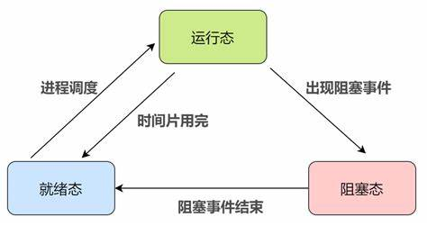
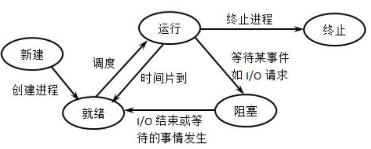
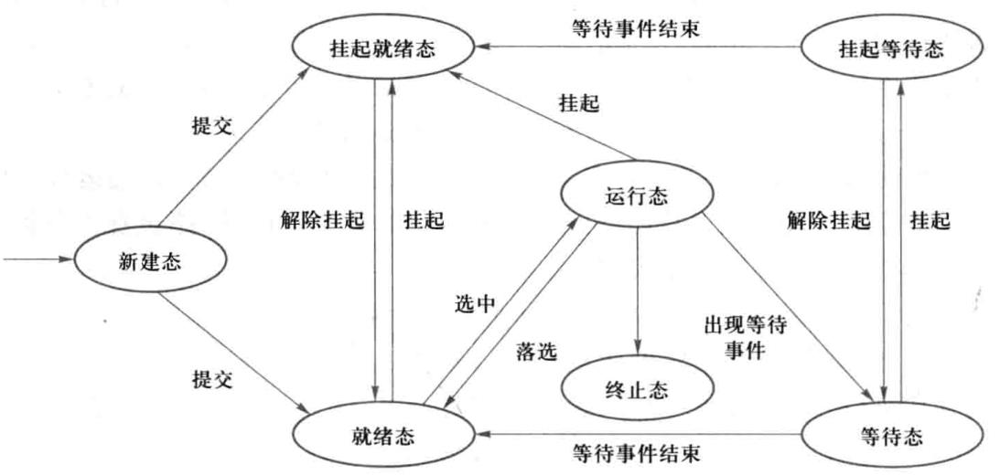

# 操作系统进程管理调度

## 1. 进程的定义

`PCB` 是进程实体的一部分，是操作系统中最重要的记录型数据结构。作用是使一个在 多道程序环境下不能独立运行的程序，成为一个能独立运行的基本单位，成为能与其它进程 并发执行的进程。`OS`是根据`PCB`对并发执行的进程进行控制和管理的

`Linux`的进程控制块为一个由结构`task_struct`所定义的数据结构，其中包括管理进程所需的各种信息

在`0.11`版本的`Linux Kernel`中`task_struct`的定义如下；在后续版本的`Linux`中这个结构体不断变大，在最新版的`Linux`中`task_struct`定义已达到数百行的长度

```c
struct task_struct {
/* these are hardcoded - don't touch */
	long state;	/* -1 unrunnable, 0 runnable, >0 stopped */
	long counter;
	long priority;
	long signal;
	struct sigaction sigaction[32];
	long blocked;	/* bitmap of masked signals */
/* various fields */
	int exit_code;
	unsigned long start_code,end_code,end_data,brk,start_stack;
	long pid,father,pgrp,session,leader;
	unsigned short uid,euid,suid;
	unsigned short gid,egid,sgid;
	long alarm;
	long utime,stime,cutime,cstime,start_time;
	unsigned short used_math;
/* file system info */
	int tty;		/* -1 if no tty, so it must be signed */
	unsigned short umask;
	struct m_inode * pwd;
	struct m_inode * root;
	struct m_inode * executable;
	unsigned long close_on_exec;
	struct file * filp[NR_OPEN];
/* ldt for this task 0 - zero 1 - cs 2 - ds&ss */
	struct desc_struct ldt[3];
/* tss for this task */
	struct tss_struct tss;
};
```


## 2. 进程的状态

### 2.1 三态模型

- 运行`running`态：进程占有处理器正在运行的状态。进程已获得`CPU`，其程序正在执行。在单处理机系统中，只有一个进程处于执行状态； 在多处理机系统中，则有多个进程处于执行状态。
- 就绪`ready`态：进程具备运行条件，等待系统分配处理器以便运行的状态。当进程已分配到除`CPU`以外的所有必要资源后，只要再获得`CPU`，便可立即执行，进程这时的状态称为就绪状态。在一个系统中处于就绪状态的进程可能有多个，通常将它们排成一个队列，称为就绪队列。
- 等待`wait`态：又称阻塞态或睡眠态，指进程不具备运行条件，正在等待某个时间完成的状态。也称为等待或睡眠状态，一个进程正在等待某一事件发生（例如请求`I/O`而等待`I/O`完成等）而暂时停止运行，这时即使把处理机分配给进程也无法运行，故称该进程处于阻塞状态。



#### 2.1.1 三态模型进程状态切换

- 运行态→阻塞态：等待使用资源；
    - 如等待外设传输；等待人工干预。
- 阻塞态→就绪态：资源得到满足；
    - 如外设传输结束；人工干预完成。
- 运行态→就绪态：运行时间片到；

### 2.2 进程五态模型

五态模型在三态模型的基础上增加了新建态`new`和终止态`exit`：

- 新建态：对应于进程被创建时的状态，尚未进入就绪队列。创建一个进程需要通过两个步骤：

    - 1. 为新进程分配所需要的资源和建立必要的管理信息。
        2.  设置该进程为就绪态，并等待被调度执行。

- 终止态：指进程完成任务到达正常结束点，或出现无法克服的错误而异常终止，或被操作系统及有终止权的进程所终止时所处的状态。处于终止态的进程不再被调度执行，下一步将被系统撤销，最终从系统中消失。终止一个进程需要两个步骤：

    - 1. 先对操作系统或相关的进程进行善后处理（如抽取信息）
        2. 然后回收占用的资源并被系统删除

     

#### 2.2.1 三态模型进程状态切换

- NULL→新建态：执行一个程序，创建一个子进程。
- 新建态→就绪态：当操作系统完成了进程创建的必要操作，并且当前系统的性能和虚拟内存的容量均允许。
- 运行态→终止态：当一个进程到达了自然结束点，或是出现了无法克服的错误，或是被操作系统所终结，或是被其他有终止权的进程所终结。
- 运行态→就绪态：运行时间片到；出现有更高优先权进程。
- 运行态→阻塞态：等待使用资源；如等待外设传输；等待人工干预。
- 就绪态→终止态：未在状态转换图中显示，但某些操作系统允许父进程终结子进程。
- 阻塞态→终止态：未在状态转换图中显示，但某些操作系统允许父进程终结子进程。
- 终止态→NULL：完成善后操作。

### 2.3 进程的七态模型

七态模型在五态模型的基础上增加了挂起就绪态`ready suspend`和挂起等待态`blocked suspend`

- 挂起就绪态：进程具备运行条件，但目前在外存中，只有它被对换到内存才能被调度执行。

- 挂起等待态：表明进程正在等待某一个事件发生且在外存中。

    

#### 2.3.1 进程七态模型转化

* 等待态→挂起等待态：操作系统根据当前资源状况和性能要求，可以决定把等待态进程对换出去成为挂起等待态。

* 挂起等待态→挂起就绪态：引起进程等待的事件发生之后，相应的挂起等待态进程将转换为挂起就绪态挂起就绪态→就绪态：当内存中没有就绪态进程，或者挂起就绪态进程具有比就绪态进程更高的优先级，系统将把挂起就绪态进程转换成就绪态。

* 就绪态→挂起就绪态：操作系统根据当前资源状况和性能要求，也可以决定把就绪态进程对换出去成为挂起就绪态。

* 挂起等待态→等待态：当一个进程等待一个事件时，原则上不需要把它调入内存。但是在下面一种情况下，这一状态变化是可能的。当一个进程退出后，主存已经有了一大块自由空间,而某个挂起等待态进程具有较高的优先级并且操作系统已经得知导致它阻塞的事件即将结束，此时便发生了这一状态变化。

* 运行态→挂起就绪态：当一个具有较高优先级的挂起等待态进程的等待事件结束后，它需要抢占 `CPU`，而此时主存空间不够，从而可能导致正在运行的进程转化为挂起就绪态。另外处于运行态的进程也可以自己挂起自己。

* 新建态→挂起就绪态：考虑到系统当前资源状况和性能要求，可以决定新建的进程将被对换出去成为挂起就绪态。

### 2.4 挂起进程的特点

**挂起进程具有如下特征：**

* 挂起进程等同于不在内存中的进程，因此挂起进程将不参与低级调度直到它们被调换进内存。

- 该进程不能立即被执行
- 挂起进程可能会等待一个事件，但所等待的事件是独立于挂起条件的，事件结束并不能导致进程具备执行条件（等待事件结束后进程变为挂起就绪态）
- 进程进入挂起状态是由于操作系统、父进程或进程本身阻止它的运行。
- 结束进程挂起状态的命令只能通过操作系统或父进程发出。


## 3. 进程调度策略

1. 先来先服务 `First-Come, First-Served, FCFS`：按照进程到达的顺序进行调度，先到达的进程先执行，直到执行完或发生阻塞。
2. 最短作业优先 `Shortest Job Next, SJN`：选择估计执行时间最短的进程优先执行。这可能会导致长作业等待时间增加，适用于作业的执行时间相对确定的情况。
3. 优先级调度：为每个进程分配一个优先级，并按照优先级高低进行调度。可分为静态优先级调度（进程创建时分配）和动态优先级调度（根据进程的行为和状态进行动态调整）。
4. 时间片轮转 `Round Robin, RR`：将处理器时间分为多个时间片，每个进程获得一个时间片，当时间片用完后，进程被暂停，执行下一个进程。适用于多任务环境。
5. 多级反馈队列调度：将进程分级，每个级别按照不同的调度策略进行调度。进程首先进入第一级队列，按照时间片轮转方式执行；如果时间片结束后进程还没有执行完，将进程移到下一级队列。适用于多种执行时间不确定的场景。


## 4. 进程状态管理

以`Linux 0.11`版本源码为例，进程的状态存储在结构体`task_struct->state`元素中，进程的状态由几个宏进行定义

```c
struct task_struct {
/* these are hardcoded - don't touch */
	long state;	/* -1 unrunnable, 0 runnable, >0 stopped */
	...
};

#define TASK_RUNNING			0	//运行态
#define TASK_INTERRUPTIBLE		1	//可中断睡眠态
#define TASK_UNINTERRUPTIBLE	2	//不可中断睡眠态
#define TASK_ZOMBIE				3	//僵尸态
#define TASK_STOPPED			4	//停止态
```

进程的状态切换和调度会在触发外部中断后对进程进行检查，以决定是否切换进程的状态或者更改当前执行的进程。
