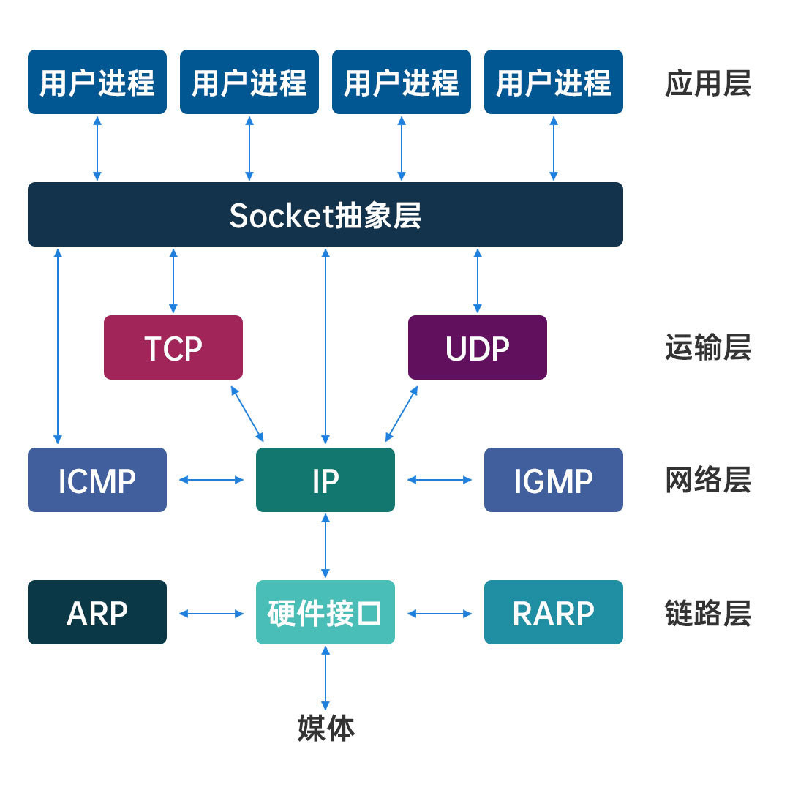

# socket（网络套接字）

## 什么是`Socket`

套接字`Socket`，就是对网络中不同主机上的应用进程之间进行双向通信的端点的抽象。一个套接字就是网络上进程通信的一端，提供了应用层进程利用网络协议交换数据的机制。从所处的地位来讲，套接字上联应用进程，下联网络协议栈，是应用程序通过网络协议进行通信的接口，是应用程序与网络协议栈进行交互的接口

套接字是通信的基石，是支持`TCP/IP`协议的路通信的基本操作单元。可以将套接字看作不同主机间的进程进行双间通信的端点，它构成了单个主机内及整个网络间的编程界面。套接字存在于通信域中，通信域是为了处理一般的线程通过套接字通信而引进的一种抽象概念。套接字通常和同一个域中的套接字交换数据(数据交换也可能穿越域的界限，但这时一定要执行某种解释程序)，各种进程使用这个相同的域互相之间用`Internet`协议簇来进行通信

`Socket`可以看成是两个网络应用程序进行通信时，各自通信连接中的端点，这是一个逻辑上的概念。它是网络环境中进程间通信的`API`(应用程序编程接口)，也是可以被命名和寻址的通信端点，使用中的每一个套接字都有其类型和一个与之相连进程。通信时其中一个网络应用程序将要传输的一段信息写入它所在主机的 `Socket`中，该 `Socket`通过与网络接口卡相连的传输介质将这段信息送到另外一台主机的 `Socket`中，使对方能够接收到这段信息。 `Socket`是由`IP`地址和端口结合的，提供向应用层进程传送数据包的机制

## `Socket`主要类型

1. **流套接字(SOCK_STREAM)**
    流套接字用于提供面向连接、可靠的数据传输服务。该服务将保证数据能够实现无差错、无重复送，并按顺序接收。流套接字之所以能够实现可靠的数据服务，原因在于其使用了传输控制协议，即`TCP(The Transmission Control Protocol)`协议 
2. **数据报套接字(SOCK_DGRAM)**
    数据报套接字提供一种无连接的服务。该服务并不能保证数据传输的可靠性,数据有可能在传输过程中丢失或出现数据重复，且无法保证顺序地接收到数据。数据报套接字使用UDP( User DatagramProtocol)协议进行数据的传输。由于数据报套接字不能保证数据传输的可靠性，对于有可能出现的数据丢失情况，需要在程序中做相应的处理 
3. **原始套接字(SOCK_RAW)**
    原始套接字与标准套接字(标准套接字指的是前面介绍的流套接字和数据报套接字)的区别在于：原始套接字可以读写内核没有处理的IP数据包，而流套接字只能读取TCP协议的数据，数据报套接字只能读取UDP协议的数据。因此，如果要访问其他协议发送的数据必须使用原始套接

## `Socket`与`TCP/UDP`的关系

`Socket`是应用层与`TCP/IP`协议簇通信的中间软件抽象层，它是一组接口。本质是对`TCP/IP`的一种实现

