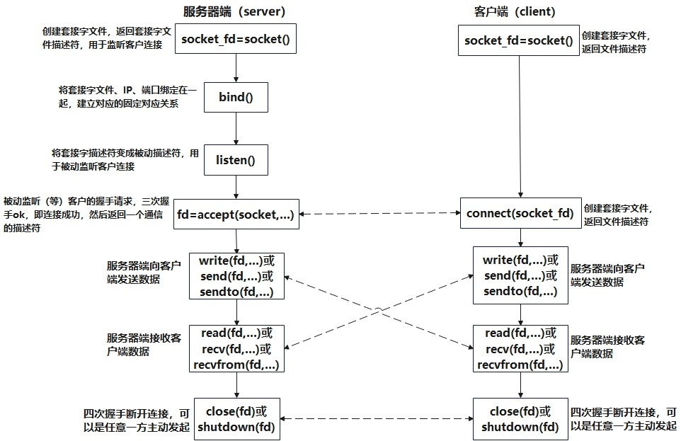

# Socket连接流程

> 参考文档
>
> [Socket到底是什么？你想知道吗？-socket是什么意思 (51cto.com)](https://www.51cto.com/article/742745.html)
>
> https://zh.wikipedia.org/wiki/%E7%B6%B2%E8%B7%AF%E6%8F%92%E5%BA%A7

## 类型

1. **数据报套接字（`SOCK_DGRAM`）**

​	数据报套接字是一种无连套接字接字，使用用户数据报协议（`UDP`）传输数据。每一个数据包都单独寻址和路由。这导致了接收端接收到的数据可能是乱序的，有一些数据甚至可能会在传输过程中丢失。不过得益于数据报套接字并不需要建立并维护一个稳定的连接，数据报套接字所占用的计算机和系统资源较小。

2. **流套接字（`SOCK_STREAM`）**

    连接导向式通信套接字，使用传输控制协议（`TCP`）、流控制传输协议（`SCTP`）或者数据拥塞控制协议（`DCCP`）传输数据。流套接字提供可靠并且有序的数据传输服务。在互联网上，流套接字通常使用TCP实现，以便应用可以在任何使用TCP/IP协议的网络上运行。

3. **原始套接字**

    原始套接字是一种网络套接字。允许直接发送和接受IP数据包并且不需要任何传输层协议格式。原始套接字主要用于一些协议的开发，可以进行比较底层的操作。

## socket流程



## 关键接口

`socket`使用时有几个常用的接口

### socket函数

`socket()`函数的原型如下，这个函数建立一个协议族为`domain`、协议类型为`type`、协议编号为`protocol`的套接字文件描述符。如果函数调用成功，会返回一个标识这个套接字的文件描述符，失败的时候返回`-1`

**函数原型**

```c
#include <sys/types.h>
 
#include <sys/socket.h>
 
int socket(int domain, int type, int protocol);
```

**domain参数**
函数`socket()`的参数`domain`用于设置网络通信的域，函数`socket()`根据这个参数选择通信协议的族。通信协议族在文件`sys/socket.h`中定义。

| 名称                 | 含义                | 名称           | 含义                       |
| -------------------- | ------------------- | -------------- | -------------------------- |
| `PF_UNIX`,`PF_LOCAL` | 本地通信            | `PF_X25`       | `ITU-T X25 / ISO-8208`协议 |
| `AF_INET`,`PF_INET`  | `IPv4 Internet`协议 | `PF_AX25`      | `Amateur radio AX.25`      |
| `PF_INET6`           | `IPv6 Internet`协议 | `PF_ATMPVC`    | 原始`ATM PVC`访问          |
| `PF_IPX`             | `IPX-Novell`协议    | `PF_APPLETALK` | `Appletalk`                |
| `PF_NETLINK`         | 内核用户界面设备    | `PF_PACKET`    | 底层包访问                 |

**type参数**
函数socket()`的参数`type`用于设置套接字通信的类型，主要有`SOCKET_STREAM`（流式套接字）、`SOCK——DGRAM`（数据包套接字）等

| 名称             | 含义                                                         |
| ---------------- | ------------------------------------------------------------ |
| `SOCK_STREAM`    | `TCP`连接，提供序列化的、可靠的、双向连接的字节流。支持带外数据传输 |
| `SOCK_DGRAM`     | 支持`UDP`连接（无连接状态的消息）                            |
| `SOCK_SEQPACKET` | 序列化包，提供一个序列化的、可靠的、双向的基本连接的数据传输通道，数据长度定常。每次调用读系统调用时数据需要将全部数据读出 |
| `SOCK_RAW`       | `RAW`类型，提供原始网络协议访问                              |
| `SOCK_RDM`       | 提供可靠的数据报文，不过可能数据会有乱序                     |
| `SOCK_PACKET`    | 这是一个专用类型，不能呢过在通用程序中使用                   |

并不是所有的协议族都实现了这些协议类型，例如，`AF_INET`协议族就没有实现`SOCK_SEQPACKET`协议类型

**`protocol`参数**
函数`socket()`的第3个参数`protocol`用于制定某个协议的特定类型，即`type`类型中的某个类型。通常某协议中只有一种特定类型，这样`protocol`参数仅能设置为`0`；但是有些协议有多种特定的类型，就需要设置这个参数来选择特定的类型

* 类型为`SOCK_STREAM`的套接字表示一个双向的字节流，与管道类似。流式的套接字在进行数据收发之前必须已经连接，连接使用`connect()`函数进行。一旦连接，可以使用`read()`或者`write()`函数进行数据的传输。流式通信方式保证数据不会丢失或者重复接收，当数据在一段时间内任然没有接受完毕，可以将这个连接人为已经死掉
* `SOCK_DGRAM`和`SOCK_RAW` 这个两种套接字可以使用函数`sendto()`来发送数据，使用`recvfrom()`函数接受数据，`recvfrom()`接受来自制定`IP`地址的发送方的数据
* `SOCK_PACKET`是一种专用的数据包，它直接从设备驱动接受数据

**示例**

建立一个流式套接字：

```perl
int sock = socket(AF_INET, SOCK_STREAM, 0);
```

### bind函数

`bind`函数的作用是通过绑定一个其他`func`函数生成一个依赖于`func`的新的函数对象，复用`func`函数的实现，但是可以改变这个func的参数数量和顺序，可以绑定普通函数、全局函数，静态函数，成员函数，而且其参数可以支持占位符（std::placeholders::_1，std::placeholders::_2）来改变参数的顺序，并且可以设置func中默认的几个参数来减少输入参数的数量。

**函数原型**

```c
int bind(int sockfd, const struct sockaddr *addr,socklen_t addrlen);
```

* `sockfd`：套接字描述符，是通过 `socket()` 创建的套接字。这个套接字将被绑定到指定的地址和端口
* `addr`：指向一个 `struct sockaddr` 结构体的指针，包含了套接字要绑定到的地址信息。对于 IPv4，通常是一个 `struct sockaddr_in` 结构体
* `addrlen`：地址结构的大小，通常使用 `sizeof(struct sockaddr_in)` 来表示

**返回值**

- **成功**：返回 `0`，表示绑定成功
- **失败**：返回 `-1`，并设置 `errno` 来指示错误原因

### listen函数

`listen`函数的作用是将一个套接字标记为监听状态，准备接受客户端的连接请求。它通常在创建并绑定一个服务器端套接字后使用，表示服务器愿意接受来自客户端的连接

**函数原型**

```c
int listen(int sockfd, int backlog);
```

* `sockfd`：这是一个套接字描述符，通常是通过 `socket()` 函数创建的

* `backlog`：这是一个整数，指定连接请求队列的最大长度。即，当客户端连接请求到来时，系统会将这些连接排队，直到 `accept()` 函数接受连接。如果队列已满，新的连接可能会被拒绝

**返回值**

- **成功**：返回 `0` 表示
- **失败**：返回 `-1` 表示出错，并且设置了 `errno` 以指示错误原因

### accept函数

`accept`函数是用于在套接字上接受传入连接的函数。它通常用于服务器端，以处理客户端的连接请求

**函数原型**

```c
#include <sys/types.h>          /* See NOTES */
#include <sys/socket.h>
int accept(int sockfd, struct sockaddr *addr, socklen_t *addrlen);
```

- `sockfd`：服务器端的套接字描述符，通常是通过 `socket()` 函数创建并且通过 `bind()` 绑定后，再通过 `listen()` 设置为监听状态的套接字
- `addr`：指向一个 `struct sockaddr` 结构体的指针，用来存储客户端的地址信息（例如，IP 地址和端口号）。可以设置为 `NULL`，如果不关心客户端地址信息
- `addrlen`：指向一个变量，表示 `addr` 缓存区的长度，`accept()` 调用后，这个变量会被更新为客户端地址的实际长度

**返回值**

- **成功**：`accept()` 返回一个新的套接字描述符，表示与客户端的连接
- **失败**：返回 `-1`，并设置 `errno` 来指示错误原因

### connect函数

`connect`函数的功能可以用一句话来概括，就是完成面向连接的协议的连接过程，它是主要连接的。面向连接的协议，在建立连接的时候总会有一方先发送数据，那么谁调用了`connect`谁就是先发送数据的一方

**函数原型**

```c
#include <sys/types.h>          /* See NOTES */
#include <sys/socket.h>
int connect(int sockfd, const struct sockaddr *addr, socklen_t addrlen);
```

* `sockfd`：客户端的套接字描述符，通常是通过 `socket()` 函数创建的
* `addr`：指向 `struct sockaddr` 结构体的指针，包含了目标服务器的地址信息（IP 地址和端口）
* `addrlen`：地址结构的大小，通常可以使用 `sizeof(struct sockaddr_in)`

**返回值**

- **成功**：返回 `0` 表示连接成功
- **失败**：返回 `-1`，并设置 `errno` 以指示错误原因

### send函数

`send`函数通常用于 客户端 或 服务器 向对方发送消息或数据

**函数原型**

```c
ssize_t send(int sockfd, const void *buf, size_t len, int flags);
```

* `sockfd`：套接字描述符，是已建立连接的套接字（例如，通过 `socket()` 创建并通过 `connect()` 或 `accept()` 连接后的套接字）。它指定了要发送数据的目标套接字。
* `buf`：指向要发送的数据的缓冲区（内存地址）。这是一个指向 `char` 类型数据的指针，存储了需要发送的消息或数据
* `len`：要发送的数据的字节数，通常是缓冲区中数据的长度
* `flags`：设置发送行为的标志位。常用的标志包括：
    * `0`：表示正常发送
    * `MSG_CONFIRM`：请求确认消息发送
    * `MSG_DONTROUTE`：不使用路由表直接发送数据（绕过路由器）
    * `MSG_NOSIGNAL`：防止发送 SIGPIPE 信号

**返回值**

- **成功**：返回发送的字节数（即成功发送的数据量）。这个值可能小于 `len`，因为数据可能未完全发送，这时候需要再次调用 `send()` 继续发送剩余的数据
- **失败**：返回 `-1`，并设置 `errno` 来指示错误原因

### recv函数

`recv()` 函数用于从已经建立连接的套接字接收数据。它是 接收数据 的核心函数，通常在服务器端用于接收客户端发送的数据，或者在客户端接收从服务器传来的响应数据

**函数原型**

```c
ssize_t recv(int sockfd, void *buf, size_t len, int flags);
```

* `sockfd`：已连接的套接字描述符。这个套接字是通过 `socket()` 创建并通过 `connect()`（客户端）或 `accept()`（服务器端）建立连接的套接字。
* `buf`：指向接收数据缓冲区的指针，用于存储接收到的数据
* `len`：要接收的最大字节数。`recv()` 函数会将最多 `len` 字节的数据存入 `buf` 中
* `flags`：指定接收操作的行为标志。常用的标志有：
    * `0`：默认行为，正常接收
    * `MSG_PEEK`：查看缓冲区的数据而不将其从缓冲区中移除
    * `MSG_WAITALL`：要求 `recv()` 等到 `len` 字节的数据都被接收到（对于流套接字，可能需要多次调用才能完全接收 `len` 字节）

**返回值**

- **成功**：返回实际接收的字节数（可以小于请求的 `len`，特别是在流套接字（如 TCP）中）。如果返回 0，表示连接已关闭
- **失败**：返回 `-1`，并设置 `errno` 来指示错误原因

### close函数&shutdown函数

#### close函数

`close` 一个套接字的默认行为是把套接字标记为已关闭，然后立即返回到调用进程

**函数原型**

```c
int close(int sockfd);     //返回成功为0，出错为-1.
```

#### shutdown函数

**函数原型**

```c
int shutdown(int sockfd,int howto);  //返回成功为0，出错为-1
```

该函数的行为依赖于`howto`的值

* `SHUT_RD`：值为`0`，关闭连接的读这一半

* `SHUT_WR`：值为`1`，关闭连接的写这一半

* `SHUT_RDWR`：值为`2`，连接的读和写都关闭

**两函数的区别**

1. `close`函数会关闭套接字`ID`，如果有其他的进程共享着这个套接字，那么它仍然是打开的，这个连接仍然可以用来读和写，并且有时候这是非常重要的 ，特别是对于多进程并发服务器来说

2. `shutdown`会切断进程共享的套接字的所有连接，不管这个套接字的引用计数是否为零，那些试图读得进程将会接收到`EOF`标识，那些试图写的进程将会检测到`SIGPIPE`信号，同时可利用`shutdown`的第二个参数选择断连的方式
