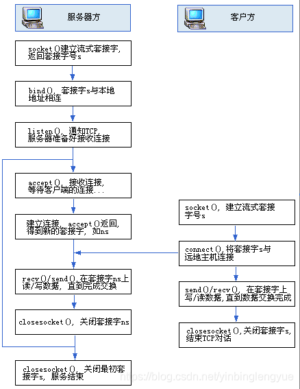

# Socket(网络套接字)

> 参考文档
>
> [Socket到底是什么？你想知道吗？-socket是什么意思 (51cto.com)](https://www.51cto.com/article/742745.html)
>
> https://zh.wikipedia.org/wiki/%E7%B6%B2%E8%B7%AF%E6%8F%92%E5%BA%A7


## 类型

1. **数据报套接字（`SOCK_DGRAM`）**

​	数据报套接字是一种无连套接字接字，使用用户数据报协议（`UDP`）传输数据。每一个数据包都单独寻址和路由。这导致了接收端接收到的数据可能是乱序的，有一些数据甚至可能会在传输过程中丢失。不过得益于数据报套接字并不需要建立并维护一个稳定的连接，数据报套接字所占用的计算机和系统资源较小。

2. **流套接字（`SOCK_STREAM`）**

    连接导向式通信套接字，使用传输控制协议（`TCP`）、流控制传输协议（`SCTP`）或者数据拥塞控制协议（`DCCP`）传输数据。流套接字提供可靠并且有序的数据传输服务。在互联网上，流套接字通常使用TCP实现，以便应用可以在任何使用TCP/IP协议的网络上运行。

3. **原始套接字**

    原始套接字是一种网络套接字。允许直接发送和接受IP数据包并且不需要任何传输层协议格式。原始套接字主要用于一些协议的开发，可以进行比较底层的操作。


## socket流程




## 关键接口

`socket`使用时有几个常用的接口

### socket函数

`socket()`函数的原型如下，这个函数建立一个协议族为`domain`、协议类型为`type`、协议编号为`protocol`的套接字文件描述符。如果函数调用成功，会返回一个标识这个套接字的文件描述符，失败的时候返回`-1`

```c
#include <sys/types.h>
 
#include <sys/socket.h>
 
int socket(int domain, int type, int protocol);
```

**`domain`参数**
函数`socket()`的参数`domain`用于设置网络通信的域，函数`socket()`根据这个参数选择通信协议的族。通信协议族在文件`sys/socket.h`中定义。

| 名称                 | 含义                | 名称           | 含义                       |
| -------------------- | ------------------- | -------------- | -------------------------- |
| `PF_UNIX`,`PF_LOCAL` | 本地通信            | `PF_X25`       | `ITU-T X25 / ISO-8208`协议 |
| `AF_INET`,`PF_INET`  | `IPv4 Internet`协议 | `PF_AX25`      | `Amateur radio AX.25`      |
| `PF_INET6`           | `IPv6 Internet`协议 | `PF_ATMPVC`    | 原始`ATM PVC`访问          |
| `PF_IPX`             | `IPX-Novell`协议    | `PF_APPLETALK` | `Appletalk`                |
| `PF_NETLINK`         | 内核用户界面设备    | `PF_PACKET`    | 底层包访问                 |

**`type`参数**
函数`socket()`的参数`type`用于设置套接字通信的类型，主要有`SOCKET_STREAM`（流式套接字）、`SOCK——DGRAM`（数据包套接字）等

| 名称             | 含义                                                         |
| ---------------- | ------------------------------------------------------------ |
| `SOCK_STREAM`    | `TCP`连接，提供序列化的、可靠的、双向连接的字节流。支持带外数据传输 |
| `SOCK_DGRAM`     | 支持`UDP`连接（无连接状态的消息）                            |
| `SOCK_SEQPACKET` | 序列化包，提供一个序列化的、可靠的、双向的基本连接的数据传输通道，数据长度定常。每次调用读系统调用时数据需要将全部数据读出 |
| `SOCK_RAW`       | `RAW`类型，提供原始网络协议访问                              |
| `SOCK_RDM`       | 提供可靠的数据报文，不过可能数据会有乱序                     |
| `SOCK_PACKET`    | 这是一个专用类型，不能呢过在通用程序中使用                   |

并不是所有的协议族都实现了这些协议类型，例如，`AF_INET`协议族就没有实现`SOCK_SEQPACKET`协议类型。

**`protocol`参数**
函数`socket()`的第3个参数`protocol`用于制定某个协议的特定类型，即`type`类型中的某个类型。通常某协议中只有一种特定类型，这样`protocol`参数仅能设置为`0`；但是有些协议有多种特定的类型，就需要设置这个参数来选择特定的类型。

* 类型为`SOCK_STREAM`的套接字表示一个双向的字节流，与管道类似。流式的套接字在进行数据收发之前必须已经连接，连接使用`connect()`函数进行。一旦连接，可以使用`read()`或者`write()`函数进行数据的传输。流式通信方式保证数据不会丢失或者重复接收，当数据在一段时间内任然没有接受完毕，可以将这个连接人为已经死掉。
* `SOCK_DGRAM`和`SOCK_RAW` 这个两种套接字可以使用函数`sendto()`来发送数据，使用`recvfrom()`函数接受数据，`recvfrom()`接受来自制定`IP`地址的发送方的数据。
* `SOCK_PACKET`是一种专用的数据包，它直接从设备驱动接受数据。

**示例**

建立一个流式套接字：

```perl
int sock = socket(AF_INET, SOCK_STREAM, 0);
```

### bind函数

`bind`函数的作用是通过绑定一个其他`func`函数生成一个依赖于`func`的新的函数对象，复用`func`函数的实现，但是可以改变这个func的参数数量和顺序，可以绑定普通函数、全局函数，静态函数，成员函数，而且其参数可以支持占位符（std::placeholders::_1，std::placeholders::_2）来改变参数的顺序，并且可以设置func中默认的几个参数来减少输入参数的数量。