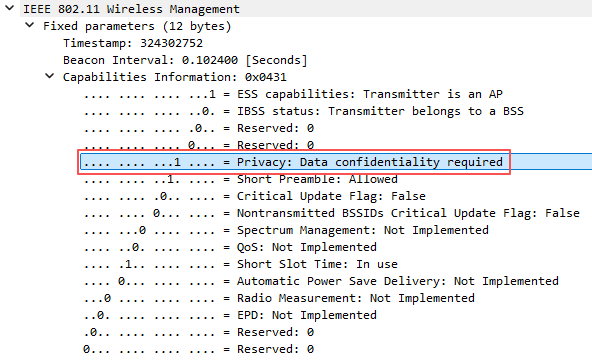
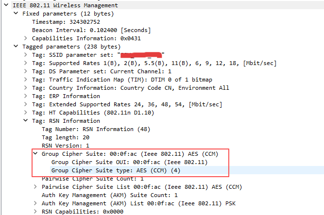
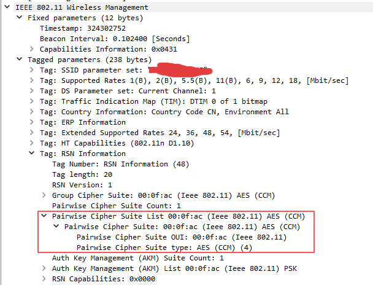
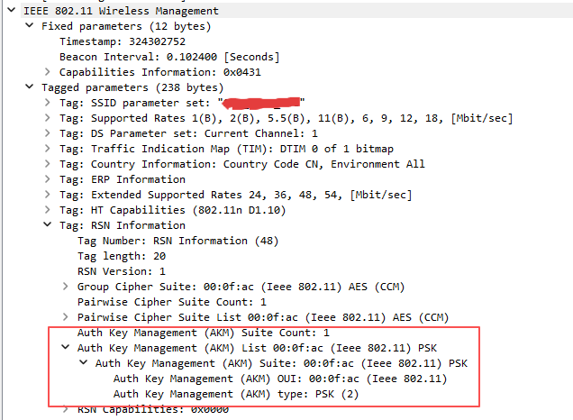
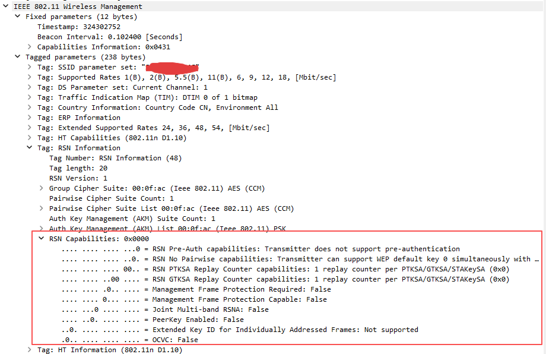
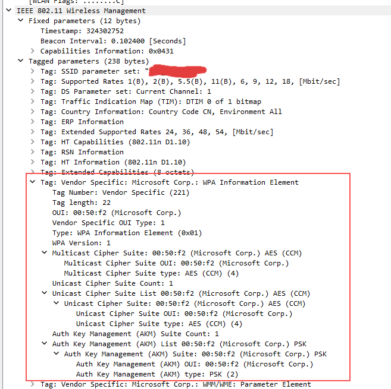

# 加密方式判断

下面给出“加密方式报文关键字段”的速查要点（主要看`Beacon/Probe Response`的`IE`）：

观察位置

- `Capability Information` → `Privacy` 位（是否开启加密）

    - **含义：**`AP` 是否要求数据帧加密
    - **取值：**`0`不开启加密（开放网络），`1`要求加密
    - **判读：**仅表明“要不要加密”。不指明具体算法。若为`1`且没有`RSN/WPA IE`，基本就是`WEP`
    - **Wireshark 字段：**`wlan.fixed.capabilities.privacy`

    

- `RSN Information Element`

    - **含义：**标准的安全能力集合，描述 `WPA2/WPA3` 的密码与认证选项
    - **位置：**`Tagged parameters → RSN information`
    - **判读：**是否为 `WPA2/WPA3`、使用哪些密码算法、哪些认证方式、是否要求 `PMF` 等都在这里
    - **Wireshark** 存在性过滤：`wlan.rsn`

    `Group Cipher Suite`（`GCS`）

    * **含义：**组播/广播数据帧使用的加密算法（`AP` 下行组播/广播）
    * **常见值：**`TKIP(2)`、`CCMP-128(4)`、`GCMP-128(8)`、`GCMP-256(9)`、`CCMP-256(10)`
    * **判读：**不等于单播算法；单播看 `PCS`。若 `GCS=TKIP` 而 `PCS=CCMP`，说明组播降级为 `TKIP`
    * **Wireshark 字段：**`wlan.rsn.gcs.type`

    

    `Pairwise Cipher Suite List`（`PCS`）

    - **含义：**`AP` 支持的单播（点对点）加密算法清单，客户端与 `AP` 会从该列表协商出一个使用
    - **常见值：**`TKIP(2)`、`CCMP-128(4)`、`GCMP-128(8)`、`GCMP-256(9)`、`CCMP-256(10)`
    - **判读**：多个条目表示“混合/兼容模式”（如同时支持 `TKIP` 与 `CCMP`）。最终实际用哪一个要看关联/四次握手协商结果
    - **Wireshark 字段：**`wlan.rsn.pcs.type`

    

    `AKM Suite List`（`AKM`）

    - **含义：**认证与密钥管理方式（决定是 `PSK`、`802.1X`、`SAE`、`OWE` 等）
    - **常见值：**
        - `1=802.1X（Enterprise）`
        - `2=PSK（WPA/WPA2-Personal）`
        - `5=802.1X-SHA256，6=PSK-SHA256`
        - `8=SAE（WPA3-Personal），9=FT/SAE`
        - `11=Suite-B-128，12=Suite-B-192（WPA3-Enterprise 192-bit）`
        - `18=OWE（Enhanced Open）`
    - **Wireshark 字段：**`wlan.rsn.akms.type`

    

    `RSN Capabilities`（含 `MFP：MFPC/MFPR`）

    - **含义：**一组能力位，描述预认证、重放计数、是否支持/强制管理帧保护（`PMF`/`MFP`）等
    - **关键位：**
        - **MFPC（Management Frame Protection Capable）：**支持 `PMF`
        - **MFPR（Management Frame Protection Required）：**必须启用 `PMF`
    - **判读：**`WPA3` 网络通常 `MFPR=1`；“过渡模式”常见 `MFPC=1` 且 `MFPR=0`。其后若出现 `Group Management Cipher（BIP-GMAC/CMAC）`，也与 `PMF` 相关
    - **Wireshark 字段：**`wlan.rsn.capabilities` 

    

- `Vendor Specific`

    - **含义：**旧版 `WPA`（俗称 `WPA1`）的信息元素，结构与 `RSN` 类似，但用微软 `OUI`
    - **作用：**出现该 `IE` 表示 `AP` 提供 `WPA1` 兼容；常与 `RSN IE` 同时出现表示“`WPA/WPA2` 混合模式”
    - **内容：**也包含 `GCS`、`PCS`、`AKM` 等（类型值在 `00:50:F2` 命名空间内，如 `1=WEP-40`、`2=TKIP`、`4=CCMP`、`5=WEP-104`）
    - **Wireshark 识别：**`Vendor Specific: Microsoft Corp.: WPA Information Element`
    - **过滤示例：**
        - **查找 WPA IE：**`wlan.tag.vendor.oui == 00:50:f2 && wlan.tag.vendor.type == 1`

     

常见加密方式与字段差异

- **开放（Open）**
    - 无 `RSN/WPA IE`；`Capability.Privacy=0`
- **WEP**
    - 无 `RSN/WPA IE`；`Capability.Privacy=1`
- **WPA（WPA1）**
    - 存在 `WPA IE`
    - 常见：`PCS/GCS=TKIP(type 2)`，`AKM=PSK(2)`或`802.1X(1)`
- **WPA2-Personal（WPA2-PSK）**
    - `RSN IE` 存在；`AKM=PSK(2)`
    - `PCS` 通常 `CCMP-128（type 4）`
- **WPA2-Enterprise**
    - `RSN IE`；`AKM=802.1X(1)`（可见 `FT/1X` 等变体）
- **WPA2 混合（TKIP+CCMP）**
    - `RSN IE`；`PCS` 同时含 `TKIP(2)` 与 `CCMP(4)`；`GCS` 可能是 `TKIP`
- **WPA3-Personal**
    - `RSN IE`；`AKM=SAE(8)`
    - `RSN Capabilities`：`MFPR=1`（`PMF` 必需）
    - 过渡模式（`WPA2/WPA3` 混合）：`AKM` 同时含 `PSK(2)` 与 `SAE(8)`，`MFPC=1` 且常 `MFPR=0`
- **WPA3-Enterprise（128-bit）**
    - `RSN IE`；`AKM=802.1X`(`1/5` 等)，`MFPR=1`
    - `Cipher` 为 `CCMP-128(4)` 或 `GCMP-128(8)`
- **WPA3-Enterprise（192-bit，Suite B）**
    - `RSN IE`；`AKM=Suite-B-192(12)`
    - `PCS=GCMP-256(9)`，`Group Mgmt Cipher=BIP-GMAC-256(12)，MFPR=1`

