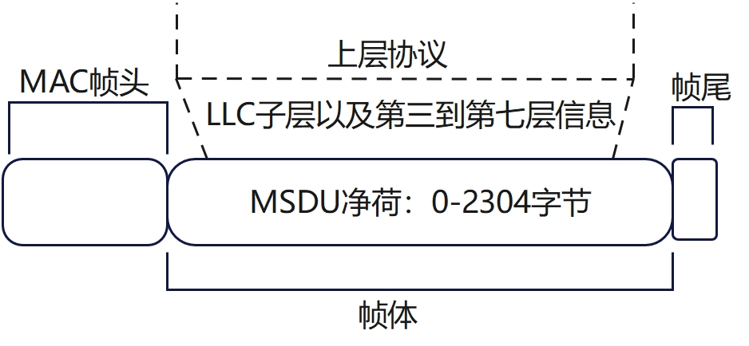
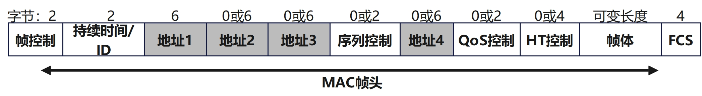
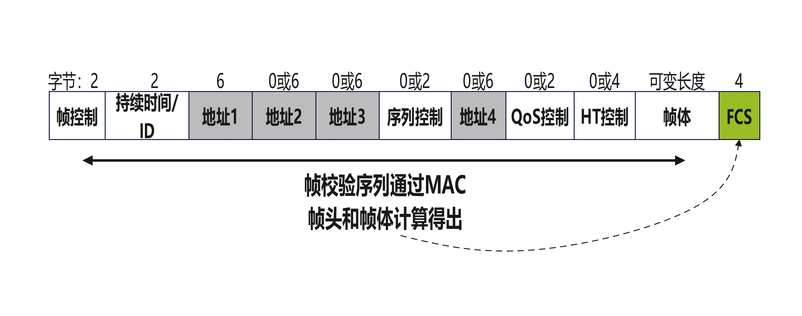

# 802.11帧结构

[TOC]

## 数据链路层分层

数据链路层分为两个子层，上层是`802.2`逻辑链路控制(`LLC`)子层，下层是介质访问控制(`MAC`)子层。所有`802`网络具有相同的`LLC`子层结构，但并非所有`802`网络都使用`LLC`子层，`802.11`标准定义的无线局域网通信位于`MAC`子层

### MAC服务数据单元

网络层(第三层)将数据发送给数据链路层(第二层)，数据在传递给`LLC`子层后成为`MAC`服务数据单元(`MSDU`)。`MSDU`由`LLC`子层已经第三到第七层信息构成，可以简单定义为包含`IP`包与部分`LLC`数据的数据净荷。本章将讨论`3`种主要的`802.11`帧类型。`802.11`管理帧和控制帧不携带上层信息，只有`802.11`数据帧体携带`MSDU`净荷。`IEEE 802.11-2016`标准规定，`MSDU`的最大长度为`2304`字节，而帧提的最大长度由`MSDU`的最大长度(`2304`字节)以及加密产生的最大开销决定

`2009`年获批的`802.11n`修正案引入了聚合`MAC`服务数据单元(`A-MSDU`)的概念。使用`A-MSDU`时，帧体的最大长度由`A-MSDU`的最大长度已经加密产生的开销决定

### MAC协议数据单元

`LLC`子层向`MAC`子层发送`MSDU`时，将添加`MAC`帧头信息以便识别。封装后的`MSDU`称为`MAC`协议数据单元(`MPDU`)，它其实就是`802.11`帧。如图所示，`802.11 MPDU`主要由以下三部分构成

* **MAC帧头**

    帧控制、持续事件、`MAC`寻址、序列控制、`QoS`控制、`HT`控制等信息均位于`MAC`帧头

* **帧体**

    帧体的大小有所不同，包含的信息也会因为帧类型及其子类型的不同而不同。`MSDU`净荷(第三到第七层信息)封装在帧体中，可以进行加密以保护其安全

* **帧校验序列**

    帧校验序列(`FCS`)包括`32`位循环冗余校验(`CRC`)，用于验证接收帧的完整性
    
    

将数据封装成这样的帧之后，就可以传递给物理层，物理层将为帧传输做进一步准备

## 物理层

和数据链路层相似，物理层也分为两个子层。上层称为物理会聚过程(`PLCP`)子层，下层称为物理介质相关(`PMD`)子层。`MAC`子层向`PLCP`子层发送帧。`PLCP`子层创建`PLCP`协议数据单元(`PPDU`)以便传输，`PMD`子层随后调试数据并以比特的形式发送出去

### PLCP服务数据单元

`PLCP`服务数据单元(`PSDU`)是物理层对`MPDU`的称谓，换言之`MAC`子层将帧称为`MPDU`，而物理层将同样的帧称为`PSDU`，唯一的区别在于从`OSI`模型的哪一层来观察帧

### PLCP协议数据单元

收到`PSDU`后，`PLCP`子层创建`PLCP`协议数据单元(`PPDU`)以便传输。`PLCP`子层向`PSDU`添加前同步码和物理层头部，发送端和接收端`802.11`无线接口利用前同步码进行同步

上层信息在数据链路层与物理层之间传递如图所示

## 802.11和802.3互操作性

由于有线基础设施属于不同的物理介质，`802.11`数据帧净荷必须转换为`802.3`以太网帧，通常在`802.11`介质与`802.3`介质之间传输帧净荷，也可以在`802.11`介质与其他介质之间传输`MSDU`。所有`IEEE 802`帧格式都具有相似的特性，`802.11`帧格式也不例外。由于这种相似性，帧从`802.11`无线网络传输到`802.3`有线网络时很容易进行转换，反之亦然，这一步通常是在物理层实现

## 802.11 MAC帧头

所有`802.11`帧都包含携带二层信息的`MAC`帧头。二层信息没有加密，可以通过协议分析仪查看其内容。如图所示，`802.11 MAC`帧头主要由`9`个主要字段构成，其中`4`个字段用于寻址，另外`5`个字段为帧控制、持续时间/`ID`、序列控制、`QoS`控制以及`HT`控制字段

## 帧控制字段

如图所示，`MAC`帧头的前两个字节是帧控制字段，由协议版本、类型、子类型、发往`DS`、来自`DS`、更多分片、重试、电源管理、更多数据、受保护帧、`+HTC`/顺序共`11`个字段构成

### 协议版本字段

所有`802.11MAC`帧头的第一个子字段都是协议版本子字段，长度为`2`比特，仅用于标识`802.11`技术的协议版本。所有`802.11`帧的协议版本子字段均设置为`0`，其他值保留不用

### 类型&子类型字段

`IEEE 802.11-2016`标准定义了`3`种主要的帧类型，它们是管理帧、控制帧、数据帧和扩展帧。这些`802.11`帧类型可进一步细分为多种子类型。`802.11MAC`帧头的类型子字段用于标识帧属于管理帧、控制帧、数据帧还是扩展帧。

类型(`Type`)和子类型(`Subtype`)子字段共同标识帧的功能。由于存在多种不同类别的管理帧、控制帧与数据帧，因此子类型子字段的长度为`4`比特

#### 类型字段

| 比特值 | 帧类型 | 作用                       |
| ------ | ------ | -------------------------- |
| `00`   | 管理帧 | 发现接入点并加入基本服务集 |
| `01`   | 控制帧 | 确认传输成功并保留无线介质 |
| `10`   | 数据帧 | 携带上层`MSDU`净荷         |
| `11`   | 扩展帧 | 一种新的、灵活的帧格式     |

#### 管理帧子类型

| 比特值 | 帧类型                                   | 作用                                                         |
| ------ | ---------------------------------------- | ------------------------------------------------------------ |
| `0000` | **关联请求**(`Association Request`)      | `STA`向`AP`请求加入`BSS`                                     |
| `0001` | **关联响应**(`Association Response`)     | `AP`回应`STA`的关联请求(成功/失败 +`AID`)                    |
| `0010` | **重关联请求**(`Reassociation Request`)  | `STA`在漫游时从一个`AP`切换到另一个`AP`时发送，保留原关联上下文(如`IP`地址) |
| `0011` | **重关联响应**(`Reassociation Response`) | 目标`AP`对重关联请求的回应                                   |
| `0100` | **探测请求**(`Probe Request`)            | `STA`主动扫描时广播，用于发现附近`AP`                        |
| `0101` | **探测响应**(`Probe Response`)           | `AP`收到`Probe Request`后回复自身信息(SSID、速率、能力等)    |
| `0110` | **时间通告帧**(`Timing Advertisement`)   | 用于时间同步(如在`TV`白频段或特定工业应用中)，较少见         |
| `0111` | **保留**(`Reserved`)                     | 未使用                                                       |
| `1000` | **信标帧**(`Beacon`)                     | `AP`定期广播，宣告网络存在，包含`SSID`、`TIM`(省电调度)、能力等 |
| `1001` | **通知传输指示消息**(`ATIM`)             | 仅用于`IBSS`(`Ad-hoc`模式)，通知休眠节点有缓存数据           |
| `1010` | **解除关联**(`Disassociation`)           | 通知对方终止逻辑连接(但认证仍有效)。可由`STA`或`AP`发起      |
| `1011` | **认证帧**(`Authentication`)             | 用于开放系统认证或共享密钥认证(`WEP`时代)，现代`WPA/WPA2`使用`802.1X/EAP`，但此帧仍存在 |
| `1100` | **解除认证帧**(`Deauthentication`)       | 终止认证状态(比`Disassociation`更彻底)，常用于踢出客户端或安全断开 |
| `1101` | **动作帧**(`Action`)                     | 用于高级功能交互，如`QoS`(`ADDTS`)、波束成形、无线多跳(`Mesh`)、`TDLS`、`WNM`等 |
| `1110` | **无确认动作帧**(`Action No Ack`)        | 与`Action`类似，但不要求接收方`ACK`(用于广播或多播场景)      |
| `1111` | **保留**(`Reserved`)                     | 未使用                                                       |

#### 控制帧子类型

| 比特值      | 帧类型                                          | 作用                                                         |
| ----------- | ----------------------------------------------- | ------------------------------------------------------------ |
| `0000-0011` | **保留**(`Reserved`)                            | 未使用                                                       |
| `0100`      | **波束成形报告轮询**(`Beamforming Report Poll`) | 在 8`02.11ac/ax`中，`AP`用此帧请求客户端发送其波束成形反馈(`CSI`) |
| `0101`      | **VHT 零数据包公告**(`VHT NDP Announcement`)    | 用于高吞吐量(`VHT, 802.11ac`)波束成形训练，通知即将发送`NDP`(`Null Data Packet`)以供信道探测 |
| `0110`      | **控制帧扩展**(`Control Frame Extension`)       | `802.11ax`引入，用于携带额外控制信息(如 HE-SIG 字段扩展)，支持`OFDMA 和 MU-MIMO`调度 |
| `0111`      | **控制封装帧**(`Control Wrapper`)               | 用于封装其他控制信息(如在`802.11n/ac`中封装多个`BlockAckReq`等)，较少见 |
| `1000`      | **块确认请求**(`Block Ack Request`)             | 请求接收方对一组已接收的`MPDU`发送`Block Ack`(批量确认)，提高效率 |
| `1001`      | **块确认**(`Block Ack`)                         | 对接收到的一组数据帧进行批量`ACK`，减少`ACK`开销(常用于高吞吐场景) |
| `1010`      | **省电轮询**(`PS-Po11`)                         | (`Power Save Poll`)：处于省电模式的 STA 用此帧向 AP 请求缓存的数据帧 |
| `1011`      | **请求发送**(`RTS`)                             | (`Request To Send`)：用于`CSMA/CA`的握手机制，预留信道(配合`CTS`使用) |
| `1100`      | **清除发送**(`CTS`)                             | (`Clear To Send`)：响应`RTS`，告知其他设备信道已被占用，同时允许`RTS`发送方开始传输 |
| `1101`      | **确认帧**(`Ack`)                               | 对单个数据帧的成功接收进行确认(最常用的控制帧之一)           |
| `1110`      | **无竞争结束**(`CF-End`)                        | (`Contention Free End`)：在旧式`PCF`(点协调功能)模式下，标记无竞争周期结束 |
| `1111`      | **无竞争结束 + 确认**(`CF-End +CF-Ack`)         | 同上，但同时确认前一个帧(仅用于`PCF`模式)                    |

#### 数据帧子类型

| 比特值 | 帧类型                                                      | 作用                                                         |
| ------ | ----------------------------------------------------------- | ------------------------------------------------------------ |
| `0000` | **普通数据帧**(`Data(simple data frame)`)                   | 携带上层协议数据（如`IP`包），使用`DCF`（分布式协调）机制传输，无`QoS`支持（适用于`802.11a/b/g`） |
| `0001` | **数据 + 无竞争确认**(`Data +CF-Ack`)                       | 在`PCF`（点协调功能） 模式下，既传输数据，又对前一个帧进行确认（`CF-Ack`）。现代`Wi-Fi`几乎不用`PCF` |
| `0010` | **数据 + 无竞争轮询**(`Data +CF-Poll`)                      | 在`PCF`模式下，`AP`发送此帧表示“我有数据发给你，同时轮询你是否有数据要发” |
| `0011` | **数据 + 确认 + 轮询**(`Data +CF-Ack +CF-Poll`)             | 同时完成三项功能：传数据、确认前帧、轮询`STA`。仅用于已废弃的`PCF`模式 |
| `0100` | **空数据帧（无负载）**(`Null(no data)`)                     | 不携带任何上层数据，但用于维持关联状态（如省电模式下告知`AP`“我还在线”），或触发响应（如漫游探测） |
| `0101` | **无竞争确认（无数据）**(`CF-Ack(no data)`)                 | 仅用于`PCF`模式下的确认，无数据负载                          |
| `0110` | **无竞争轮询（无数据）**(`CF-Poll(no data)`)                | `AP`在`PCF`周期中轮询`STA`是否有数据要发送                   |
| `0111` | **确认 + 轮询（无数据）**(`CF-Ack +CF-Poll(no data)`)       | `PCF`模式下组合操作，无数据                                  |
| `1000` | **QoS 数据帧**(`QoS Data`)                                  | 最常用的数据帧类型（`802.11e`及以后）。携带上层数据，并包含`QoS`控制字段（如`TID`、`EOSP`、`ACK policy`），支持`WMM`、语音/视频优先级、`A-MPDU`聚合等 |
| `1001` | **QoS 数据 + 确认**(`QoS Data +CF-Ack`)                     | 理论上存在，但因`PCF`已弃用，实际几乎不会出现                |
| `1010` | **QoS 数据 + 轮询**(`QoS Data +CF-Poll`)                    | 同上，仅在`PCF + QoS`混合场景（极罕见）                      |
| `1011` | **QoS 数据 + 确认 + 轮询**(`QoS Data +CF-Ack +CF-Poll`)     | 同上，基本不用                                               |
| `1100` | **QoS 空帧**(`QoS Null(no data)`)                           | 不携带数据，但包含`QoS`信息。常用于： • 客户端进入/退出省电模式（通过`EOSP`位） • 触发`AP`发送缓存帧 • 保持关联并声明流量类别（如`VoIP`流保活） |
| `1101` | **保留**(`Reserved`)                                        | 未使用                                                       |
| `1110` | **QoS 轮询（无数据）**(`QoS CF-Poll(no data)`)              | 理论存在，实际不用（`PCF`已淘汰）                            |
| `1111` | **QoS 确认+轮询（无数据）**(`QoS CF-Ack +CF-Poll(no data)`) | 同上，废弃                                                   |

#### 扩展帧子类型

| 比特值      | 帧类型                         | 作用                                                         |
| ----------- | ------------------------------ | ------------------------------------------------------------ |
| `0000`      | **定向信标帧**(`DMG Beacon`)   | 用于`60 GHz`网络中扇区级的同步和发现                         |
| `0001`      | **短格式信标帧**(`S1G Beacon`) | 专门为`1GHz`以下物联网环境设计的短格式信标帧。，将帧长从数十字节压缩至`19`字节左右，大幅节省低速率链路的空口开销 |
| `0010`      | **扇区扫描帧**(`SSW`)          | 用于波束训练，`STA`和`AP`交换扇区信息以建立最佳定向链路      |
| `0011`      | **扇区扫描确认帧**(`SSW-ACK`)  | 对`SSW`帧的响应，完成波束对齐                                |
| `0100`      | **扇区扫描反馈帧**(`SSW-FB`)   | 提供更详细的信道质量反馈，用于优化波束选择                   |
| `0101-1111` | **保留**(`Reserved`)           | 保留供未来使用                                               |

### 重试字段

重试(`Retry`)子字段的长度为`1`比特，它或许是`802.11 MAC`帧头中最重要的字段之一。重试子字段的值为`0`表示帧为首次传输；如果发送端无线接口将管理帧或数据帧的重试子字段设置为`1`,则表明正在发送的帧属于重传
发送端`802.11`无线接口每次传输单播帧时，如果接收端`802.11`无线接口正确收到该帧且帧校验序列的循环冗余校验通过，将回复确认帧。如果发送端`802.11`无线接口没有收到确认帧，就无法判断单播帧是否传输成功，因此必须重传该帧。通过重试子字段可以判断正在传输的帧属于重传还是首次发送

### 受保护帧

受保护帧(`Protected Frame`)子字段的长度为`1`比特，用于标识数据帧的`MSDU`净荷是否加密，它是帧控制字段的子字段之一。如果数据帧的受保护帧子字段设置为`1`,则表示`MSDU`净荷确实经过加密；但这个子字段无法给出使用的加密类型，它只表示帧体的`MSDU`净荷经过加密。可供使用的加密类型包括有线等效加密(`WEP`)、临时密钥完整性协议(`TKIP`)与计数器模式密码块链消息认证码协议(`CCMP`)

### 持续时间/ID字段

持续时间/`ID`(`Duration/ID`)字段：传输终端的`MAC`帧头中包含持续时间值，用于重置其他监听终端的`NAV`计时器
虚拟载波监听使用称为网络分配向量(`NAV`)的计时器机制，`NAV`计时器根据从前一个帧传输中观察到的持续时间值来预测介质今后的流量。没有传输数据的`802.11`无线接口将监听介质。监听终端在侦听到其他终端的帧传输时将查看帧头，并确定持续时间/`ID`字段是否包含持续时间值或`ID`值。如果字段中包含持续时间值，监听终端就将自己的`NAV`计时器设置为该值，然后使用`NAV`作为倒数计时器。在倒计时减少到`0`之前，终端认为射频介质处于繁忙状态

## MAC寻址

与`802.3`以太网帧类似，`802.11`帧头同样包括`MAC`地址。`MAC`地址分为以下两种类型：
**单地址**：分配给网络中唯一终端的地址，又称单播地址
**组地址**：供网络中一个或多个终端使用的多目的地址，包括以下两类

* 多播组地址：上层实体用于定义终端逻辑组的地址
* 广播地址：标识网络中所有终端的组地址。广播地址的所有位均为`1`,它定义了局域网中的所有终端。以十六进制形式表示的广播地址为`FF:FF:FF:F:FF:FF`

虽然存在相似之处，但`802.11`帧使用的`MAC`寻址方式远较以太网帧复杂。`802.3 MAC`帧头仅有源地址和目的地址；`802.11 MAC`帧头共有`4`个地址字段。`802.11`帧一般仅使用`3`个`MAC`地址字段，但通过无线分布系统(`WDS`)传输的`802.11`帧需要使用全部`4`个MAC地址。某些帧可能不包括某些地址字段。虽然地址字段的数量不同，但`802.3`帧和`802.11`帧均包括源地址和目的地址，并使用相同的`MAC`地址格式。前`3`个字节称为组织唯一标识符(`OUI`),后`3`个字节称为扩展标识符。
下图显示了`4`个`802.11 MAC`地址字段，它们是地址`1`、地址`2`、地址`3`以及地址`4`。根据发往`DS`和来自`DS`子字段的值，这`4`个`MAC`地址字段的定义或许有所不同。`5`种可能的定义如下：

1. **源地址**

    原发送端的`MAC`地址称为源地址(`SA`)。源地址可以是无线终端，也可能位于有线网络

2. **目的地址**

    作为二层帧的最终目的地的MAC地址称为目的地址(`DA`)。最终目的地可以是无线终端，也可能位于有线网络(如服务器)

3. **发射机地址**

    发送端`802.11`无线接口的`MAC`地址称为发射机地址(`TA`)。接收机地址 接收端`802.11`无线接口的`MAC`地址称为接收机地址(`RA`)

4. **基本服务集标识符**

    基本服务集(`BSS`)的二层标识符称为基本服务集标识符(`BSSID`),它是接入点无线接口的`MAC`地址。如果存在多个基本服务集，则`BSSID`在接入点无线接口原始`MAC`地址的基础上递增

发往`DS`和来自`DS`子字段的长度均为`1`比特，可共同使用它们以控制`802.11`帧头中`4`个`MAC`地址的含义。此外，这两个子字段还能标识无线局域网与分布系统(通常为有线以太网)之间的`802.11`数据帧流

当发往`DS`子字段、来自`DS`子字段与`4`个`MAC`地址一起使用时，两个子字段的定义将发生变化。一般来说，地址`1`字段始终用作接收机地址(`RA`),但也可能另有定义；地址`2`字段始终用作发射机地址(`TA`),但同样可能另有定义；地址`3`字段通常提供附加的`MAC`地址信息；地址`4`字段仅在无线分布系统中使用

发往`DS`和来自`DS`子字段共有`4`种可能的组合

| 组合类型                     | 含义                                                         |
| ---------------------------- | ------------------------------------------------------------ |
| 发往`DS`为`0`，来自`DS`为`0` | 1.这些帧是管理帧或控制帧(通常为这种情况) 2.在独立基本服务集中，客户端之间直接传输数据 |
| 发往`DS`为`0`，来自`DS`为`1` | 接入点向客户端发送的`802.11`数据帧(下行传输)                 |
| 发往`DS`为`1`，来自`DS`为`0` | 客户端向接入点发送`802.11`数据帧(上行数据)                   |
| 发往`DS`为`1`，来自`DS`为`1` | 数据帧使用四地址格式                                         |

**四地址：**仅当**发往DS**和**来自DS**这两个子字段均设置为`1`时，数据帧才会使用四地址格式。虽然`802.11`标准并未定义这种格式的使用规程，但`Wi-Fi`供应商经常会实施所谓的无线分布系统，如无线局域网桥接和网状网。在无线分布系统中，数据帧通过第二种无线介质传输，最终转发给有线介质。发往`DS`和来自`DS`子字段均设置为`1`表示使用无线分布系统，且需要`4`个地址

## 序列控制字段

序列控制字段由两个子字段构成，长度为`16`比特，在进行`802.11 MSDU`分片时使用。`IEEE 802.11-2016`标准支持进行帧分片。分片机制将`802.11`帧分割为较小的分片，并为每个分片添加头部信息，然后单独传输每个分片。所有`802.11`接入点都可以配置分片阈值，接收端`802.11`无线接口同样需要使用序列控制字段中的信息来重组分片

## QoS控制字段

`QoS`控制(`QoS Control`)字段的长度为`16`比特，用于标识数据帧的服务质量(`QoS`)参数。请注意，并非所有数据帧都包含`QoS`控制字段，仅有`QoS`数据帧的`MAC`帧头使用该字段。以太网帧添加的`802.1Q`头部包括一个长度为`3`比特的用户优先级(`UP`)字段，用于标识不同类别的服务。`802.1D`支持优先级排队(在交换式以太网中，允许某些以太网帧先于其他帧转发)。`802.1D`服务类别被映射到`Wi-Fi`多媒体(`WMM`)访问类别，而`WMM`通过语音、视频、尽力而为、背景这`4`种访问类别来划分`802.11`流量优先级。`QoS`控制字段能有效标识`QoS`数据帧的`WMM`服务类别，因此该字段有时也称为`WMM QoS`控制字段

## HT控制字段

`HT`控制(`HT Control`)字段用于`802.11n/ac`发射机和接收机的链路自适应、发射波束成形等高级功能。当帧控制字段的`+HTC`/顺序(`+HTC/Order`)子字段设置为`1`时，`HT`控制字段仅用于管理帧和`QoS`数据帧。`CWNA`考试不会考查`HT`控制字段的具体内容

## 802.11帧体

`802.11`标准定义了3种主要的帧类型，它们是管理帧、控制帧与数据帧。需要注意的是，并非所有帧类型的帧体都携带相同类型的净荷。实际上，控制帧甚至没有帧体

* **802.11控制帧**

    又称`MAC`管理协议数据单元(`MMPDU`),由`MAC`帧头、帧体与帧尾构成，但不携带任何上层信息

* **802.11控制帧**

    用于清除信道、获取信道并提供单播帧确认。控制帧仅由帧头和帧尾构成，没有帧体

* **802.11数据帧**

    帧体携带上层信息(`MSDU`净荷),可以通过加密来保护`MSDU`净荷的安全。请注意，某些数据帧的子类型(如空功能帧)也没有帧体

## 802.11帧尾

`802.11`帧尾的主要目的是携带整个帧的数据完整性校验信息。所有`802.11`帧尾都包括帧校验序列(`FCS`),又称`FCS`字段。帧校验序列包括`32`位循环冗余校验(`CRC`),用于验证接收帧的完整性。如图所示，帧校验序列通过`MAC`帧头的所有字段和帧体计算得出，这些字段称为计算字段

## 参考文档

> 《无线局域网权威指南 第五版》
>
> [80211-2016规范](https://github.com/Garfield-1/Books/blob/master/11_802.11协议规范/80211-2016.pdf)
