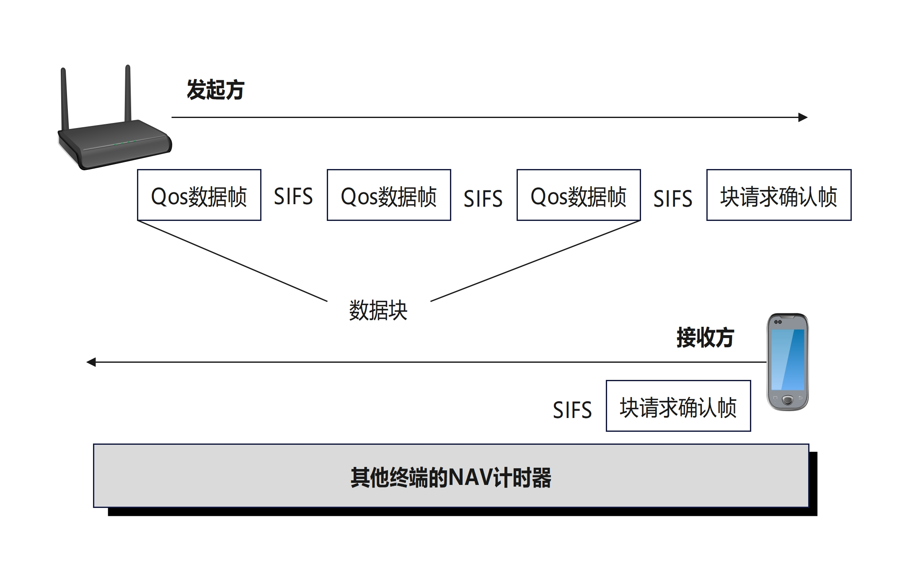
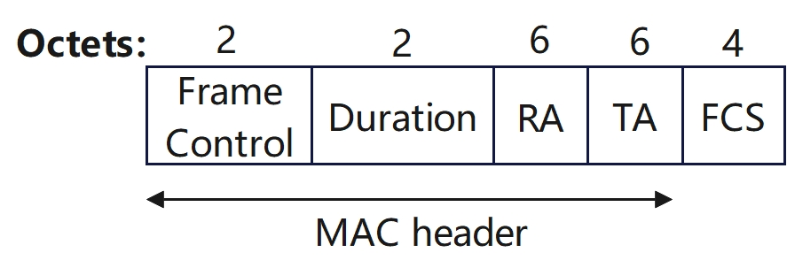
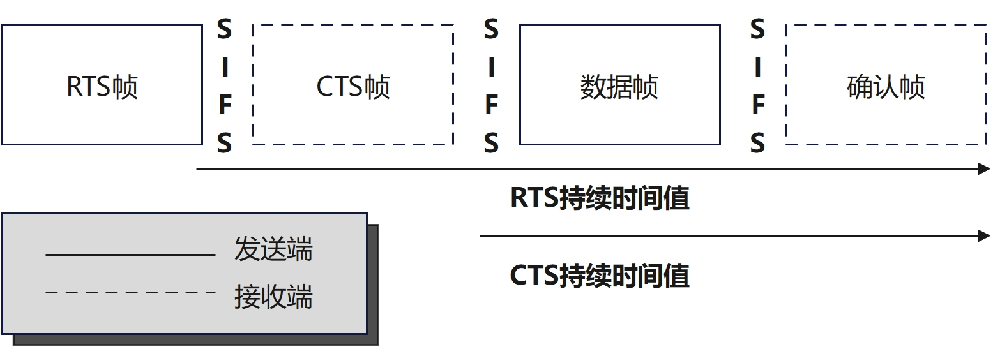
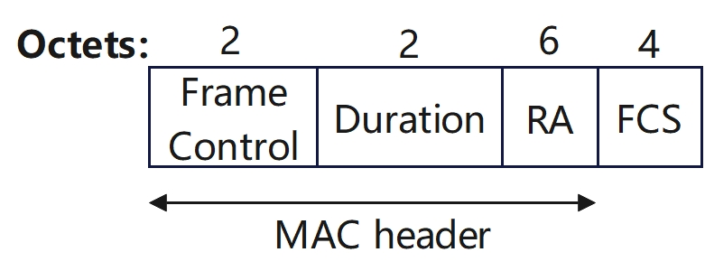

# 802.11控制帧

[TOC]

## 概述

`802.11`控制帧协助传输数据帧，以某个基本速率发送。控制帧用于清除信道、获取信道并提供单播帧确认。**控制帧仅由`MAC`帧头和帧尾构成，没有帧体**。`MAC`帧头包含的信息足以完成赋予`802.11`控制帧的任务。

`802.11`帧在帧头的类型和子类型字段共同定义了一个帧

### 类型(Type)字段

| 比特值 | 帧类型 | 作用                       |
| ------ | ------ | -------------------------- |
| `00`   | 管理帧 | 发现接入点并加入基本服务集 |
| `01`   | 控制帧 | 确认传输成功并保留无线介质 |
| `10`   | 数据帧 | 携带上层`MSDU`净荷         |
| `11`   | 扩展帧 | 一种新的、灵活的帧格式     |

### 控制帧子类型(Subtype)字段

| 比特值      | 帧类型                                            | 作用                                                         |
| ----------- | ------------------------------------------------- | ------------------------------------------------------------ |
| `0000-0011` | **保留**(`Reserved`)                              | 未使用                                                       |
| `0100`      | **波束成形报告轮询帧**(`Beamforming Report Poll`) | 在`802.11ac/ax`中，`AP`用此帧请求客户端发送其波束成形反馈(`CSI`) |
| `0101`      | **VHT NDP公告帧**(`VHT NDP Announcement`)         | 用于高吞吐量(`VHT, 802.11ac`)波束成形训练，通知即将发送`NDP`(`Null Data Packet`)以供信道探测 |
| `0110`      | **控制帧扩展帧**(`Control Frame Extension`)       | `802.11ax`引入，用于携带额外控制信息(如`HE-SIG`字段扩展)，支持`OFDMA`和`MU-MIMO`调度 |
| `0111`      | **控制封装帧**(`Control Wrapper`)                 | 用于封装其他控制信息(如在`802.11n/ac`中封装多个`BlockAckReq`等)，较少见 |
| `1000`      | **块确认请求帧**(`Block Ack Request`)             | 请求接收方对一组已接收的`MPDU`发送`Block Ack`(批量确认)，提高效率 |
| `1001`      | **块确认帧**(`Block Ack`)                         | 对接收到的一组数据帧进行批量`ACK`，减少`ACK`开销(常用于高吞吐场景) |
| `1010`      | **省电轮询帧**(`PS-Poll`)                         | (`Power Save Poll`)：处于省电模式的`STA`用此帧向`AP`请求缓存的数据帧 |
| `1011`      | **请求发送帧**(`RTS`)                             | (`Request To Send`)：用于`CSMA/CA`的握手机制，预留信道(配合`CTS`使用) |
| `1100`      | **清除发送帧**(`CTS`)                             | (`Clear To Send`)：响应`RTS`，告知其他设备信道已被占用，同时允许`RTS`发送方开始传输 |
| `1101`      | **确认帧**(`Ack`)                                 | 对单个数据帧的成功接收进行确认(最常用的控制帧之一)           |
| `1110`      | **无竞争结束帧**(`CF-End`)                        | (`Contention Free End`)：在旧式`PCF`(点协调功能)模式下，标记无竞争周期结束 |
| `1111`      | **无竞争结束 + 确认帧**(`CF-End +CF-Ack`)         | 同上，但同时确认前一个帧(仅用于`PCF`模式)                    |

## 波束成形报告轮询帧(Beamforming Report Poll)

### Beamforming Report Poll帧主体

> 笔者注：Beamforming Report Poll帧**详情见IEEE 802.11-2016文档9.3.1.21**

### Beamforming Report Poll帧结构


* **Duration字段：**按照`IEEE 802.11-2016 9.2.5`节中的规定进行设置。
* **RA字段：**设置为预期接收方的地址
* **TA字段：**设置为发送波束成形报告轮询(`Beamforming Report Poll`)帧的`STA`的地址，或一个带宽信令`TA`(传输地址)。当`VHT STA`以非`HT`格式或非`HT`重复格式发送波束成形报告轮询帧，并且加扰序列携带了`TXVECTOR`参数`CH_BANDWIDTH_IN_NON_HT`时，`TA`字段应设置为一个带宽信令`TA`

* **反馈段重传位图(Feedback Segment Retransmission Bitmap)字段：**用于指示所请求的`VHT`压缩波束成形报告中的反馈段。如果该字段中第`n`位(`n=0`表示最低有效位`LSB`，`n=7`表示最高有效位`MSB`)为`1`，则表示请求`VHT MIMO`控制字段中“剩余反馈段”(`Remaining Feedback Segments`)子字段值等于`n`的反馈段；若第`n`位为`0`，则表示不请求该反馈段

## VHT NDP公告帧(VHT NDP Announcement)

> 笔者注：VHT NDP Announcement**详情见IEEE 802.11-2016文档9.3.1.20**

`VHT NDP Announcement`属于`802.11ac`即`VHT`)引入的波束成形(`Beamforming`)机制中的关键组成部分,用途：由波束成形器(`Beamformer`，通常是`AP`)发送，用于启动信道探测与反馈流程，以便后续执行显式波束成形

### VHT NDP Announcement帧结构


`VHT NDP Announcement`帧至少包含一个`STA`信息(`STA Info`)字段。如果该`VHT NDP Announcement`帧仅包含一个`STA Info`字段，则RA字段设置为能够提供反馈的`STA`的地址；如果该帧包含多个`STA Info`字段，则`RA`字段设置为广播地址

`TA`字段设置为发送该`VHT NDP Announcement`帧的`STA`的地址，或该`STA`的带宽信令`TA`(传输地址)当`VHT STA`以非`HT`格式或非`HT`重复格式发送`VHT NDP Announcement`帧，并且加扰序列携带了`TXVECTOR`参数`CH_BANDWIDTH_IN_NON_HT`时，`TA`字段应设置为一个带宽信令`TA`

探测对话令牌(`Sounding Dialog Token`)字段中的探测对话令牌编号(`Sounding Dialog Token Number`)子字段包含一个由波束成形器(`beamformer`)选定的值，用于标识该`VHT NDP Announcement`帧

## 控制帧扩展(Control Frame Extension)

> 笔者注：Control Frame Extension**详情见IEEE 802.11-2016文档9.2.4.1**

`IEEE 802.11ax`引入了控制帧扩展(`Control Frame Extension`) 机制，作为`HE-SIG-B`字段的一部分，在同一个物理帧内携带多个用户的控制信息

控制帧扩展并不是一个独立的`MAC`帧，而是嵌入在 HE 或 EHT 物理帧(`PPDU`)中的控制信息字段，用于在 下行多用户传输(`DL MU`) 中向多个接收端(`STAs`)传递各自所需的控制指令，例如：

- 各自的`BlockAckReq`
- 各自的缓存状态请求(`Buffer Status Report Request`)
- 其他每用户粒度的控制信息

它本质上是一种 “多用户控制信息复用”机制，使得`AP`可以在一次传输中同时触发多个`STA`的响应(如`BlockAck`)，而无需逐个发送独立的控制帧

### 控制帧扩展结构

帧控制(`Frame Control`)字段的前三个子字段分别是协议版本(`Protocol Version`)、类型(`Type`)和子类型(`Subtype`)。帧控制字段中其余的子字段取决于类型和子类型子字段的取值。

当类型(`Type`)子字段的值不等于`1`，或者子类型(`Subtype`)子字段的值不等于`6`时，帧控制字段中的其余子字段包括：`To DS`、`From DS`、`More Fragments`(更多分片)、`Retry`(重传)、`Power Management`(省电管理)、`More Data`(更多数据)、`Protected Frame`(受保护帧)以及`+HTC/Order`。在此情况下，帧控制字段的格式如图所示


当类型(`Type`)子字段的值等于`1`且子类型(`Subtype`)子字段的值等于`6`时，帧控制(`Frame Control`)字段中的其余子字段如下：控制帧扩展(`Control Frame Extension`)、省电管理(`Power Management`)、更多数据(`More Data`)、受保护帧(`Protected Frame`)以及`+HTC/Order`。在此情况下，帧控制字段的格式如图所示


**Control Frame Extension字段的具体含义见下表**

| Control Frame Extension value B11 B10 B9 B8 | Description    |
| ------------------------------------------- | -------------- |
| `0000`                                      | `Reserved`     |
| `0001`                                      | `Reserved`     |
| `0010`                                      | `Poll`         |
| `0011`                                      | `SPR`          |
| `0100`                                      | `Grant`        |
| `0101`                                      | `DMG CTS`      |
| `0110`                                      | `DMG DTS`      |
| `0111`                                      | `Grant Ack`    |
| `1000`                                      | `SSW`          |
| `1001`                                      | `SSW-Feedback` |
| `1010`                                      | `SSW-Ack`      |
| `1011-1111`                                 | `Reserved`     |

## 块确认请求帧(Block Ack Request)

> 笔者注：Block Ack Request帧**详情见IEEE 802.11-2016文档9.3.1.8**

`Block Acknowledgment Request`(`BlockAckReq`) 帧是用于请求对一组已发送的`MPDU`进行批量确认的一种控制帧。它是在支持`Block Ack`机制的高吞吐量(`HT`)或甚高吞吐量(`VHT`)等`802.11n/802.11ac/802.11ax`等协议中引入的重要机制，用于提升效率、减少`ACK`开销

### Block Ack Request帧结构


* **Duration字段的值：**按照`IEEE 802.11-2016 9.2.5`节中的规定进行设置
* **BlockAckReq帧的RA字段：**为接收该帧的`STA`的地址
  `BlockAckReq`帧的`TA`字段：为发送`BlockAckReq`帧的STA的地址，或一个带宽信令`TA`(传输地址)。当`VHT STA`以非`HT`格式或非`HT`重复格式发送`BlockAckReq`帧，并且加扰序列携带了`TXVECTOR`参数`CH_BANDWIDTH_IN_NON_HT`时，`TA`字段的值即为一个带宽信令`TA`
* **BAR：**即`Block Acknowledgment Request`，块确认请求
* **FCS：**帧尾

### Block Ack Request帧的作用

1. **批量确认请求**：发送方在连续发送多个数据帧(`MPDUs`)后，不为每个帧单独等待`ACK`，而是发送一个`BlockAckReq`帧，请求接收方用一个`BlockAck`帧一次性确认多个帧的接收状态
2. **提高信道利用率**：避免了逐帧`ACK`的开销，尤其在高吞吐场景下显著提升效率
3. **支持重传机制**：接收方在`BlockAck`中会指明哪些帧成功接收、哪些未收到，发送方可据此重传失败帧

## 块确认帧(Block Ack)

> 笔者注：Block Ack帧**详情见《无线权威指南第五版》9.10.2或IEEE 802.11-2016文档6.3.29**

`802.11e`修正案定义了块确认机制，这种机制将多个确认帧聚合为一个确认帧以提高信道利用率。块确认机制包括以下两类

* 即时块确认(`immediate BA`):适用于延迟容忍度较低的流量

* 延迟块确认(`delayed BA)`:适用于延迟容忍度较高的流量


### Block Ack帧作用

发起方终端向接收方终端发送一个`QoS`数据帧块，并通过块确认请求帧请求确认所有`QoS`数据帧。有别于单独确认每个单播帧，一个块确认帧可以确认整个`QoS`数据帧块。块确认帧中的位图(`Bitmap`)字段用于标识所有接收数据帧的状态。如果只有一个数据帧损坏，那么只需要重传该帧。使用块确认帧而非传统的确认帧有助于减少介质争用开销，从而提高效率

如图所示，块确认机制最初定义为与“帧突发”一起使用，但目前更常用于`A-MPDU`帧聚合



## 省电轮询帧(PS-Poll)

> 笔者注：PS-Poll帧**详情见《无线权威指南第五版》9.10.3或IEEE 802.11-2016文档9.3.1.5**

`Power Save Poll`是专门用于支持处于省电模式的站点（`STA`，如手机、笔记本等）从接入点（`AP`）获取缓存的数据。采用遗留电源管理机制的客户端通过节电轮询帧请求接入点发送缓冲流量。在节电轮询帧中，`持续时间/ID`字段作为`AID`值；换言之，客户端向接入点标识自己并请求缓冲的单播帧。这种情况下，`持续时间/ID`字段仅充当标识符，不用于持续时间或重置`NAV`计时器。请注意，仅有节电轮询帧使用`持续时间/ID`字段作为`AID`

### PS-Poll帧结构


`BSSID`是`AP`中所包含的`STA`的地址。`TA`字段的值是发送该帧的`STA`的地址，或者是一个带宽信令`TA`（`Bandwidth Signaling TA`）。当`VHT STA`以非`HT`格式或非`HT`重复格式发送`PS-Poll`帧，并且加扰序列携带了`TXVECTOR`参数`CH_BANDWIDTH_IN_NON_HT`时，`TA`字段的值即为带宽信令`TA`。`ID`字段包含`AP`在建立该`STA`当前关联的（重）关联响应帧中分配给该`STA`的`AID`值，且其两个最高有效位（`MSB`）被置为`1`

## 请求发送帧(RTS) & 清除发送帧(CTS)

> 笔者注：RTS帧 & CTS帧**详情见《无线权威指南第五版》 9.10.4或IEEE 802.11-2016文档9.3.1.2 & 9.3.1.3**

**RTS**（`Request to Send`）和 **CTS**（`Clear to Send`）是一对用于解决隐藏节点问题并减少冲突的控制帧。它们共同构成了 `RTS/CTS` 握手机制，是 `CSMA/CA`（载波侦听多路访问/冲突避免）协议的重要补充

### 核心作用

1. **解决隐藏节点问题**

- **场景**：
  - `STA A` 和 `STA C` 都连接到同一个 `AP`
  - `A` 能“看到”`AP`，`C` 也能“看到”`AP`，但 **A 和 C 彼此无法互相侦听到对方**（例如被墙隔开）
  - 如果 `A` 和 `C` 同时向 `AP` 发送数据，会在 `AP` 处发生碰撞，导致传输失败
- **RTS/CTS 如何解决**？
  1. `A` 想发数据 → 先发 `RTS` 给 `AP`
  2. `AP` 收到 `RTS` → 回复 `CTS`
  3. `CTS` 帧被 `A` 和 `C` 都能收到（因为 `AP` 功率通常更强、位置居中）
  4. `C` 听到 `CTS` 后，知道`AP` 即将接收 `A` 的数据，于是主动退避，暂停发送
  5. `A` 安全地发送数据，避免碰撞

2. **减少长帧传输冲突的代价**

   - 如果直接发送一个很长的数据帧（如视频包），一旦冲突，浪费大量时间和带宽

   - 使用短小的 `RTS/CTS`（通常几十字节）先“探路”，即使冲突，损失也小

   - 只有 `RTS/CTS` 成功交换后，才发送长数据帧

### RTS帧结构



**RA 字段：**是无线介质（`WM`）上预期直接接收待发送的单播数据帧、管理帧或控制帧的 `STA` 的地址

**TA 字段：**是发送 `RTS` 帧的 `STA` 的地址，或者是该 `STA` 的带宽信令 `TA`（`Bandwidth Signaling TA`）。当 `VHT STA` 以非 `HT` 格式或非 `HT` 重复格式发送`RTS` 帧，且加扰序列携带了 `TXVECTOR` 参数 `CH_BANDWIDTH_IN_NON_HT` 和 `DYN_BANDWIDTH_IN_NON_HT`时，`TA` 字段即为带宽信令 `TA`



**Duration字段：**对于所有由非 `QoS STA` 发送的 `RTS` 帧，`Duration` 字段的值（单位为微秒）等于**发送待处理的数据帧或管理帧所需的时间，加上一个 `CTS` 帧、一个 `ACK` 帧以及三个 `SIFS` 的时间总和**。如果计算出的持续时间包含小数微秒，则向上取整为下一个整数

### CTS帧结构



**RA字段：**当 `CTS` 帧是对 `RTS` 帧的响应时，`CTS` 帧中 `RA` 字段的值被设为 `RTS` 帧 `TA` 字段中的地址，并强制将 `Individual/Group` 位设为 `0`。当 `CTS` 帧是帧交换序列中的第一个帧时，`RA` 字段被设为发送方的 `MAC` 地址

**Duration字段：**对于所有由非 `QoS STA` 发送、用于响应 `RTS` 帧的 `CTS` 帧，其 `Duration` 字段的值等于前一个 `RTS` 帧 `Duration` 字段中的值，减去发送该 `CTS` 帧及其 `SIFS` 所需的时间（单位为微秒）。如果计算出的持续时间包含小数微秒，则向上取整为下一个整数

在非 `QoS STA` 中，如果 `CTS` 帧是帧交换序列中的第一个帧，且待发送的数据帧或管理帧需要确认（`ACK`），则 `Duration` 字段的值等于发送该待处理数据帧或管理帧所需的时间，加上两个 `SIFS` 和一个 `ACK` 帧的时间（单位为微秒）
 在非 `QoS STA` 中，如果 `CTS` 帧是帧交换序列中的第一个帧，且待发送的数据帧或管理帧不需要确认，则 `Duration` 字段的值等于发送该待处理数据帧或管理帧所需的时间，加上一个 `SIFS`（单位为微秒）。
如果计算出的持续时间包含小数微秒，则向上取整为下一个整数

## 确认帧(Ack)

> 笔者注：Ack帧**详情见《无线权威指南第五版》 9.10.1或IEEE 802.11-2016文档9.3.1.4**

由于`802.11`通信使用的无线介质无法确保数据传输成功，发送端只能依靠接收端的通知来判断传输的帧是否已正确接收。这种通知使用确认帧

### ACK帧格式

如图所示，确认帧是一种由`14`字节构成的简单帧格式


收到单播帧后，接收端将等待一段很短的时间(`SIFS`)。接收端复制数据帧包含的发送端`MAC`地址，并写入确认帧的接收机地址(`RA`)字段。如果一切顺利，在发送端收到的确认帧中，接收机地址字段(`RA`)包含其`MAC`地址，发送端借此获知接收端已收到单播帧且没有损坏

所有单播帧传输必须经过验证，否则发送端必须重传该帧。所有单播帧必须后跟确认帧。如果单播帧由于任何原因损坏，将无法通过`32`位循环冗余校验(即帧校验序列),导致接收端不会发送确认帧。如果单播帧没有经过确认，发送端将重传该帧。除个别情况外，广播帧和多播帧不需要确认

## 无竞争结束帧(CF-End)(已废弃)

> 笔者注：**CF-End帧已废弃，详情见IEEE 802.11-2016文档9.3.1.6**

早期的`802.11`标准（如`802.11-1999`和`802.11b`）定义了两种`MAC`访问模式：

1. **分布式协调功能**（`DCF`）
   - 基于`CSMA/CA`，所有站点竞争信道（即“有竞争”）
   - 是`Wi-Fi`最常用的工作方式
2. **点协调功能**（`PCF`）(已废弃)
   - 由`AP`充当点协调器（`Point Coordinator, PC`），在特定时间段内**轮询站点**，避免竞争
   - 这个时间段称为 **无竞争周期**（`CFP`）
   - `CFP`出现在信标间隔（`Beacon Interval`）的开始部分，后面跟着 DCF 的竞争周期（`CP`）

### CF-End的作用

1. **提前终止无竞争周期**

   - 正常情况下，`CFP`持续到信标帧中指定的`CFP Max Duration`

   - 但如果`AP`在完成所有轮询后还有剩余时间，它会发送`CF-End`帧**，**立即释放信道，让其他站点可以提前进入竞争模式（`DCF`），提高信道利用率

2. **防止信道空闲浪费**

   - 若没有`CF-End`，即使`CFP`中无数据传输，其他站点也必须等到`CFP`结束才能竞争信道

   - `CF-End`允许 动态结束`CFP`，提升效率

### CF-End帧的结构


当由非`DMG STA`发送时，`Duration`字段被设为`0`。当由`DMG STA`发送时，Duration 字段被设为完成其所参与的`CF-End`截断序列所需的时间：

```shell
Duration = (i – 1) × (TXTIME(CF-End) + SIFS)
```


 其中`i`的取值范围为`1`到`3`，表示该`CF-End`帧在反向截断序列中的顺序（即`i=1`对应序列中的最后一个`CF-End`帧）

当由非`DMG STA`发送时，`RA`字段为广播组地址。当由`DMG STA`发送时，RA 字段为预期直接接收该单播数据帧或管理帧的`STA`的`MAC`地址，或者为广播组地址

当由非`DMG STA`发送时，`BSSID`（`TA`）字段为`AP`中所包含的`STA`地址，但有一个例外：当`VHT STA`以非`HT`格式或非 HT 重复格式向`VHT AP`发送`CF-End`帧时，`BSSID`（`TA`）字段的`Individual/Group`位被置为`1`，以表明加扰序列携带了`TXVECTOR`参数`CH_BANDWIDTH_IN_NON_HT`。当由`DMG STA`发送时，`TA`字段为发送该帧的`STA`的`MAC`地址

## 无竞争结束 + 确认帧(CF-End+CF-Ack)(已废弃)

> 笔者注：**CF-End+CF-Ack帧已废弃，详情见IEEE 802.11-2016文档9.3.1.7**

`CF-End + CF-Ack`是一种复合控制帧，在无竞争周期（`CFP`）结束时，既确认上一个来自`STA`的数据帧，又通知所有站点`CFP`已终止

### CF-End帧和CF-End + CF-Ack帧的区别

`CF-End + CF-Ack`帧是`CF-End`帧的一种变体，它在结束`CFP`的同时，确认上一个接收到的数据帧（类似`ACK`），在 CFP 最后一次传输后，既结束周期又完成确认，减少帧交换次数

### CF-End + CF-Ack帧结构


`BSSID`字段是`AP`中所包含的`STA`的地址。`RA`字段为广播组地址。`Duration`字段被设为`0`

## 参考文档

> 《无线局域网权威指南 第五版》
>
> [80211-2016规范](https://github.com/Garfield-1/Books/blob/master/11_802.11协议规范/80211-2016.pdf)