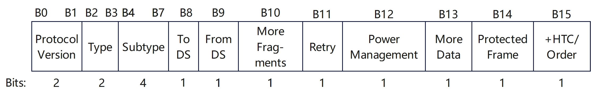
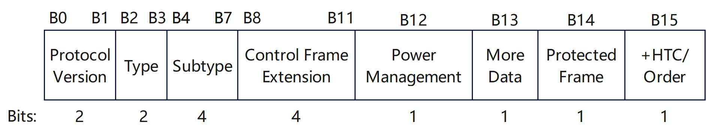

# 802.11控制帧

[TOC]

## 概述

`802.11`控制帧协助传输数据帧，以某个基本速率发送。控制帧用于清除信道、获取信道并提供单播帧确认。控制帧仅由`MAC`帧头和帧尾构成，没有帧体。`MAC`帧头包含的信息足以完成赋予`802.11`控制帧的任务。

`802.11`帧在帧头的类型和子类型字段共同定义了一个帧

### 类型(Type)字段

| 比特值 | 帧类型 | 作用                       |
| ------ | ------ | -------------------------- |
| `00`   | 管理帧 | 发现接入点并加入基本服务集 |
| `01`   | 控制帧 | 确认传输成功并保留无线介质 |
| `10`   | 数据帧 | 携带上层`MSDU`净荷         |
| `11`   | 扩展帧 | 一种新的、灵活的帧格式     |

### 控制帧子类型(Subtype)字段

| 比特值      | 帧类型                                            | 作用                                                         |
| ----------- | ------------------------------------------------- | ------------------------------------------------------------ |
| `0000-0011` | **保留**(`Reserved`)                              | 未使用                                                       |
| `0100`      | **波束成形报告轮询帧**(`Beamforming Report Poll`) | 在`802.11ac/ax`中，`AP`用此帧请求客户端发送其波束成形反馈(`CSI`) |
| `0101`      | **VHT零数据包公告帧**(`VHT NDP Announcement`)     | 用于高吞吐量(`VHT, 802.11ac`)波束成形训练，通知即将发送`NDP`(`Null Data Packet`)以供信道探测 |
| `0110`      | **控制帧扩展帧**(`Control Frame Extension`)       | `802.11ax`引入，用于携带额外控制信息(如`HE-SIG`字段扩展)，支持`OFDMA`和`MU-MIMO`调度 |
| `0111`      | **控制封装帧**(`Control Wrapper`)                 | 用于封装其他控制信息(如在`802.11n/ac`中封装多个`BlockAckReq`等)，较少见 |
| `1000`      | **块确认请求帧**(`Block Ack Request`)             | 请求接收方对一组已接收的`MPDU`发送`Block Ack`(批量确认)，提高效率 |
| `1001`      | **块确认帧**(`Block Ack`)                         | 对接收到的一组数据帧进行批量`ACK`，减少`ACK`开销(常用于高吞吐场景) |
| `1010`      | **省电轮询帧**(`PS-Po11`)                         | (`Power Save Poll`)：处于省电模式的`STA`用此帧向`AP`请求缓存的数据帧 |
| `1011`      | **请求发送帧**(`RTS`)                             | (`Request To Send`)：用于`CSMA/CA`的握手机制，预留信道(配合`CTS`使用) |
| `1100`      | **清除发送帧**(`CTS`)                             | (`Clear To Send`)：响应`RTS`，告知其他设备信道已被占用，同时允许`RTS`发送方开始传输 |
| `1101`      | **确认帧**(`Ack`)                                 | 对单个数据帧的成功接收进行确认(最常用的控制帧之一)           |
| `1110`      | **无竞争结束帧**(`CF-End`)                        | (`Contention Free End`)：在旧式`PCF`(点协调功能)模式下，标记无竞争周期结束 |
| `1111`      | **无竞争结束 + 确认帧**(`CF-End +CF-Ack`)         | 同上，但同时确认前一个帧(仅用于`PCF`模式)                    |

## 波束成形报告轮询帧(Beamforming Report Poll)

### Beamforming Report Poll帧主体

> 笔者注：Beamforming Report Poll帧**详情见IEEE 802.11-2016文档9.3.1.21**

### Beamforming Report Poll帧结构

* **Duration字段：**按照`IEEE 802.11-2016 9.2.5`节中的规定进行设置。
* **RA字段：**设置为预期接收方的地址
* **TA字段：**设置为发送波束成形报告轮询(`Beamforming Report Poll`)帧的`STA`的地址，或一个带宽信令`TA`(传输地址)。当`VHT STA`以非`HT`格式或非`HT`重复格式发送波束成形报告轮询帧，并且加扰序列携带了`TXVECTOR`参数`CH_BANDWIDTH_IN_NON_HT`时，`TA`字段应设置为一个带宽信令`TA`

* **反馈段重传位图(Feedback Segment Retransmission Bitmap)字段：**用于指示所请求的`VHT`压缩波束成形报告中的反馈段。如果该字段中第`n`位(`n=0`表示最低有效位`LSB`，`n=7`表示最高有效位`MSB`)为`1`，则表示请求`VHT MIMO`控制字段中“剩余反馈段”(`Remaining Feedback Segments`)子字段值等于`n`的反馈段；若第`n`位为`0`，则表示不请求该反馈段

## VHT零数据包公告帧(VHT NDP Announcement)

## 控制帧扩展(Control Frame Extension)

> 笔者注：Control Frame Extension**详情见IEEE 802.11-2016文档9.2.4.1**

**IEEE 802.11ax 引入了 **控制帧扩展（Control Frame Extension） 机制，作为 **HE-SIG-B** 字段的一部分，在同一个物理帧内携带多个用户的控制信息

控制帧扩展并不是一个独立的 `MAC` 帧，而是 **嵌入在 HE 或 EHT 物理帧（PPDU）中的控制信息字段**，用于在 **下行多用户传输（DL MU）** 中向多个接收端（`STAs`）传递各自所需的控制指令，例如：

- 各自的 **BlockAckReq**
- 各自的 **缓存状态请求（Buffer Status Report Request）**
- 其他每用户粒度的控制信息

它本质上是一种 **“多用户控制信息复用”机制**，使得 `AP` 可以在一次传输中同时触发多个 `STA` 的响应（如 `BlockAck`），而无需逐个发送独立的控制帧

### 控制帧扩展结构

帧控制（`Frame Control`）字段的前三个子字段分别是协议版本（`Protocol Version`）、类型（`Type`）和子类型（`Subtype`）。帧控制字段中其余的子字段取决于类型和子类型子字段的取值。

当类型（`Type`）子字段的值不等于 `1`，或者子类型（`Subtype`）子字段的值不等于 `6` 时，帧控制字段中的其余子字段包括：`To DS`、`From DS`、`More Fragments`（更多分片）、`Retry`（重传）、`Power Management`（省电管理）、`More Data`（更多数据）、`Protected Frame`（受保护帧）以及 `+HTC/Order`。在此情况下，帧控制字段的格式如图所示

当类型（`Type`）子字段的值等于 `1` 且子类型（`Subtype`）子字段的值等于 `6` 时，帧控制（`Frame Control`）字段中的其余子字段如下：控制帧扩展（`Control Frame Extension`）、省电管理（`Power Management`）、更多数据（`More Data`）、受保护帧（`Protected Frame`）以及 `+HTC/Order`。在此情况下，帧控制字段的格式如图所示

**Control Frame Extension字段的具体含义见下表**

| Control Frame Extension value B11 B10 B9 B8 | Description    |
| ------------------------------------------- | -------------- |
| `0000`                                      | `Reserved`     |
| `0001`                                      | `Reserved`     |
| `0010`                                      | `Poll`         |
| `0011`                                      | `SPR`          |
| `0100`                                      | `Grant`        |
| `0101`                                      | `DMG  CTS`     |
| `0110`                                      | `DMG  DTS`     |
| `0111`                                      | `Grant Ack`    |
| `1000`                                      | `SSW`          |
| `1001`                                      | `SSW-Feedback` |
| `1010`                                      | `SSW-Ack`      |
| `1011-1111`                                 | `Reserved`     |

## 块确认请求帧(Block Ack Request)

> 笔者注：Block Ack Request帧**详情见IEEE 802.11-2016文档9.3.1.8**

`Block Acknowledgment Request`(`BlockAckReq`) 帧是用于请求对一组已发送的`MPDU`进行批量确认的一种控制帧。它是在支持`Block Ack`机制的高吞吐量(`HT`)或甚高吞吐量(`VHT`)等`802.11n/802.11ac/802.11ax`等协议中引入的重要机制，用于提升效率、减少`ACK`开销

### Block Ack Request帧结构

* **Duration字段的值**：按照`IEEE 802.11-2016 9.2.5`节中的规定进行设置
* **BlockAckReq帧的RA字段**：为接收该帧的`STA`的地址
  `BlockAckReq`帧的`TA`字段：为发送`BlockAckReq`帧的STA的地址，或一个带宽信令`TA`(传输地址)。当`VHT STA`以非`HT`格式或非`HT`重复格式发送`BlockAckReq`帧，并且加扰序列携带了`TXVECTOR`参数`CH_BANDWIDTH_IN_NON_HT`时，`TA`字段的值即为一个带宽信令`TA`
* **BAR**：即`Block Acknowledgment Request`，块确认请求
* **FCS**：帧尾

### Block Ack Request帧的作用

1. **批量确认请求**：发送方在连续发送多个数据帧(`MPDUs`)后，不为每个帧单独等待`ACK`，而是发送一个`BlockAckReq`帧，请求接收方用一个`BlockAck`帧一次性确认多个帧的接收状态
2. **提高信道利用率**：避免了逐帧`ACK`的开销，尤其在高吞吐场景下显著提升效率
3. **支持重传机制**：接收方在`BlockAck`中会指明哪些帧成功接收、哪些未收到，发送方可据此重传失败帧

## 块确认帧(Block Ack)

> 笔者注：Block Ack Request帧**详情见《无线权威指南第五版》9.10.2或IEEE 802.11-2016文档6.3.29**

`802.11e`修正案定义了块确认机制，这种机制将多个确认帧聚合为一个确认帧以提高信道利用率。块确认机制包括以下两类

* 即时块确认(`immediate BA`):适用于延迟容忍度较低的流量

* 延迟块确认(`delayed BA)`:适用于延迟容忍度较高的流量

### Block Ack帧作用

发起方终端向接收方终端发送一个`QoS`数据帧块，并通过块确认请求帧请求确认所有`QoS`数据帧。有别于单独确认每个单播帧，一个块确认帧可以确认整个`QoS`数据帧块。块确认帧中的位图(`Bitmap`)字段用于标识所有接收数据帧的状态。如果只有一个数据帧损坏，那么只需要重传该帧。使用块确认帧而非传统的确认帧有助于减少介质争用开销，从而提高效率

如图所示，块确认机制最初定义为与“帧突发”一起使用，但目前更常用于`A-MPDU`帧聚合

## 省电轮询帧(PS-Po11)

## 请求发送帧(RTS)

## 清除发送帧(CTS)

## 确认帧(Ack)

> 笔者注：Ack帧**详情见《无线权威指南第五版》 9.10.1或IEEE 802.11-2016文档9.3.1.4**

由于`802.11`通信使用的无线介质无法确保数据传输成功，发送端只能依靠接收端的通知来判断传输的帧是否已正确接收。这种通知使用确认帧

### ACK帧格式

如图所示，确认帧是一种由`14`字节构成的简单帧格式

收到单播帧后，接收端将等待一段很短的时间(`SIFS`)。接收端复制数据帧包含的发送端`MAC`地址，并写入确认帧的接收机地址(`RA`)字段。如果一切顺利，在发送端收到的确认帧中，接收机地址字段(`RA`)包含其`MAC`地址，发送端借此获知接收端已收到单播帧且没有损坏

所有单播帧传输必须经过验证，否则发送端必须重传该帧。所有单播帧必须后跟确认帧。如果单播帧由于任何原因损坏，将无法通过`32`位循环冗余校验(即帧校验序列),导致接收端不会发送确认帧。如果单播帧没有经过确认，发送端将重传该帧。除个别情况外，广播帧和多播帧不需要确认

## 无竞争结束帧(CF-End)

## 无竞争结束 + 确认帧(CF-End +CF-Ack)

## 参考文档

> 《无线局域网权威指南 第五版》
>
> [80211-2016规范](https://github.com/Garfield-1/Books/blob/master/11_802.11协议规范/80211-2016.pdf)