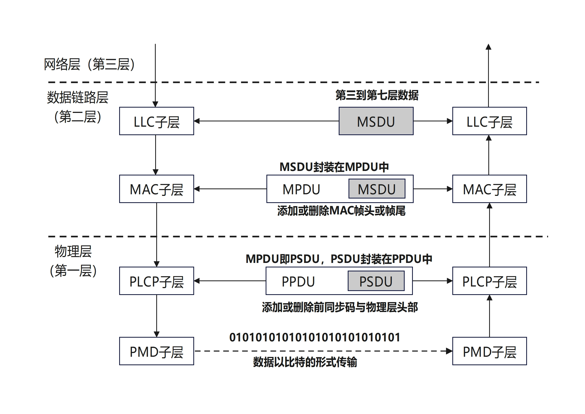

# OSI数据模型分层

> 参考文档：《无线局域网权威指南 第五版》

## 数据链路层分层

数据链路层分为两个子层，上层是`802.2`逻辑链路控制(`LLC`)子层，下层是介质访问控制(`MAC`)子层。所有`802`网络具有相同的`LLC`子层结构，但并非所有`802`网络都使用`LLC`子层，`802.11`标准定义的无线局域网通信位于`MAC`子层

### MAC服务数据单元

网络层（第三层）将数据发送给数据链路层（第二层），数据在传递给`LLC`子层后成为`MAC`服务数据单元（`MSDU`）。`MSDU`由`LLC`子层已经第三到第七层信息构成，可以简单定义为包含`IP`包与部分`LLC`数据的数据净荷。本章将讨论`3`种主要的`802.11`帧类型。`802.11`管理帧和控制帧不携带上层信息，只有`802.11`数据帧体携带`MSDU`净荷。`IEEE 802.11-2016`标准规定，`MSDU`的最大长度为`2304`字节，而帧提的最大长度由`MSDU`的最大长度（`2304`字节）以及加密产生的最大开销决定

`2009`年获批的`802.11n`修正案引入了聚合`MAC`服务数据单元（`A-MSDU`）的概念。使用`A-MSDU`时，帧体的最大长度由`A-MSDU`的最大长度已经加密产生的开销决定

### MAC协议数据单元

`LLC`子层向`MAC`子层发送`MSDU`时，将添加`MAC`帧头信息以便识别。封装后的`MSDU`称为`MAC`协议数据单元（`MPDU`），它其实就是`802.11`帧。如图所示，`802.11 MPDU`主要由以下三部分构成

* **MAC帧头**

    帧控制、持续事件、`MAC`寻址、序列控制、`QoS`控制、`HT`控制等信息均位于`MAC`帧头

* **帧体**

    帧体的大小有所不同，包含的信息也会因为帧类型及其子类型的不同而不同。`MSDU`净荷（第三到第七层信息）封装在帧体中，可以进行加密以保护其安全

* **帧校验序列**

    帧校验序列（`FCS`）包括32`位`循环冗余校验（`CRC`），用于验证接收帧的完整性
    
    

将数据封装成这样的帧之后，就可以传递给物理层，物理层将为帧传输做进一步准备

## 物理层

和数据链路层相似，物理层也分为两个子层。上层称为物理会聚过程（`PLCP`）子层，下层称为物理介质相关（`PMD`）子层。`MAC`子层向`PLCP`子层发送帧。`PLCP`子层创建`PLCP`协议数据单元（`PPDU`）以便传输，`PMD`子层随后调试数据并以比特的形式发送出去

### PLCP服务数据单元

`PLCP`服务数据单元（`PSDU`）是物理层对`MPDU`的称谓，换言之`MAC`子层将帧称为`MPDU`，而物理层将同样的帧称为`PSDU`，唯一的区别在于从`OSI`模型的哪一层来观察帧

### PLCP协议数据单元

收到`PSDU`后，`PLCP`子层创建`PLCP`协议数据单元（`PPDU`）以便传输。`PLCP`子层向`PSDU`添加前同步码和物理层头部，发送端和接收端`802.11`无线接口利用前同步码进行同步

上层信息在数据链路层与物理层之间传递如图所示

