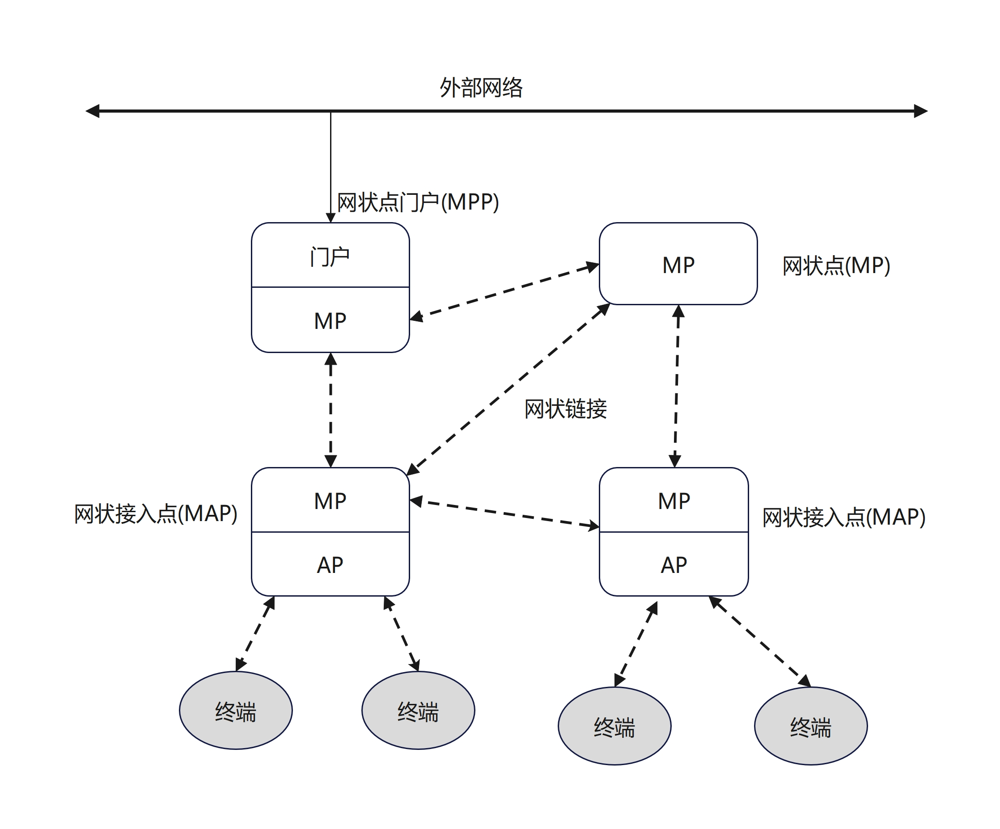

# IEEE 802.11标准与修正案

> 参考文档《无线局域网权威指南 第五版》

## 标准的制定

`IEEE`是一个负责制定和维护通信标准的专业协会，成立了多个工作组。`802.3`工作组负责制定线网络使用以太网标准，`802.15`工作组负责制定射频（如蓝牙）传输信息的个人局域网通信标准，`802.16`工作组负责制定宽带无线接入标准，`802.11`工作组负责制定射频传输信息的局域网通信

`802.11`工作组由常设委员会、研究组以及大量任务组构成，每个`802.11`任务组负责更正和修订`MAC`任务组与`PHY`任务组制定的原始标准。每个任务组通过字母表中的一个字母来标识名称

## 802.11a-1999

`802.11a`任务组的工程师们采用称为正交频分复用（`OFDM`）的射频技术，定义了`5GHZ`频率的无线局域网通信。在`5GHZ`频段内，`802.11a`无线接口可以使用`3`个不同的`100MHZ`非授权频段传输信息，三者称为非授权国家信息基础设施频段。最初的`3`个`U-NII`频段包括`12`条可用信道。但可供`802.11a`无线接口使用的`5GHz`频段和信道取决于各国射频监管机构的规定。`802.11a`修正案主要是引入了`OFDM`技术，这项技术能提高数据速率

`802.11`标准将工作在`5GHz U-NII`频段的`802.11a`无线接口归为条款`17`设备。根据`802.11a`修正案的定义，这些设备必须支持`6`、`12`、`24Mbps`三种数据速率，最高数据速率为`54Mbps`。通过使用`OFDM`技术，`802.11a`无线接口可以支持`6`、`9`、`12`、`18`、`24`、`36`、`48`、`54Mbps`等数据速率。

`802.11a`无线接口无法与`802.11 FHSS/DSSS`、`802.11b`或`802.11g`无线接口相互通信，原因有两个，首先`802.11a`设备采用的射频技术与`802.11 FHSS/DSSS`或`802.11b`设备有所不同。其次，`802.11a`设备使用`5GHz U-NII`频段传输信息，而`802.11 FHSS/DSSS`、`802.11b`与`802.11g`设备使用`2.4GHz ISM`频段传输信息，但是因为这些设备工作频段不同，所以它们可以共存与同一物理空间而不会互相干扰

## 802.11b-1999

`1999`年，`802.11b`任务组发布`802.11b`修正案，后修订并更正为`IEEE Std 802.11b-1999/Corl-2001`

`802.11b`修正案定义的物理层介质时`HR-DSSS`，`802.11b`无线接口使用无需授权的`2.4GHz ISM`频段（`2.4GHz~2.4835GHz`）传输数据

`802.11b`任务组主要研究如何在`2.4GHz ISM`频段获得更高的数据速率。为了实现这个目标，`802.11b`无线接口采用补码键控（`CCK`）作为扩频和编码技术，并辅以使用射频信号相位特性的调制方法。`802.11b`设备采用称为巴克码的扩频技术，支持`1`、`2`、`5.5`、`11 Mbps`四种数据速率，并向后兼容数据速率为`1 Mbps`和`2 Mbps`的`802.11 DSSS`系统。`5.5 Mbps`和`11 Mbps`这两种数据速率又称为`HR-DSSS`。由于不同的扩频技术之间无法互通，因此`802.11b`无线接口不能向后兼容`802.11 FHSS`无线接口。此外`IEEE 802.11-2016`标准删除了分组二进制卷积编码（`PBCC`）这一可选技术

## 802.11d-2001

`802.11`原始标准是为了符合美国、加拿大、日本和欧洲的监管规定而制定的标准，但其他国家也可能对允许使用的频率和发射功率做出不同的限制。因此，`802.11d`修正案增加了必要的要求和定义，以便`802.11`设备能在原始标准没有涉及的地区使用。

名为信标帧（`beacon frame`）和探询响应帧（`probe response frame`）的字段中包含国家代码信息，`802.11d`兼容设备利用该信息确保符合特定国家的频率和功率规定

## 802.11e-2005

`802.11`原始标准并没有为使用`Wi-Fi`语言等时敏应用定义合乎要求的服务质量规程。`Wi-Fi`语言又称无线局域网语言（`VoWLAN`）不过大多数供应商与`CWNP`项目都使用`WI-FI`语言一词，语言、音频、视频等应用流量要求较低的延迟和抖动，其传输优先级高于标准的数据应用流量。`802.11e`修正案定义了二层`MAC`机制，以满足无线局域网对时敏应用的`QoS`要求

为满足`QoS`要求，`802.11e`修正案定义了经过改进的介质访问方法。

## 802.11g-2003

`802.11g`无线接口采用称为扩展速率物理层(`ERP`)的新技术，并且仍然可以使用`2.4 GHz ISM`频段(`2.4GHz~2.4835GHz`)传输数据。`IEEE802.11-2016`标准的条款`18`描述了`802.11g`获批修正案的全部内容。
`802.11g`任务组(`TGg`)致力于研究如何通过改进`802.11b`物理层来获得更大的带宽，同时保持与`802.11 MAC`子层的兼容性。`802.11g`修正案分别定义了两种强制的和两种可选的物理层。两种强制的物理层是`ERP-OFDM`与`ERP-DSSS/CCK`。为获得更高的数据速率，设备必须支持称为扩展速率物理层-正交频分复用(`ERP-OFDM`)的物理层技术，这种技术支持`6`、`9`、`12`、`18`、`24`、`36`、`48`、`54 Mbps`等多种数据速率。不过与`802.11a`修正案类似，`IEEE`仅要求设备必须支持`6`、`12`、`24 Mbps`三种数据速率。为向后兼容`802.11 DSSS`与`802.11b`网络，设备必须支持称为扩展速率物理层-直接序列扩频/补码键控(`ERP-DSSS/CCK`)的物理层技术，这种技术支持`1`、`2`、`5.5`、`11 Mbps`等数据速率

## 802.11h-2003

制定`802.11h`修正案的初衷是为了满足欧洲对于`5 GHz`频段通信的监管要求，以及检测和避免对`5 GHz`卫星和雷达系统的干扰。同样的监管要求已被美国联邦通信委员会采用。`DFS`和`TPC`旨在提供避免`5 GHz`无线局域网通信对`5 GHz`雷达和卫星通信造成干扰的服务。

修正案定义了动态频率选择(`DFS`)和发射功率控制(`TPC`)机制和一个新的频段供`802.11`无线接口传输信息使用。这就是`U-NII-2`扩展(`UNII-2 Extended`)频段，该频段在某些监管域增加了`11`条信道。所有`U-NII`频段均采用`OFDM`技术，`802.11 h`修正案实际上属于`802.11 a`修正案的延伸。`IEEE`负责定义`DFS`和`TPC`的雷达探测与回避技术，但各国的射频监管机构也在制定射频法规。美国和欧洲规定，使用`U-NII-2`和U-NII-2扩展频段传输信息时必须部署雷达探测与回避技术。
`OFDM`无线设备采用`DFS`实现`5 GHz`信道的频谱管理。根据欧洲无线电通信委员会(`ERC`)和`FCC`的要求，通过`5 GHz`频段传输信息的无线接口卡应实施防干扰机制，避免干扰到雷达系统。`DFS`本质上属于雷达检测和雷达干扰回避技术，`DFS`服务致力于满足这些监管要求。
`DFS`服务提供以下功能：

* 接入点根据支持的信道，允许客户端进行关联。如果客户端成为接入点所在无线网络的
    成员，则称二者建立关联
* 接入点可以将信道禁声以测试是否存在雷达传输
* 在使用信道之前，接入点可以测试信道是否存在雷达传输
* 接入点可以检测当前信道和其他信道是否存在雷达传输
* 如果检测到雷达传输，接入点将停止操作以避免干扰
* 检测到干扰时，接入点可以选择不同的信道进行传输，并通知所有关联到自己的客户端

`OFDM`无线设备采用`TPC`实现`5 GHz`频段的功率管理。`ERC`要求工作在`5 GHz`频段的无线接口卡使用`TPC`,以符合最大发射功率的监管规定，并能通过降低发射功率来避免干扰。`TPC`服务致力于满足有关传输功率的监管要求。
`TPC`服务提供以下功能：

* 客户端可以根据发射功率与接入点建立关联
* 如果法规允许，接入点和客户端遵守信道的最大发射功率电平
* 接入点可以指定某个或所有关联到自己的客户端使用的发射功率
* 接入点可以根据实际的射频环境参数(如路径损耗)调整客户端的传输功率

客户端与接入点之间通过管理帧交换`DFS`和`TPC`使用的信息。`802.11h`修正案主要对以下两方面进行改进：引入`U-NII-2`扩展频段以增加频率空间；定义雷达回避和探测技术

## 802.11i-2004
`802.11`原始标准定义了两种身份验证机制。开放系统身份验证是默认机制，无论用户的身份如何，都能获得网络资源的访问权限。`802.11`原始标准定义的另一种机制称为共享密钥身份验证,它同样存在很大的安全隐患
`IEEE`批准并发布的`802.11i`修正案定义了安全性更高的加密和认证机制。修正案完善了无线网络的安全保护机制，它无疑是针对`802.11`原始标准最重要的改进之一。这项修正案主要涉及以下安全增强措施

* **数据保密**

    为解决保密性需求，`802.11i`修正案使用计数器模式密码块链消息认证码协议(`CCMP`)。这种安全性更高的加密机制采用高级加密标准(`AES`)算法，一般简称为`CCMP/AES`、`AES CCMP`或`CCMP`。`802.11i`修正案还定义了临时密钥完整性协议(`TKIP`)作为可选的加密机制。`TKIP`采用`ARC4`流密码算法，本质上是对`WEP`加密的改进

* **数据完整性**

    `IEEE`定义的所有无线局域网加密机制均使用数据完整性机制，以确保加密数据不会遭到篡改。`WEP`使用完整性校验值(`ICV`)作为数据完整性方法，TKIP使用消息完整性校验(`MIC`),而`CCMP`使用安全性更高的`MIC`以及其他机制来确保数据完整性。所有`802.11`帧的帧尾都包含称为帧校验序列(`FCS`)的`32`位循环冗余校验，用于保护整个`802.11`帧

* **身份验证**

    `802.11i`修正案使用`802.1X`授权框架或预共享密钥(`PSK`)定义了两种身份验证机制。`802.1X`解决方案需要配合可扩展认证协议(`EAP`)使用，但`802.11i`修正案并未指定EAP的具体实现方式

* **强健安全网络**

    `RSN`定义了一整套用于建立认证、协商安全关联、为客户端和接入点动态生成加密密钥的机制

`Wi-Fi`联盟有一项名为`WPA2`的认证项目，它与`IEEE`制定的`802.11i`修正案并无二致。`WPA`属于`802.11i`修正案获批前的过渡性方案，而`WPA2`完全符合`802.11i`修正案

## 802.11j-2004
`802.11j`任务组(`TGj`)致力于改进`802.11MAC`子层和`802.11`物理层在`4.9 GHz`和`5 GHz`频段的操作，以获得日本监管机构的认可。然而，并非所有无线局域网供应商的产品都支持该频段。`2004`年，`IEEE`批准并发布`802.11j`修正案

日本市场上销售的`802.11a`无线接口卡既可以使用`U-NII`低频段(`5.150 GHz~5.250 GHz`),也可以使用日本的授权/非授权频段(`4.900GHz~5.091 GHz`)传输数据

`802.11a`无线接口卡采用`OFDM`技术，需要支持`20 MHz`的信道间隔，数据速率为`6`、`9`、`12`、`18`、`24`、`36`、`48`、`54 Mbps`。日本市场上销售的`802.11a`无线接口卡还可以使用`10 MHz`的信道间隔，此时的可用带宽数据速率为`3`、`4.5`、`6`、`9`、`12`、`18`、`24`、`27 Mbps`。在这种情况下，无线接口卡必须支持`3`、`6`、`12 Mbps`这三种数据速率

## 802.11k-2008
`802.11k`任务组(`TGk`)负责制定无线资源测量(`RRM`)的相关标准。`802.11k`修正案要求物理层以及数据链路层的`MAC`子层以请求和报告的形式提供可测量的客户统计信息。利用这项修正案定义的机制，接入点或无线局域网控制器可以采集并处理客户端资源数据。`802.11k`修正案定义了以下重要的无线资源测量参数

* **发射功率控制**

    `802.11h`修正案定义了在`5 GHz`频段使用`TPC`以减少干扰的机制。`802.11k`修正案扩大了`TPC`的使用范围，允许在其他频段和其他监管机构的辖区内使用`TPC`

* **客户统计**

    除信噪比、信号强度、数据速率等物理层信息外，客户端也可以向接入点或无线局域网控制器报告传输、重传、错误等`MAC`子层信息

* **信道统计**

    客户端可以从信道背景的射频能量采集本底噪声信息，并向接入点报告这些信息。此外，客户端还能收集信道负载信息并发送给接入点。接入点或无线局域网控制器可以在信道管理决策中使用这些信息

* **邻居报告**

    如果客户端计划向某个接入点漫游，可以从当前的接入点或无线局域网控制器学习目标接入点的信息。为提高漫游效率，无线局域网设备之间会共享接入点邻居报告信息

客户端采用专有方法维护一份已知接入点的列表，并决定何时漫游到另一个接入点。大多数客户端基于已知接入点的接收信号振幅做出漫游决策。换言之，客户端根据对射频环境的判断决定漫游的最佳时机

`802.11k`修正案定义的机制能为客户端提供当前射频环境的额外信息，根据`802.11k`修正案的定义，客户端向接入点或无线局域网控制器请求其他信道中的邻居接入点的相关信息。当前的接入点或无线局域网控制器随后处理这些信息并生成一份邻居报告，按信号质量好坏详细列出可用的接入点。漫游开始前，客户端向当前的接入点或无线局域网控制器请求邻居报告，然后决定是否漫游到邻居报告列出的某个接入点。根据其他现有无线接口的反馈，邻居报告可以为客户端提供射频环境的更多信息，从而有助于客户端做出更明智的漫游决策

## 802.11n-2009

`802.11n`修正案的获批对`Wi-Fi`市场产生了重大影响。从`2004`年起，`802.11n`任务组(`TGn`)就致力于完善`802.11`标准以提高吞吐量。之前的部分`802.11`修正案已经解决了`2.4 GHz`频段的带宽数据速率问题，而`802.11n`修正案致力于提高`2.4 GHz`和`5 GHz`两个频段的吞吐量。这项修正案定义了称为高吞吐量(`HT`)的新操作，通过改进物理层和`MAC`子层以支持高达`600 Mbps`的数据速率，总吞吐量因而超过`100 Mbps`
`HT`(条款`19`)无线接口采用多输入多输出(`MIMO`)技术和`ODFM`技术。`MIMO`系统使用多副接收与发射天线，实际上利用(而非补偿或消除)多径效应来改善通信质量。采用`MIMO`技术不仅有助于提高吞吐量，还能扩大传输范围。此外，`802.11n`无线接口向后兼容遗留的`802.11ab/g`无线接口

## 802.11p-2010

`802.11p`任务组(`TGp`)致力于改进`802.11`标准，以支持智能交通系统(`ITS`)应用。高速行驶的车辆之间通过`5.9GHz`授权`ITS`频段交换数据，而车辆与路边基础设施可以利用`5GHz`频段(北美：`5.850 GHz～5.925 GHz`)相互通信
在`1000m`距离内，速度高达`200km/h`的车辆之间可以相互通信。由于某些应用必须保证在`4～50 ms`内交付数据，因此对延迟的要求极高
`802.11p`修正案又称车载环境无线接入(`WAVE`),它为美国交通部的专用短距离通信(`DSRC`)项目奠定了基础。该项目致力于建立覆盖全美的车辆和路边通信网，将车辆安全服务、交通阻塞警报、收费、车辆防撞、自适应交通灯控制等应用纳入其中。在欧洲，`ETSI`智能交通系统以`802.11p`技术为基础，旨在实现车辆之间、车辆与基础设施之间的通信。此外，`802.11p`技术也可应用于海事通信和铁路通信

## 802.11r-2008

`802.11r`修正案又名快速基本服务集转换(`FT`)修正案。这项技术利用强健安全网络定义的强安全性，致力于在无线局域网中的小区之间漫游时实现更快的切换，因此通常称为快速安全漫游(`FSR`)。请注意，存在多种由不同供应商实施的快速安全漫游，包括`Cisco`集中密钥管理(`CCKM`)、主动密钥缓存(`PKC`)、机会密钥缓存(`OKC`)、快速会话恢复等。并非所有供应商的产品都支持`802.11r`技术。制定`802.11r`修正案的主要目的是解决`Wi-Fi`语音等应用的时间限制问题。客户端从一个接入点漫游到另一个接入点时，平均时延为几百毫秒
`WPA`企业版/`WPA2`企业版安全解决方案需要使用`RADIUS`服务器进行`802.1X/EAP`身份验证，客户端的身份验证时间通常在`700ms`以上，可能会严重影响漫游的性能。为防止通话质量下降甚至掉话，`Wi-Fi`语音要求切换时间不得超过`100ms`
`802.11r`修正案支持客户端高效创建`QoS`流并与新的接入点建立安全关联，从而在漫游到新的接入点时绕过`802.1X/EAP`身份验证。客户端既能以有线方式(经由原接入点),也能以无线方式实现这一目标。最终，客户端完成漫游过程并移到新的接入点

## 802.11s-2011

`2011`年`9`月，`802.11s`修正案获批。`802.11`接入点通常充当分布系统(`DS`)的门户设备，分布系统多采用有线`802.3`以太网介质。但`IEEE 802.11-2016`标准并未要求分布系统必须使用有线介质，因此接入点也可以充当无线分布系统(`WDS`)的门户设备。`802.11s`修正案定义了自适应和自配置系统使用的协议，支持在多跳网状无线分布系统中传输广播、多播与单播流量
`802.11s`任务组(`TGs`)致力于规范使用`802.11 MAC`子层/物理层的网状网(`mesh network`)。`802.11s`修正案定义了网状点(`MP`),`MP`是支持网状服务的`802.11 QoS`终端。网状点采用混合无线网状协议(`HWMP`),这种强制网状路由协议使用默认的路径选择度量指标。供应商也可以采用专有的网状路由协议和度量指标。如图所示，网状接入点(`MAP`)是能同时提供网状功能与接入点功能的设备，而网状点门户(`MPP`)通常作为连接一个或多个外部网络(如`802.3`有线主干网)的网关

