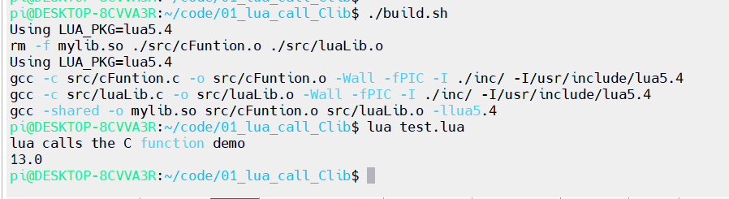
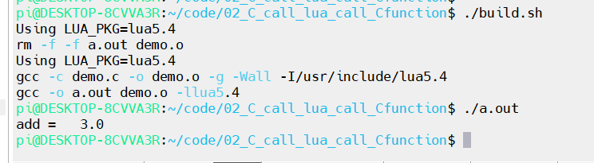

# Lua调用C

`Lua`调用`C`的几种主流方法

1. 封装成c动态链接库，在`lua`中`require`
2. 通过在`C`中注册函数给`lua`调用
3. 在`LuaJIT`里面可以使用`ffi`高性能的调用`C`

## 调用C动态库

将`C`函数封装成动态库，通过`luaL_newlib` 将C 函数打包成一个 `Lua` 模块，以供 `Lua` 脚本使用

## 通过在C中注册函数给lua调用

程序主体在`C`中运行，`C`函数注册到`Lua`中。`C`调用`Lua`，`Lua`调用`C`注册的函数，`C`得到函数的执行结果

