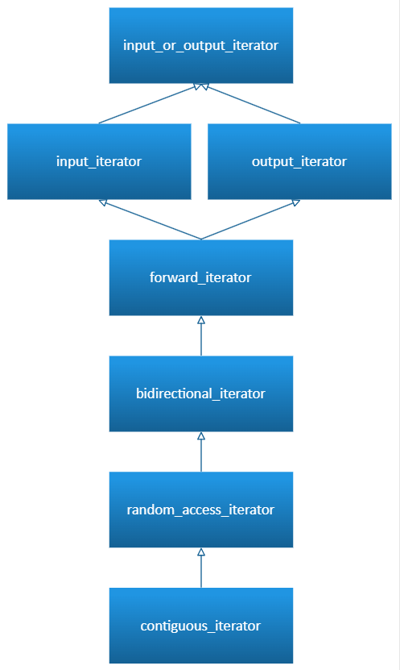

# 迭代器

> 参考文档：<https://learn.microsoft.com/zh-cn/cpp/standard-library/iterator-concepts?view=msvc-170#contiguous_iterator>

## 概述

迭代器是一种特殊的对象，它能够遍历并指向容器中的元素。在`C++`中，**迭代器的设计模拟了指针的行为**，使得程序员能够通过它们访问和操作数据。迭代器概念在命名空间 `std` 中定义，并在头文件 `<iterator>` 中声明。 它们用于范围适配器、视图等的声明

## 迭代器的类型和作用

按能力可分为七大类

1. 输入输出迭代器（`input_or_output_iterator`）

    `C++ 20`加入的新特性，迭代器概念分类的基础。

2. 输入迭代器（Input Iterator）

     指定可以进行一次读取的迭代器，只支持 `*it`、`++it`

3. 输出迭代器（Output Iterator）

    指定可以写入的迭代器，只支持 `*it = value`、`++it`

4. 前向迭代器（Forward Iterator）

    指定可以进行多次读取（可能可以写入）的迭代器，单向遍历

5. 双向迭代器（Bidirectional Iterator）

    指定可以向前和向后读取和写入的迭代器，在前向迭代器基础上支持 `--it`

6. 随机访问迭代器（Random-Access Iterator）

    指定可以按索引读取和写入的迭代器，支持跳跃式访问 `it + n`、`it–n`、`it[n]`

7. 连续迭代器（`contiguous_iterator`）

    指定一个迭代器，其元素在内存中按顺序排列，大小相同，并且可以使用指针算术进行访问

**不同迭代器之间的关系**

以下迭代器概念按功能逐渐增强的顺序列出。 `input_or_output_iterator` 位于功能层次结构的最底部，`contiguous_iterator` 位于功能层次结构的最顶部。 层次结构中较高级别的迭代器通常可以代替较低级别的迭代器，但反之则不然。 例如，`random_access_iterator` 迭代器可以代替 `forward_iterator` 迭代器，但反之则不行。 例外情况是 `input_iterator`，由于它无法写入，因此无法由 `output_iterator` 代替
