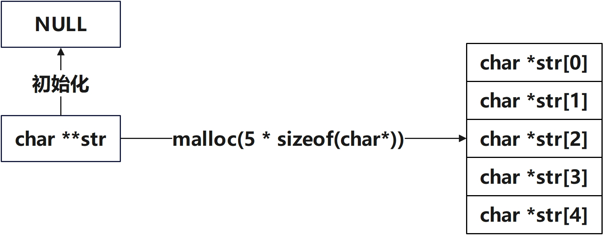

# 数组与指针

数组与指针常常出现许多神奇的使用方法，和可能遇到的容易踩坑的点

## 数组名是不是指针

在申请一个数组时，其内存空间被分为了两部分

* 数组名被存放在了常量内存区，是不可修改的
* 数组元素是存放在可变内存区，是可以修改的

```c
char str[3] = {'a', 'b', 'c'};
printf("str = %p str[0] = %p str[1] = %p str[2] = %p", &str, &str[0], &str[1], &str[2]);
/**
 * 输出结果：
 * str = 0x7ffe1b1a6ea5 str[0] = 0x7ffe1b1a6ea5 str[1] = 0x7ffe1b1a6ea6 str[2] = 0x7ffe1b1a6ea7
 */


char str[3] = {'a', 'b', 'c'};
printf("str = %p str[0] = %p str[1] = %p str[2] = %p", str, str[0], str[1], str[2]);
/**
 * 多次运行后输出结果：
 * str = 0x7ffd2afb3055 str[0] = 0x61 str[1] = 0x62 str[2] = 0x63
 * str = 0x7fff4e277f15 str[0] = 0x61 str[1] = 0x62 str[2] = 0x63
 * str = 0x7ffdd057c805 str[0] = 0x61 str[1] = 0x62 str[2] = 0x63
 * str = 0x7ffcc01f0fe5 str[0] = 0x61 str[1] = 0x62 str[2] = 0x63
 * str = 0x7ffcbe2cce35 str[0] = 0x61 str[1] = 0x62 str[2] = 0x63
 */
```

从第一段代码可以看到，数组名和数组`0`号元素**所在的内存地址**是相同的，并且和数组其他元素的**所在的内存是连续的**；从第二段代码可以看到，数组名**指向的地址**是每次重新分配的且在常量内存区是**不可更改的**，数组的`0`元素指向的地址则是指向数组的首个元素

由于这个特性，数组名与指针并不能完全视作等价


## Struct的可变长度的动态申请内存

在`C`语言中操作字符串通常是创建一个`char`数组或者一个`char*`指针指向某个字符串。是直接操作内存，常常引发一些内存安全问题。以下是一些使用时的注意事项

* 通常会将`char`数组的名字视为一个`char*`指针，但这两者并不严格相等

    * 数组名指向的内存不可更改，指针指向的内存可更改。但二者都不可更改其本身的内存地址

    * 在`struct`声明时，有时会在`struct`尾部加上一行`char[0]`，这种写法是考虑到结构体内存对齐默认按照最长元素来对齐。当不适合在声明时创建大数组可以后续申请内存时可以灵活的确定申请内存的长度，实现变长申请内存。例如消息信息等内容，结构体申请时需要一个变长的字符串。

        ```c
        struct struct_A {
            int a;
            char b[1];			//char[1]会占用一个字节的内存
        }__attribute ((packed));
        
        /* 
         * 如果分配的内存大于结构体的实际大小，那么超出的那部分就是b的内容。
         */
        struct struct_B {
            int a;
            char b[0];			//charb[0]实际不占用的内存，只是一个地址偏移量
        }__attribute ((packed));
        
        int main()
        {
            struct struct_A A;
            struct struct_B B;
        
            int a = sizeof(A);
            printf("%d \n", a);		//输出：5
        
            int b = sizeof(B);
            printf("%d \n", b);		//输出：4
            
            struct struct_B *C;
            C = (struct struct_B *)malloc(sizeof(struct struct_B) + 10);
        
            strcpy(C->b, "abcde");
            printf("%s \n", C->b);	//输出：abcde
        
            return 0;
        }
        ```

* 将`C`语言转换成汇编后可以发现，`[]`运算符其本质是取地址偏移量，这与指针运算相同

    * **指针运算与使用`[]`和数组下标取元素，其汇编只是近似，但不严格相同**


## C语言怎么实现"继承"

`C`语言没有类也没有继承的特性，是怎么做到"继承"的效果；在`C`语言里，结构体里的内存是连续的，将要继承的"父类"，放到结构体的第一位，然后将指向“父结构体”的头部，然后通过指针类型转换获取“父结构体”的头部的“子结构体”

```c
struct stu_1 {
    char stu_1_a[8];
    int stu_1_b;
    double stu_1_c;
};

struct stu_2 {
    struct stu_1 stu_2_a;
    int b;
};
```

然后我们就可以通过结构体名的长度来强行截取内存，这样就能转换结构体，从而实现类似"继承"的效果。

```c
static inline struct stu_1 *demo(const struct stu_2 *stu)
{
    return (struct stu_1 *)stu;
}
```

实例代码

```c
int main()
{
    struct stu_1 *a = NULL;
    struct stu_2 *b = NULL;
    struct stu_1 *c = NULL;

    a = (struct stu_1 *)malloc(sizeof(struct stu_1));
    snprintf(a->stu_1_a, sizeof(a->stu_1_a), "%s", "absda");
    a->stu_1_b = 10;
    a->stu_1_c = 3.14;

    b = (struct stu_2 *)malloc(sizeof(struct stu_2));
    b->stu_2_a = *a;
    b->stu_2_b = 11;

    c = demo(b);

    return 0;
}

```

通过`GDB`可以直观的看到，其内存分布情况。可以看到，这种“继承”方法获取的地址实际上也是指向了“父结构体”的头部，只是结构体类型不同可以读取到的内存数据也就不同


## 函数指针

函数指针是一个在实际工程运用中非常常见的一种用法，提供了极大的灵活性

**声明**

```c
/**
 * 函数指针声明
 * 假设有一个函数，它接受两个 int 类型的参数，并返回一个 int 类型的结果。这个和函数指针的声明如下：
 */
int (*func_ptr)(int, int);

// 使用 typedef 创建函数指针类型
typedef int (*func_ptr_def)(int, int);
```

**赋值**

```c
int add(int a, int b)
{
    return a + b;
}

//针指向具体的函数
func_ptr = add;

//或者可以直接在函数指针的声明时进行初始化
int (*func_ptr)(int, int) = add;

//如果是通过typedef声明的函数指针，则需要先创建变量再进行赋值
func_ptr_def prt = add
```

**使用**

```c
//使用解引用操作符 * 和函数指针调用函数：
int result = (*func_ptr)(3, 4);

//直接使用函数指针调用函数（简写形式）：
int result = func_ptr(3, 4);
```


## 函数指针数组

**声明与赋值**

函数指针数组的声明与赋值与普通数组并没有什么不同

```c
int add(int a, int b) {return a + b;}
int subtract(int a, int b) {return a - b;}
int multiply(int a, int b) {return a * b;}

/**
 * 函数指针数组声明
 * 假设函数指针类型如下，它接受两个 int 类型的参数，并返回一个 int 类型的结果。这个函数指针数组的声明如下：
 */
int (*func_ptr[3])(int, int) = {add, subtract, multiply};

// 使用 typedef 创建函数指针类型
typedef int (*func_ptr_def)(int, int);
func_ptr_def prt[3] = {add, subtract, multiply};
```

**使用**

与普通的函数指针使用不同的是，函数指针数组的成员使用时需要添加指定下标

```c
int a = 10;
int b = 2;
int c;

c = func_ptr[0](a, b);
//func_ptr[0]是add函数，c等于12
c = prt[2](a, b);
//prt[2]是multiply函数，c等于20
```


## 动态分配二维数组长度

> 笔者注：一维数组同样可以动态分配，但太过基础，此处不再赘述

使用`malloc`来动态分配二维数组时，需要先创建一个二级指针，然后向这个二级指针分配内存，此时指针名可以视为数组名，一级指针视为二维数组的前半部分也就是行，通过对一维数组取下标就是二级数组的列

```c
#define numstr 3

char **str = NULL;

str = (char**)malloc(numstr * sizeof(char*));
memset(str, 0, sizeof(char*) * numstr);

str[0] = "qwer";
str[1] = "123adaHJKLgugFLSUKJB AASFNjkbFKSBdKJbvKJDBV KJGBSJKSjbkSBJSDKJBKBJKSJKSVKJVBJKJBKDVSDKBJSDVBJKVJKBJFVJB,FZBJKBJSVDKJBASCBJKSJKBasJBKASJKBSVDJKBFBJKFBJK.FBJKSVDBKJJKXBJKDVXJKDXVJKXK.DJBVKXBVKJBKJBV.NJSDGda";
str[2] = "jahdkahf";

for (size_t i = 0; i < numstr; i++) {
    printf("str[%d] = %s\n", i, str[i]);
}
/**
 * 输出结果：
 * str[0] = qwer
 * str[1] = 123adaHJKLgugFLSUKJB AASFNjkbFKSBdKJbvKJDBV KJGBSJKSjbkSBJSDKJBKBJKSJKSVKJVBJKJBKDVSDKBJSDVBJKVJKBJFVJB,FZBJKBJSVDKJBASCBJKSJKBasJBKASJKBSVDJKBFBJKFBJK.FBJKSVDBKJJKXBJKDVXJKDXVJKXK.DJBVKXBVKJBKJBV.NJSDGda
 * str[2] = jahdkahf
 */
```

**内存分配示意图**

如下图所示，`malloc`分配的内存可以被看作是数个指针，对应着二维数组中的行




**内存连续性**

使用`GDB`调试程序可以看到，这样动态分配的内存实际上是一段连续的内存空间


