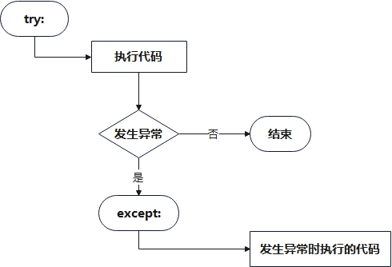
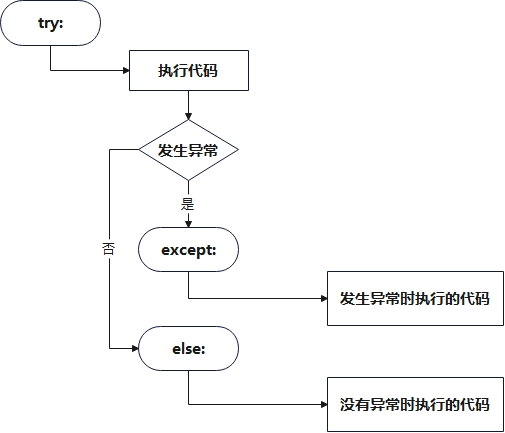
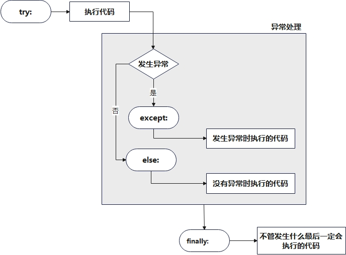

# Python基础语法

[TOC]

## 变量类型

**Python有五个标准的数据类型：**

* `Numbers`（数字）
* `String`（字符串）
* `List`（列表）
* `Tuple`（元组）
* `Dictionary`（字典）

### 1. Numbers（数字）

**数字数据类型用于存储数值，Python支持四种不同的数字类型：**

* `int`（有符号整型）
* `long`（长整型，也可以代表八进制和十六进制）
* `float`（浮点型）
* `complex`（复数）

**他们是不可改变的数据类型，这意味着改变数字数据类型会分配一个新的对象**

当你指定一个值时，`Number` 对象就会被创建：

```python
var1 = 1
var2 = 10
```

可以使用`del`语句删除一些对象的引用

```python
del var1[,var2[,var3[....,varN]]]
```

也可以通过使用`del`语句删除单个或多个对象的引用。

```python
del var
del var_a, var_b
```

### 2. String（字符串）

字符串或串`String`是由数字、字母、下划线组成的一串字符

**一般记为 :**

```python
s = "a1a2···an"   # n>=0
```

如果你要实现从字符串中获取一段子字符串的话，可以使用 `[头下标:尾下标]` 来截取相应的字符串，其中下标是从 `0` 开始算起，可以是正数或负数，下标可以为空表示取到头或尾。`[头下标:尾下标]` 获取的子字符串包含头下标的字符，但不包含尾下标的字符。

**如下实例：**

```python
str = 'Hello World!'
 
print(str)            # 输出完整字符串
print(str[0])         # 输出字符串中的第一个字符
print(str[2:5])       # 输出字符串中第三个至第六个之间的字符串
print(str[2:])        # 输出从第三个字符开始的字符串
print(str * 2)        # 输出字符串两次
print(str + "TEST")   # 输出连接的字符串
```

**输出结果如下：**

```shell
Hello World!
H
llo
llo World!
Hello World!Hello World!
Hello World!TEST
```

### 3. List（列表）

`List`（列表） 是 `Python` 中使用最频繁的数据类型

列表可以完成大多数集合类的数据结构实现。它支持字符，数字，字符串甚至可以包含列表（即嵌套）

列表用 `[ ]` 标识，是 `python` 最通用的复合数据类型

列表中值的切割也可以用到变量 `[头下标:尾下标]` ，就可以截取相应的列表，从左到右索引默认 `0` 开始，从右到左索引默认 `-1` 开始，下标可以为空表示取到头或尾


加号 `+` 是列表连接运算符，星号 `*`是重复操作

**如下实例：**

```python
list = [ 'runoob', 786 , 2.23, 'john', 70.2 ]
tinylist = [123, 'john']
 
print(list)                # 输出完整列表
print(list[0])             # 输出列表的第一个元素
print(list[1:3])           # 输出第二个至第三个元素 
print(list[2:])            # 输出从第三个开始至列表末尾的所有元素
print(tinylist * 2)        # 输出列表两次
print(list + tinylist)     # 打印组合的列表
```

**输出结果如下：**

```shell
['runoob', 786, 2.23, 'john', 70.2]
runoob
[786, 2.23]
[2.23, 'john', 70.2]
[123, 'john', 123, 'john']
['runoob', 786, 2.23, 'john', 70.2, 123, 'john']
```

### 4. Tuple（元组）

元组是另一个数据类型，类似于 `List`（列表）

元组用 `()` 标识。内部元素用逗号隔开。但是元组不能二次赋值，相当于只读列表

**如下实例：**

```python
tuple = ( 'runoob', 786 , 2.23, 'john', 70.2 )
tinytuple = (123, 'john')
 
print(tuple)                # 输出完整元组
print(tuple[0])             # 输出元组的第一个元素
print(tuple[1:3])           # 输出第二个至第四个（不包含）的元素 
print(tuple[2:])            # 输出从第三个开始至列表末尾的所有元素
print(tinytuple * 2)        # 输出元组两次
print(tuple + tinytuple)    # 打印组合的元组
```

**输出结果如下：**

```shell
('runoob', 786, 2.23, 'john', 70.2)
runoob
(786, 2.23)
(2.23, 'john', 70.2)
(123, 'john', 123, 'john')
('runoob', 786, 2.23, 'john', 70.2, 123, 'john')
```

### 5. Dictionary（字典）

`dictionary`（字典）是除列表以外`python`之中最灵活的内置数据结构类型。列表是有序的对象集合，字典是无序的对象集合

两者之间的区别在于字典当中的元素是通过键来存取的，而不是通过偏移存取

字典用`{ }`标识，字典由索引`key`和它对应的值`value`组成

**如下实例：**

```python
dict = {}
dict['one'] = "This is one"
dict[2] = "This is two"
 
tinydict = {'name': 'runoob','code':6734, 'dept': 'sales'}
 
 
print(dict['one'])           # 输出键为'one' 的值
print(dict[2])               # 输出键为 2 的值
print(tinydict)              # 输出完整的字典
print(tinydict.keys())       # 输出所有键
print(tinydict.values())     # 输出所有值
```

**输出结果如下：**

```python
This is one
This is two
{'name': 'runoob', 'code': 6734, 'dept': 'sales'}
dict_keys(['name', 'code', 'dept'])
dict_values(['runoob', 6734, 'sales'])
```

## 运算符

`Python`语言支持以下类型的运算符:

* 算术运算符
* 比较（关系）运算
* 赋值运算符
* 逻辑运算符
* 位运算符
* 成员运算符
* 身份运算符
* 运算符优先级

### 算术运算符

以下假设变量： **a=10，b=20**

| 运算符 | 描述                                        | 实例                                                       |
| :----- | :------------------------------------------ | :--------------------------------------------------------- |
| `+`    | 两个对象相加                                | `a + b` 输出结果 `30`                                      |
| `-`    | 得到负数或是一个数减去另一个数              | `a - b` 输出结果 `-10`                                     |
| `*`    | 两个数相乘或是返回一个被重复若干次的字符串  | `a * b` 输出结果 `200`                                     |
| `/`    | 除 `x`除以`y`                               | `b / a` 输出结果 `2`                                       |
| `%`    | 返回除法的余数                              | `b % a` 输出结果 `0`                                       |
| `**`   | 返回`x`的`y`次幂                            | `a**b` 为`10`的`20`次方， 输出结果 `100000000000000000000` |
| `//`   | 取整除 `-` 返回商的整数部分（**向下取整**） | `>>> 9//2 4 >>> -9//2 -5`                                  |

### 比较运算符

以下假设变量 **a=10，b=20**

| 运算符 | 描述                                                         | 实例                                        |
| :----- | :----------------------------------------------------------- | :------------------------------------------ |
| `==`   | 比较对象是否相等                                             | `(a == b)` 返回 `False`                     |
| `!=`   | 比较两个对象是否不相等                                       | `(a != b)` 返回 `True`                      |
| `<>`   | 比较两个对象是否不相等。**python3 已废弃**                   | `(a <> b)` 返回 `True`。这个运算符类似 `!=` |
| `>`    | 返回`x`是否大于`y`                                           | `(a > b)` 返回 `False`                      |
| `<`    | 返回`x`是否小于`y`。所有比较运算符返回`1`表示真，返回0表示假。这分别与特殊的变量 `True` 和 `False` 等价 | `(a < b)` 返回 `True`                       |
| `>=`   | 返回`x`是否大于等于`y`                                       | `(a >= b)` 返回 `False`                     |
| `<=`   | 返回`x`是否小于等于`y`                                       | `(a <= b)` 返回 `True`                      |

### 赋值运算符

以下假设变量**a=10，b=20**

| 运算符 | 描述             | 实例                                        |
| :----- | :--------------- | :------------------------------------------ |
| `=`    | 简单的赋值运算符 | `c = a + b` 将 `a + b` 的运算结果赋值为 `c` |
| `+=`   | 加法赋值运算符   | `c += a` 等效于 `c = c + a`                 |
| `-=`   | 减法赋值运算符   | `c -= a` 等效于 `c = c - a`                 |
| `*=`   | 乘法赋值运算符   | `c *= a` 等效于 `c = c * a`                 |
| `/=`   | 除法赋值运算符   | `c /= a` 等效于 `c = c / a`                 |
| `%=`   | 取模赋值运算符   | `c %= a` 等效于 `c = c % a`                 |
| `**=`  | 幂赋值运算符     | `c = a` 等效于 `c = c ** a`                 |
| `//=`  | 取整除赋值运算符 | `c //= a` 等效于 `c = c // a`               |

### 位运算符

按位运算符是把数字看作二进制来进行计算的，`Python`中的按位运算法则如下：

```python
a = 0011 1100

b = 0000 1101

-----------------

a&b = 0000 1100

a|b = 0011 1101

a^b = 0011 0001

~a  = 1100 0011
```

运算符类型如下
| 运算符 | 描述                                                         | 实例                                                         |
| :----- | :----------------------------------------------------------- | :----------------------------------------------------------- |
| `&`    | 按位与运算符：参与运算的两个值,如果两个相应位都为`1`,则该位的结果为`1`,否则为`0` | `(a & b)` 输出结果 `12` ，二进制解释： `0000 1100`           |
| `|`    | 按位或运算符：只要对应的二个二进位有一个为`1`时，结果位就为`1` | `(a | b)` 输出结果 `61` ，二进制解释： `0011 1101`           |
| `^`    | 按位异或运算符：当两对应的二进位相异时，结果为`1`            | `(a ^ b)` 输出结果 `49` ，二进制解释： `0011 0001`           |
| `~`    | 按位取反运算符：将二进制表示中的每一位取反，`0` 变为 `1`，`1` 变为 `0`。`~x` 类似于 `-x-1` | `(~a )` 输出结果 `-61` ，二进制解释： `1100 0011` (以补码形式表示)，在一个有符号二进制数的补码形式。 |
| `<<`   | 左移动运算符：运算数的各二进位全部左移若干位，由 `<<` 右边的数字指定了移动的位数，高位丢弃，低位补`0` | `a << 2` 输出结果 `240` ，二进制解释： `1111 0000`           |
| `>>`   | 右移动运算符：把`>>`左边的运算数的各二进位全部右移若干位，`>>` 右边的数字指定了移动的位数 |                                                              |

### 逻辑运算符

`Python`语言支持逻辑运算符，以下假设变量 **a=10，b=20**

| 运算符 | 逻辑表达式 | 描述                                                         | 实例                        |
| :----- | :--------- | :----------------------------------------------------------- | :-------------------------- |
| `and`  | `x and y`  | 如果 `x` 为 `False`，`x and y` 返回 False，否则它返回 `y` 的计算值 | `(a and b)` 返回 `20`       |
| `or`   | `x or y`   | 如果 `x` 是非 `0`，它返回 `x` 的计算值，否则它返回 `y` 的计算值 | `(a or b)` 返回 `10`        |
| `not`  | `not x`    | 如果 `x` 为 `True`，返回 `False` 。如果 `x` 为 `False`，它返回 `True` | `not(a and b)` 返回 `False` |

### 成员运算符

除了以上的一些运算符之外，`Python`还支持成员运算符，测试实例中包含了一系列的成员，包括字符串，列表或元组

| 运算符   | 描述                                                      | 实例                                                      |
| :------- | :-------------------------------------------------------- | :-------------------------------------------------------- |
| `in`     | 如果在指定的序列中找到值返回 `True`，否则返回 `False`     | `x` 在 `y` 序列中 , 如果 `x` 在 `y` 序列中返回 `True`     |
| `not in` | 如果在指定的序列中没有找到值返回 `True`，否则返回 `False` | `x` 不在 `y` 序列中 , 如果 `x` 不在 `y` 序列中返回 `True` |

### 身份运算符

身份运算符用于比较两个对象的存储单元

| 运算符   | 描述                                          | 实例                                                         |
| :------- | :-------------------------------------------- | :----------------------------------------------------------- |
| `is`     | `is` 是判断两个标识符是不是引用自一个对象     | `x is y` 类似 `id(x) == id(y)` , 如果引用的是同一个对象则返回 `True`，否则返回 `False` |
| `is not` | `is not` 是判断两个标识符是不是引用自不同对象 | `x is not y` ， 类似 `id(a) != id(b)`。如果引用的不是同一个对象则返回结果 `True`，否则返回 `False` |

### 运算符优先级

**以下表格列出了从最高到最低优先级的所有运算符：**

| 优先级        | 运算符                     | 描述                                                       |
| ------------- | :------------------------- | :--------------------------------------------------------- |
| 1(最高优先级) | `**`                       | 指数                                                       |
| 2             | `~ + -`                    | 按位翻转, 一元加号和减号 (最后两个的方法名为 `+@` 和 `-@`) |
| 3             | `* / % //`                 | 乘，除，取模和取整除                                       |
| 4             | `+ -`                      | 加法减法                                                   |
| 5             | `>> <<`                    | 右移，左移运算符                                           |
| 6             | `&`                        | 位 `AND`                                                   |
| 7             | `^ |`                      | 位运算符                                                   |
| 8             | `<= < > >=`                | 比较运算符                                                 |
| 9             | `<> == !=`                 | 等于运算符                                                 |
| 10            | `= %= /= //= -= += *= **=` | 赋值运算符                                                 |
| 11            | `is is not`                | 身份运算符                                                 |
| 12            | `in not in`                | 成员运算符                                                 |
| 13            | `not and or`               | 逻辑运算符                                                 |

## 流程语句

### 条件语句

`python`中的条件语句与大部分编程语言一致

```python
if 判断条件：
    执行语句……
else：
    执行语句……
```

**实例：**

```python
# 例1：if 基本用法
 
flag = False
name = 'luren'
if name == 'python':         # 判断变量是否为 python 
    flag = True              # 条件成立时设置标志为真
    print 'welcome boss'     # 并输出欢迎信息
else:
    print name               # 条件不成立时输出变量名称
```

### 循环语句

#### while循环

`python`中的`while`与大部分编程语言一样

```python
while 判断条件(condition)：
    执行语句(statements)……
```

#### for循环

`python`中的`for`循环可以用于遍历可迭代对象中的所有元素，例如列表、元组、字符串等

**形式如下：**

```python
for iterating_var in sequence:
   statements(s)
```

**实例：**

```python
for letter in 'Python':     # 第一个实例
   print("当前字母: %s" % letter)
'''
运行结果：

当前字母: P
当前字母: y
当前字母: t
当前字母: h
当前字母: o
当前字母: n
'''
 
fruits = ['banana', 'apple',  'mango']
for fruit in fruits:        # 第二个实例
   print ('当前水果: %s'% fruit)
'''
运行结果：

当前水果: banana
当前水果: apple
当前水果: mango
'''
```

## 函数定义

函数定义时需要遵守下面的规则

* 函数代码块以 **def** 关键词开头，后接函数标识符名称和圆括号**()**
* 任何传入参数和自变量必须放在圆括号中间。圆括号之间可以用于定义参数
* 函数的第一行语句可以选择性地使用文档字符串—用于存放函数说明
* 函数内容以冒号起始，并且缩进
* **return [表达式]** 结束函数，选择性地返回一个值给调用方。不带表达式的`return`相当于返回`None`

**实例：**

```python
#!/usr/bin/python
# -*- coding: UTF-8 -*-
 
# 定义函数
def printme( str ):
   "打印任何传入的字符串"
   print str
   return
 
# 调用函数
printme("我要调用用户自定义函数!")
printme("再次调用同一函数")
```

## 异常处理

### try\except语句

**整体流程如下图：**



**try 语句按照如下方式工作：**

* 首先，执行 `try` 子句（在关键字 `try` 和关键字 `except` 之间的语句）
* 如果没有异常发生，忽略 `except` 子句，`try` 子句执行后结束
* 如果在执行 `try` 子句的过程中发生了异常，那么 `try` 子句余下的部分将被忽略。如果异常的类型和 `except` 之后的名称相符，那么对应的 `except` 子句将被执行
* 如果一个异常没有与任何的 `except` 匹配，那么这个异常将会传递给上层的 `try` 中

**示例：**

```python
try:
    fh = open("testfile", "w")
    fh.write("这是一个测试文件，用于测试异常!!")
except IOError:
    print "Error: 没有找到文件或读取文件失败"
```

**`try`语句后也可以加上else语句，如果try中的执行语句没有发生异常则执行else中的语句**

**整体流程如下图：**



**例如：**

```python
try:
    fh = open("testfile", "w")
    fh.write("这是一个测试文件，用于测试异常!!")
except IOError:
    print "Error: 没有找到文件或读取文件失败"
else:
    print "内容写入文件成功"
    fh.close()
```

### except ... as ...语句

`except ... as ...` - 捕获异常并绑定到变量，`except`语句仅会捕获异常而不进行绑定。当需要访问异常对象的详细信息（如错误消息、错误类型等）时使用

**实例：**

```python
try:# 一些可能出错的代码
  result = 10 / 0
except Exception as e:
  print(f"发生了除零错误: {e}")
  print(f"异常类型: {type(e)}")
```

`except ... as ...`语句会将捕捉到的错误绑定到变量`e`，方便再后续的流程中将这个错误打印出来

### except* 语句

`except*` 是`Python 3.11`引入的新语法，用于处理**异常组**。`except` 语句只能处理单个异常，`except*`则可以处理多个同时发生的异常通常与 `ExceptionGroup` 或 `BaseExceptionGroup` 一起使用

**使用场景**

* `except` 适用于：
  * 传统的单线程、顺序执行的代码
  * 一次只可能发生一个异常的情况

* `except*` 适用于：
  * 并发编程（如 `asyncio.gather()`）
  * 需要同时处理多个相关异常的场景
  * 批量操作中部分失败的情况

**实例：**

```python
import asyncio

async def failing_task(n):
    if n == 1:
        raise ValueError(f"值错误 {n}")
    elif n == 2:
        raise TypeError(f"类型错误 {n}")
    else:
        return f"成功 {n}"

async def main():
    try:
        # 并发执行多个任务，其中一些会失败
        results = await asyncio.gather(
            failing_task(1),
            failing_task(2), 
            failing_task(3),
            return_exceptions=True
        )
    except* ValueError as eg:
        print(f"处理所有值错误: {len(eg.exceptions)} 个")
    except* TypeError as eg:
        print(f"处理所有类型错误: {len(eg.exceptions)} 个")
```

### finally 语句

`finally`字句中的语句无论发生了什么最后都会被执行

**整体流程如下图：**



**需要注意的：**

* 完整的格式顺序是：`try —> except X —> except —> else—> finally`
* 如果`else`和`finally`都存在的话，`else`必须在`finally`之前，`finally`必须在整个程序的最后

**例如：**

```python
try:
    Nomal execution block
except A:
    Exception A handle
except B:
    Exception B handle
except:
    Other Exception handle
else:
	if no exception, get here
finally:
    print('finally')
```

## 内置异常类型

内置异常类型的详细说明见`python3`官方文档，本文不做赘述

> [[内置异常 — Python 3.13.5 文档](https://docs.python.org/zh-cn/3.13/library/exceptions.html#bltin-exceptions)]:

## 防止重复包含

`python`中当把模块`A`中的代码在模块`B`中进行`import A`时，只要`B`模块代码运行到该`import`语句，模块`A`的代码会被执行，为了程序被防止重复执行同时也是保证程序只有一个唯一的入口，通常会在程序的入口处加上`if __name__ == "__main__":`的语句

```python
if __name__ == "__main__":
    main()
```

哪个模块被直接执行时，该模块`__name__`的值就是`__main__`，当被导入另一模块时，`__name__`的值就是模块的真实名称

## 参考文献

> 菜鸟教程python语法部分
>
> [Python 教程 — Python 3.13.5 文档](https://docs.python.org/zh-cn/3.13/tutorial/)
