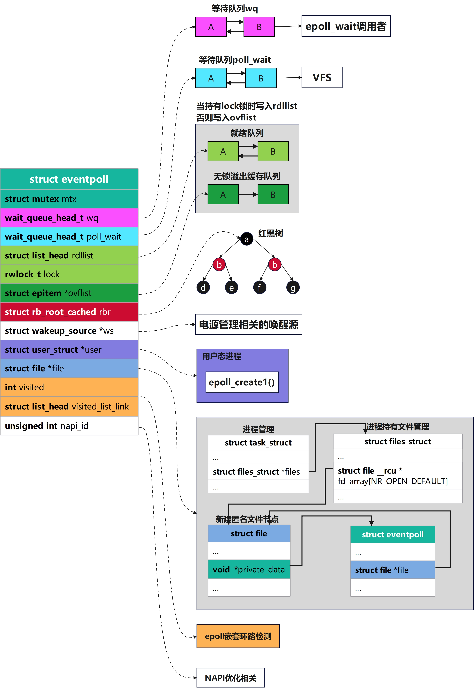
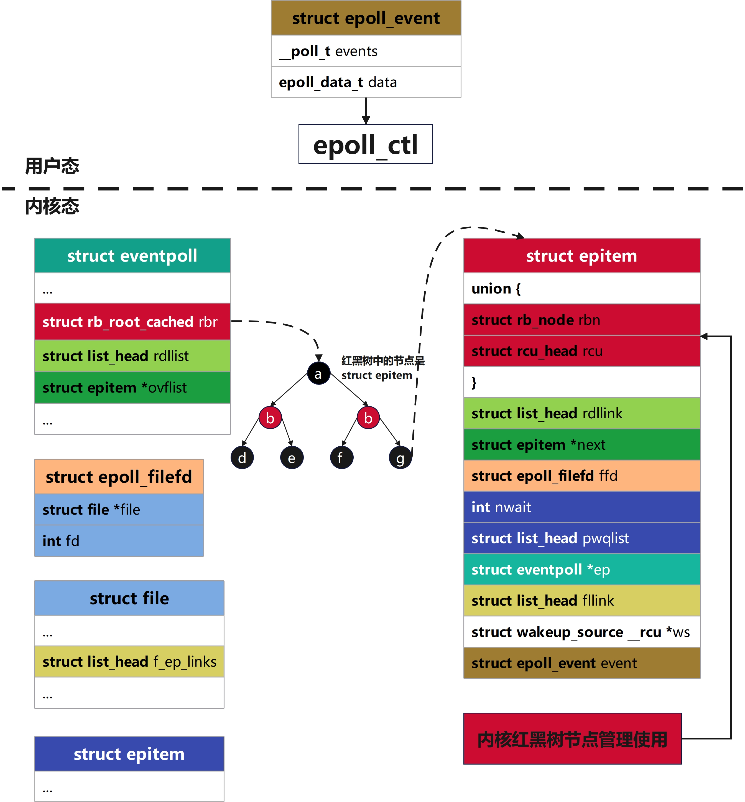
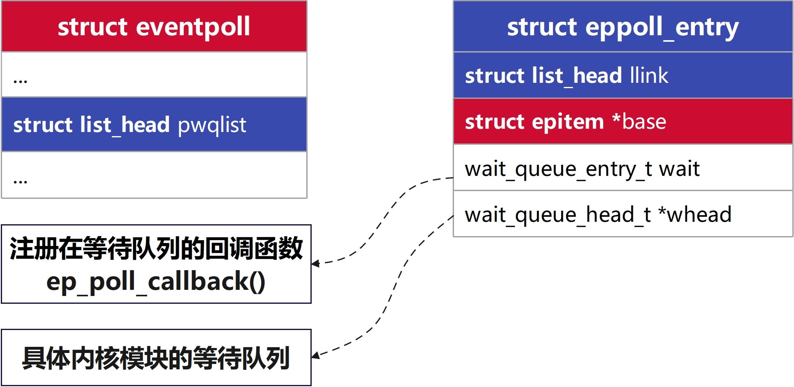
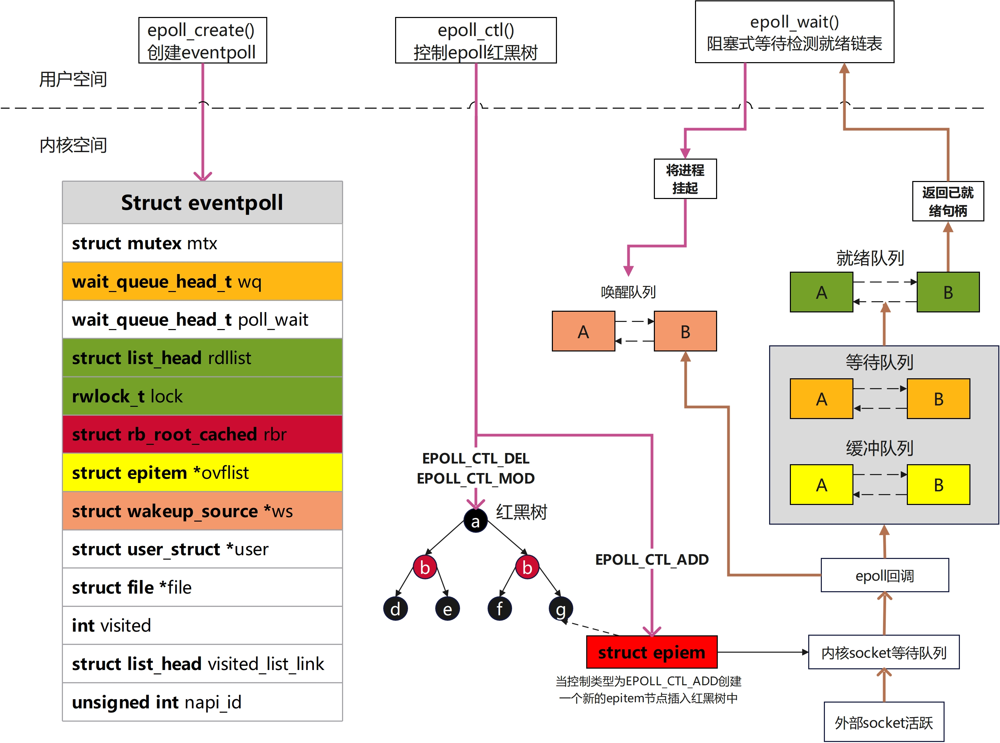
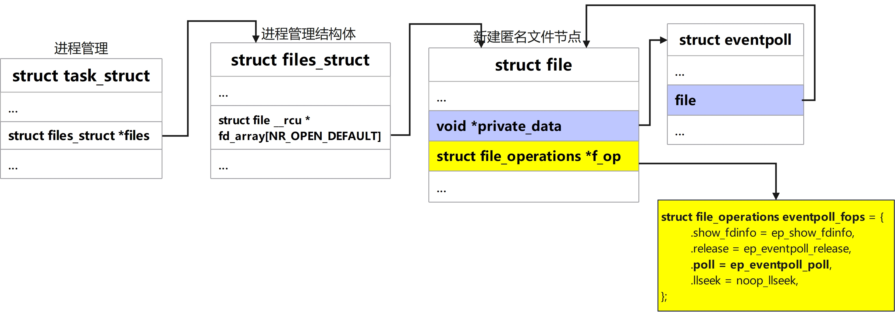
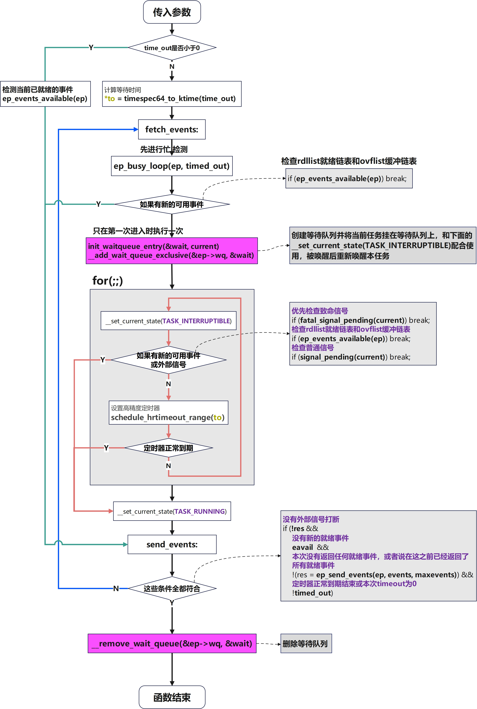
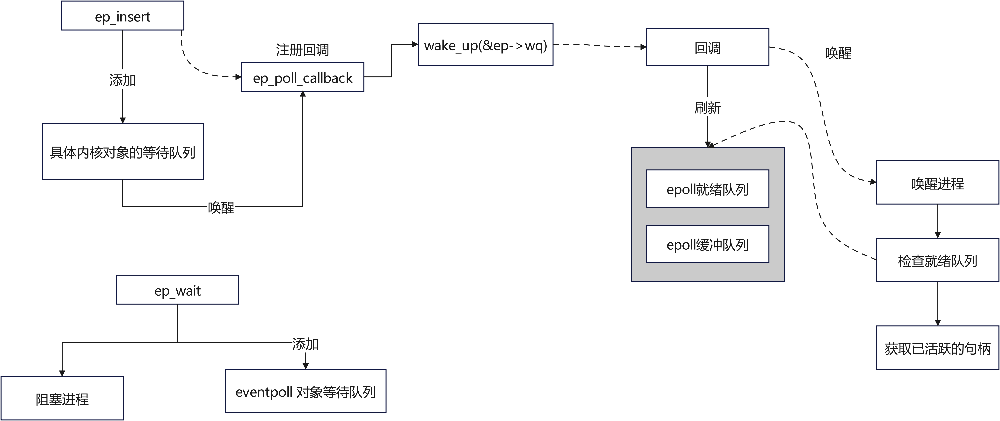
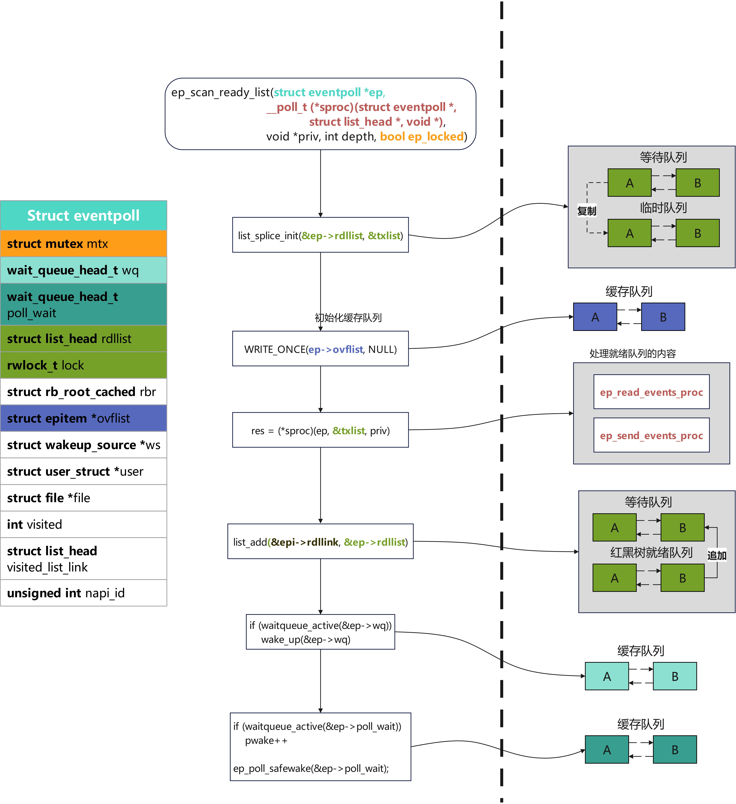
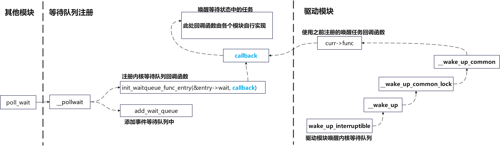

# epoll原理及实现

[toc]

## 待补充部分

* 内核与用户态交互接口和具体的方式

    用户态传入内核态的部分省略，内核态传回用户态的部分和扫描就绪链表放一起

* 水平触发和边沿触发，是什么怎么实现的

    和扫描就绪链表放一起

* `VFS`子系统和`socket`的结合

* `epoll`底层监听使用的`poll`整体流程

  这里可以和底层的几个链表写在一起

* 几个关键回调函数在整体流程中的作用是什么

* 核心数据结构和他们之间的关系

## 一、 发展历史

### API 发布的时间线

下文中列出了网络 `IO`中，各个`api`的发布时间线

> 1983，socket 发布在 Unix(4.2 BSD)
> 1983，select 发布在 Unix(4.2 BSD)
> 1994，Linux的1.0，已经支持socket和select
> 1997，poll 发布在 Linux 2.1.23
> 2002，epoll发布在 Linux 2.5.44

可以看到`select`、`poll` 和 `epoll`，这三个“`IO`多路复用`API`”是相继发布的。这说明了，它们是`IO`多路复用的`3`个进化版本。因为`API`设计缺陷，无法在不改变 `API` 的前提下优化内部逻辑。所以用`poll`替代`select`，再用`epoll`替代`poll`

`epoll`和`poll`还有`select`都是监听`socket`的接口，`poll`还有`select`出现的时间更早，但是性能更差。后来在此继承上发展改进得到了`epoll`

## 二、epoll是什么

`epoll`是一种`I/O`事件通知机制，是`linux`内核实现`IO`多路复用的一个实现
 `IO`多路复用是指，在一个操作里同时监听多个输入输出源，在其中一个或多个输入输出源可用的时候返回，然后对其的进行读写操作

`epoll`的通俗解释是一种当文件描述符的内核缓冲区非空的时候，发出可读信号进行通知，当写缓冲区不满的时候，发出可写信号通知的机制

## 三、epoll接口示例代码

### 1. 监听键盘输入

创建一个`epoll`连接，监听标准输入。打印用户输入的值，若输入`exit`则直接退出结束进程

```c
#include <stdio.h>
#include <string.h>
#include <unistd.h>
#include <errno.h>
#include <sys/epoll.h>

#define MAX_EVENTS 10

static int create_epoll_event()
{
    int epoll_fd;
    struct epoll_event event = {0};

    epoll_fd = epoll_create1(0);
    if (epoll_fd < 0)
        return -1;

    event.events = EPOLLIN;
    event.data.fd = STDIN_FILENO;
    if (epoll_ctl(epoll_fd, EPOLL_CTL_ADD, STDIN_FILENO, &event) != 0) {
        close(epoll_fd);
        return -1;
    }

    return epoll_fd;
}

int main()
{
    int n = -1;
    int nfds = -1;
    int epoll_fd = -1;
    ssize_t nr = 0;
    char buf[256] = {0};
    struct epoll_event events[MAX_EVENTS] = {0};

    epoll_fd = create_epoll_event();
    if (epoll_fd < 0) {
        perror("create_epoll_event");
        return 1;
    }

    while (1) {
        // 等待事件发生
        nfds = epoll_wait(epoll_fd, events, MAX_EVENTS, -1);
        if (nfds < 0) {
            if (errno == EINTR)
                continue;
            perror("epoll_wait");
            goto cleanup;
        }

        // 处理就绪的事件
        for (n = 0; n < nfds; ++n) {
            if (events[n].data.fd == STDIN_FILENO) {
                // 从标准输入中读取数据
                nr = read(events[n].data.fd, buf, sizeof(buf) - 1);
                if (nr < 0) {
                    perror("read");
                    goto cleanup;
                }
                if (nr == 0)
                    goto cleanup;
                buf[nr] = '\0';
                printf("Received input: %s", buf);
                // 如果收到exit，则退出循环
                if (strcmp(buf, "exit\n") == 0) {
                    goto cleanup;
                }
            }
        }
    }

cleanup:
    if (epoll_fd >= 0)
        close(epoll_fd);
    return 0;
}
```

### 2. 监听本地socket文件

**server端**

创建本地`socket`文件`/tmp/epoll_demo.sock`并用`epoll`监听，打印收到的消息，如果消息是`exit`则会直接结束进程

```c
/*
 * epoll_server.c
 * 作为服务端，监听本地套接字，接受客户端连接，并处理客户端发来的消息。
 */

#include <errno.h>
#include <stdio.h>
#include <stdlib.h>
#include <string.h>
#include <sys/epoll.h>
#include <sys/socket.h>
#include <sys/un.h>
#include <unistd.h>

#define MAX_EVENTS 10

/* 监听套接字（listening socket）句柄，供 epoll 与 accept 使用 */
static const char SOCK_PATH[] = "/tmp/epoll_demo.sock";

static void stop_server()
{
	printf("服务器退出\n");
	exit(0);
}

static void clean_local_socket(const int lfd)
{
	if (lfd >= 0)
		close(lfd);

	unlink(SOCK_PATH);
}

static int create_local_socket(int *lfd)
{
	int ret = 0;

	*lfd = socket(AF_UNIX, SOCK_STREAM, 0);
	if (*lfd < 0) {
		ret = -1;
		perror("socket");
		goto end;
	}

end:
	return ret;
}

static int listen_local_socket(int lfd)
{
	int ret = 0;
	struct sockaddr_un addr = {0};

	unlink(SOCK_PATH);
	addr.sun_family = AF_UNIX;
	snprintf(addr.sun_path, sizeof(addr.sun_path), "%s", SOCK_PATH);

	ret = bind(lfd, (struct sockaddr *)&addr, sizeof(addr));
	if (ret < 0) {
		perror("bind");
		goto end;
	}

	ret = listen(lfd, MAX_EVENTS);
	if (ret < 0) {
		perror("listen");
		goto end;
	}

	printf("监听 %s 中...\n", SOCK_PATH);
end:
	return ret;
}

/* 处理客户端发来的消息 */
static void handle_client_data(int epfd, int cfd)
{
	char buf[1024] = {0};
	ssize_t nr = 0;

	nr = read(cfd, buf, sizeof(buf) - 1);
	/* read 返回 0：对端关闭；LT 下若不 epoll_del+close，会一直可读 */
	if (nr <= 0) {
		epoll_ctl(epfd, EPOLL_CTL_DEL, cfd, NULL);
		close(cfd);
		goto end;
	}

	buf[nr] = '\0';
	if (strcmp(buf, "exit") == 0)
		stop_server();
	else
		printf("收到: %s\n", buf);

end:
	fflush(stdout);
}

/* 新客户端在 Unix 域流套接字上连接成功，将 accept 得到的句柄加入 epoll 监听 */
static int handle_client_connect(int epfd, int fd)
{
	int ret = 0;
	int cfd = -1;
	struct epoll_event ev = {0};

	cfd = accept(fd, NULL, NULL);
	if (cfd < 0) {
		ret = cfd;
		perror("accept");
		goto end;
	}

	ev.events = EPOLLIN;
	ev.data.fd = cfd;
	ret = epoll_ctl(epfd, EPOLL_CTL_ADD, cfd, &ev);
	if (ret < 0) {
		perror("epoll_ctl");
		close(cfd);
		goto end;
	}

end:
	return ret;
}

/* 使用 epoll（事件轮询，默认水平触发 LT）监听 lfd 与新接受的连接 */
static int run_epoll_demo(int lfd)
{
	int n = -1;
	int i = -1;
	int ret = 0;
	int epfd = -1;
	struct epoll_event ev = {0};
	struct epoll_event events[MAX_EVENTS] = {0};

	ev.events = EPOLLIN;
	ev.data.fd = lfd;

	epfd = epoll_create1(0);
	if (epfd < 0) {
		ret = epfd;
		perror("epoll_create1");
		goto end;
	}

	ret = epoll_ctl(epfd, EPOLL_CTL_ADD, lfd, &ev);
	if (ret < 0) {
		perror("epoll_ctl");
		goto end;
	}

	while(1) {
		n = epoll_wait(epfd, events, sizeof(events) / sizeof(events[0]), -1);
		if (n < 0) {
			ret = n;
			perror("epoll_wait");
			goto end;
		}

		for (i = 0; i < n; i++) {
			if (events[i].data.fd == lfd) {
				/* 新客户端连接成功 */
				ret = handle_client_connect(epfd, events[i].data.fd);
				if (ret < 0) {
					perror("handle_client_connect");
					goto end;
				}
			} else {
				/* 已有客户端发来消息，处理数据 */
				handle_client_data(epfd, events[i].data.fd);
			}
		}
	}

end:
	if (epfd >= 0)
		close(epfd);

	return ret;
}

int main(void)
{
	int ret = -1;
	int lfd = -1;

	ret = create_local_socket(&lfd);
	if (ret < 0) {
		perror("create_local_socket");
		return 1;
	}

	ret = listen_local_socket(lfd);
	if (ret < 0) {
		perror("listen_local_socket");
		clean_local_socket(lfd);
		return 1;
	}

	ret = run_epoll_demo(lfd);
	if (ret < 0) {
		perror("run_epoll_demo");
		clean_local_socket(lfd);
		return 1;
	}

	clean_local_socket(lfd);

	return 0;
}
```

**client端**

创建`socket`绑定到`/tmp/epoll_demo.sock`，通过`socket`发送消息

```c
/**
 * epoll_client.c
 * 作为客户端，连接本地套接字，并发送消息给服务端
 */

#include <stdio.h>
#include <string.h>
#include <sys/socket.h>
#include <sys/un.h>
#include <unistd.h>

static const char SOCK_PATH[] = "/tmp/epoll_demo.sock";

static void create_socket(int *fd)
{
	struct sockaddr_un addr = {0};

	addr.sun_family = AF_UNIX;
	snprintf(addr.sun_path, sizeof(addr.sun_path), "%s", SOCK_PATH);

	*fd = socket(AF_UNIX, SOCK_STREAM, 0);
	connect(*fd, (struct sockaddr *)&addr, sizeof(addr));
}

static void send_message(char *message, const int fd)
{
	char buf[1024] = {0};

	snprintf(buf, sizeof(buf), "%s", message);
	send(fd, buf, strlen(buf) + 1, 0);
}

/* 作为客户端(client)连接epoll_server监听的本地套接字并发送数据 */
int main(int argc, char *argv[])
{
	int fd = -1;

	if(argc < 2) {
		printf("Usage: %s <message>\n", argv[0]);
        printf("if want to exit, send 'exit' message\n");
		return 1;
	}

	create_socket(&fd);
	send_message(argv[1], fd);

	if (fd > 0)
		close(fd);

	return 0;
}
```

## 四、锁与内存屏障问题（写在前面）

> 笔者注：本文对**多进程下锁的调度与使用以及多CPU下与内存屏障问题**部分不做展开

**关于epoll模块对于多进程下锁的处理**

附上源代码中注释一段，供读者自行理解

> 笔者注：所有代码均未删改

```c++
// linux-5.4/fs/eventpoll.c

/*
 * LOCKING:
 * There are three level of locking required by epoll :
 *
 * 1) epmutex (mutex)
 * 2) ep->mtx (mutex)
 * 3) ep->lock (rwlock)
 *
 * The acquire order is the one listed above, from 1 to 3.
 * We need a rwlock (ep->lock) because we manipulate objects
 * from inside the poll callback, that might be triggered from
 * a wake_up() that in turn might be called from IRQ context.
 * So we can't sleep inside the poll callback and hence we need
 * a spinlock. During the event transfer loop (from kernel to
 * user space) we could end up sleeping due a copy_to_user(), so
 * we need a lock that will allow us to sleep. This lock is a
 * mutex (ep->mtx). It is acquired during the event transfer loop,
 * during epoll_ctl(EPOLL_CTL_DEL) and during eventpoll_release_file().
 * Then we also need a global mutex to serialize eventpoll_release_file()
 * and ep_free().
 * This mutex is acquired by ep_free() during the epoll file
 * cleanup path and it is also acquired by eventpoll_release_file()
 * if a file has been pushed inside an epoll set and it is then
 * close()d without a previous call to epoll_ctl(EPOLL_CTL_DEL).
 * It is also acquired when inserting an epoll fd onto another epoll
 * fd. We do this so that we walk the epoll tree and ensure that this
 * insertion does not create a cycle of epoll file descriptors, which
 * could lead to deadlock. We need a global mutex to prevent two
 * simultaneous inserts (A into B and B into A) from racing and
 * constructing a cycle without either insert observing that it is
 * going to.
 * It is necessary to acquire multiple "ep->mtx"es at once in the
 * case when one epoll fd is added to another. In this case, we
 * always acquire the locks in the order of nesting (i.e. after
 * epoll_ctl(e1, EPOLL_CTL_ADD, e2), e1->mtx will always be acquired
 * before e2->mtx). Since we disallow cycles of epoll file
 * descriptors, this ensures that the mutexes are well-ordered. In
 * order to communicate this nesting to lockdep, when walking a tree
 * of epoll file descriptors, we use the current recursion depth as
 * the lockdep subkey.
 * It is possible to drop the "ep->mtx" and to use the global
 * mutex "epmutex" (together with "ep->lock") to have it working,
 * but having "ep->mtx" will make the interface more scalable.
 * Events that require holding "epmutex" are very rare, while for
 * normal operations the epoll private "ep->mtx" will guarantee
 * a better scalability.
 */
```

## 五、核心数据结构

### 1. struct eventpoll

这个数据结构是我们在调用`epoll_create`之后内核侧创建的一个句柄，表示了一个`epoll`实例。后续如果我们再调用`epoll_ctl`和`epoll_wait`等，都是对这个`eventpoll`数据进行操作，这部分数据会被保存在`do_epoll_create`创建的匿名文件`file`的`private_data`字段中

> 笔者注：除注释外，所有代码均未删改

```c
// linux-5.4/fs/eventpoll.c
/*
 * Each file descriptor added to the eventpoll interface will
 * have an entry of this type linked to the "rbr" RB tree.
 * Avoid increasing the size of this struct, there can be many thousands
 * of these on a server and we do not want this to take another cache line.
 */
struct eventpoll {
    /**
     * ep->mtx保护的是这个eventpoll实例在逻辑上的完整性与生命周期相关操作
     * 谁在集合里、epitem怎么挂/拆、和底层file的关联何时失效——本质上就是ep状态机不要被epoll_wait/epoll_ctl/close等路径打乱
     */
    struct mutex mtx;

    /**
     * 等待队列，执行epoll_Wait加入等待队列
     * epoll_wait()里阻塞的进程挂在这个等待队列上
     * 有就绪事件或需要唤醒等待者时，会wake_up这里
     */
    wait_queue_head_t wq;

    /** 
     * 等待队列的file->poll()
     * 这个队列里存放的是该eventloop作为poll对象的一个实例，加入到等待的队列
     * 这是因为eventpoll本身也是一个file, 所以也会有poll操作
     */
    wait_queue_head_t poll_wait;

    /* 就绪链表 */
    struct list_head rdllist;

    /* 用于rdllist和ovflist的读写锁 */
    rwlock_t lock;

    /* 指向被检视对象存储的红黑树 */
    struct rb_root_cached rbr;

    /**
     * 当向用户空间拷贝就绪事件的过程中，有时候不能持有->lock锁，就会将事件放在这里
     * 之后添加到正式的就绪队列中
     */
    struct epitem *ovflist;
    
    /* 电源管理相关唤醒源 */
    struct wakeup_source *ws;

    /* 创建eventpoll描述符的用户 */
    struct user_struct *user;
    
    /**
     * epoll fd自身对应的struct file
     * 便于从eventpoll反查VFS层文件、与 f_op、引用计数等衔接
     */
    struct file *file;

    /* 用于检测是否有嵌套调用造成环路 */
    int visited;
    struct list_head visited_list_link;

    /**
     * 在开启网络RX busy polling时
     * 用于跟踪与NAPI(网络中断缓解接口)相关的 napi_id
     * 使epoll路径能与网卡侧的busy poll优化协作
     */
    unsigned int napi_id;
};
```

**核心思想**

`struct eventpoll` 是每个`epoll`实例 的核心上下文，创建 `epoll_create*`时分配，挂在对应`struct file`的`private_data`上

`mtx`互斥锁确保`epoll`整体逻辑的完整，`lock`确保`rdllist`队列和`ovflist`队列读写安全，在持有`lock`时就绪事件写入`rdllist`中，没有持有`lock`时发送的就绪事件写入`ovflist`中

`wp`队列和`poll_wait`队列都是内核等待队列，`wp`队列向用户态`epoll_wait`调用者提供。`poll_wait`队列则是当向`VFS`系统提供的，当别的代码对这个`epoll`的`file`做 `poll/select`时用的等待队列



### 2. struct epitem

每当我们调用`epoll_ctl`增加一个`fd`时，内核就会为我们创建出一个`epitem`实例，并且把这个实例作为红黑树的一个子节点，增加到`eventpoll`结构体中的红黑树中，对应的字段是`rbr`。这之后，查找每一个`fd`上是否有事件发生都是通过红黑树上的`epitem`来操作

> 笔者注：除注释外，所有代码均未删改

```c
// linux-5.4/fs/eventpoll.c
/*
 * Each file descriptor added to the eventpoll interface will
 * have an entry of this type linked to the "rbr" RB tree.
 * Avoid increasing the size of this struct, there can be many thousands
 * of these on a server and we do not want this to take another cache line.
 */
struct epitem {
    union {
        /* 红黑树节点将此结构链接到eventpoll红黑树 */
        struct rb_node rbn;
        /* RCU头部，用于释放struct epitem */
        struct rcu_head rcu;
    };

    /**
     * 这里使用内核公共的双向链表结构便于降低修改时的开销，实际上这只是一个节点指针，而不是整条链表
     * 用于将此结构体链接到eventpoll->rdllist就绪列表的列表头
     */
    struct list_head rdllink;

    /* 协同struct eventpoll结构体中的ovflist字段，共同维护这个单链表链 */
    struct epitem *next;

    /* 被监视的struct file *和int fd */
    struct epoll_filefd ffd;

    /* 表示当前挂着的活跃等待队列项数量，用于注册/注销 pollwait 时维护 */
    int nwait;

    /** 
     * 每个被poll的文件可能有多处wait queue head。epoll通过 struct eppoll_entry把自己挂到目标文件的poll等待队列上
     * 这些eppoll_entry通过llink挂在epi->pwqlist上
     */
    struct list_head pwqlist;

    /* 当前epollitem所属的eventpoll */
    struct eventpoll *ep;

    /* 列表头文件，用于将该项链接到"struct file"的项列表 */ 
    struct list_head fllink;

    /* 设置EPOLLWAKEUP标志时使用的唤醒源,电源管理使用 */
    struct wakeup_source __rcu *ws;

    /* 用户传入的兴趣位(events mask)以及data */
    struct epoll_event event;
};
```

**核心思想**

`struct epitem`结构体是用来管理`epoll_ctl`监听的实例的数据结构，`struct epitem`结构体可能同时存在数十万个，为了增加管理效率使用了红黑树来管理。这个结构体被设计的尽可能少的占用内容，同时使用`union`和`__packed`来进一步优化

需要特别关注的是`pwqlist`存储等待队列相关信息，`event`存储用户传入待监听的句柄的数据



### 3. struct eppoll_entry

每次当一个`fd`关联到一个`epoll`实例，就会有一个`eppoll_entry`产生，用于轮询钩子使用的等待结构

> 笔者注：除注释外，所有代码均未删改

```c
/* Wait structure used by the poll hooks */
struct eppoll_entry
{
    /* 把本eppoll_entry串进所属epitem的pwqlist */
    struct list_head llink;

    /* 所属epitem结构体的地址 */
    struct epitem *base;

    /* 真正挂在驱动/子系统 whead 上的等待队列项；其唤醒函数被设为 ep_poll_callback */
    wait_queue_entry_t wait;

    /* 记录 wait 被加到了哪个 wait_queue_head_t */
    wait_queue_head_t *whead;
};
```



## 六、epoll基本流程

### 1. epoll基本流程图



### 2. 创建epoll实例

内核对于新建一个`epoll`实例提供了两个外部接口

**epoll_create接口已废弃**，`epoll_create1`接口参数通常使用`0`，也可使用`EPOLL_CLOEXEC`为新的文件描述符设置“执行时关闭”标志（`FD_CLOEXEC`）

> 笔者注：除注释外，所有代码均未删改

```c
// linux/linux-5.4/fs/eventpoll.c
SYSCALL_DEFINE1(epoll_create1, int, flags)
{
    return do_epoll_create(flags);
}

// linux/linux-5.4/fs/eventpoll.c:已废弃
SYSCALL_DEFINE1(epoll_create, int, size)
{
    if (size <= 0)
        return -EINVAL;

    return do_epoll_create(0);
}
```

**do_epoll_create函数**

创建新的`epoll`节点

**核心逻辑如下**

> 笔者注：下文代码已格式化处理，并适当简化只保留核心逻辑

```c
// linux-5.4/fs/anon_inodes.c
/**
 * anon_inode_getfile-通过连接一个匿名inode和一个描述文件“类”的dentry来创建一个新的文件实例
 * @name:新文件的“类”的名称
 * @fops:文件操作的新文件
 * @priv:新文件的私有数据(将是文件的private_data)
 * @flags:打开文件的行为和属性
 *
 * 通过将一个文件挂接在单个索引节点上来创建一个新文件。这对于不需要完整inode就可以正确操作的文件很有用。
 * 使用anon_inode_getfile()创建的所有文件将共享一个inode，从而节省内存并避免文件/inode/dentry设置的代码重复。返回新创建的文件*或错误指针。
 */
struct file *anon_inode_getfile(const char *name, const struct file_operations *fops, void *priv, int flags);

// linux-5.4/fs/eventpoll.c
/* File callbacks that implement the eventpoll file behaviour */
static const struct file_operations eventpoll_fops = {
    .show_fdinfo    = ep_show_fdinfo,
    .release        = ep_eventpoll_release,
    .poll           = ep_eventpoll_poll,
    .llseek         = noop_llseek,
};

// linux-5.4/fs/eventpoll.c
static int ep_alloc(struct eventpoll **pep)
{
    struct user_struct *user;
    struct eventpoll *ep;

    /* 返回当前进程的用户ID */
    user = get_current_user();
    ep = kzalloc(sizeof(*ep), GFP_KERNEL);

    /* 初始化互斥锁 */
    mutex_init(&ep->mtx);
    /* 初始化读写锁 */
    rwlock_init(&ep->lock);
    init_waitqueue_head(&ep->wq);
    init_waitqueue_head(&ep->poll_wait);
    INIT_LIST_HEAD(&ep->rdllist);
    ep->rbr = RB_ROOT_CACHED;
    ep->ovflist = EP_UNACTIVE_PTR;
    ep->user = user;

    *pep = ep;

    return 0;
}

static int do_epoll_create(int flags)
{
    int error, fd;
    struct eventpoll *ep = NULL;
    struct file *file;

    ep_alloc(&ep);

    /* 获取一个可读可写的未被使用的文件描述符 */
    fd = get_unused_fd_flags(O_RDWR | (flags & O_CLOEXEC));
    /* 创建一个匿名的inode节点 */
    file = anon_inode_getfile("[eventpoll]", &eventpoll_fops, ep, O_RDWR | (flags & O_CLOEXEC));

    /* 将这个新的file注册到对应的eventpoll中 */
    ep->file = file;
    /* 把file指针写进当前进程fd对应槽位 */
    fd_install(fd, file);

    return fd;
}
```

**核心思想**

1. **创建inode节点**

   创建一个匿名的`inode`节点，这个文件对象通常不对应于实际的文件系统中的任何文件，因此被称为匿名`inode`。它被用作`epoll`实例的文件描述符，通过这个文件描述符，用户空间程序可以对`epoll`实例进行`I/O`操作。并返回与之关联的文件描述符

2. **使用anon_inode_getfile创建匿名inode节点**，此处不详细展开实现代码，仅列出函数调用栈

   ```c
     /* 创建一个新的匿名inode */
   ->anon_inode_getfile(const char *name, const struct file_operations *fops, 
                         void *priv, int flags)
         /* 基于伪文件系统 anon_inode_mnt（匿名 inode 挂载点）+ 共享 inode 分配一个新的 struct file */
       ->alloc_file_pseudo(struct inode *inode, struct vfsmount *mnt, const char *name, int flags,
                            const struct file_operations *fops)
           /* 将新建的file->f_op赋值为入参eventpoll_fops */
           ->alloc_file(const struct path *path, int flags, const struct file_operations *fop)
               /* 创建一个空的file对象，设置被创建文件的状态和属性为flags */
               ->alloc_empty_file(int flags, const struct cred *cred)
         /* 将新建的file->private_data赋值为priv */
       ->file->private_data = priv
   ```

3. **使用fd_install将新创建的inode节点插入当前进程的文件数组中**

   > 笔者注：下文代码已格式化处理，并适当简化只保留核心逻辑

   ```C
   // linux-5.4/fs/file.c
   void fd_install(unsigned int fd, struct file *file)
   {
       /* current->files是指向当前进程文件描述符表的指针 */
       __fd_install(current->files, fd, file);
   }
   
   /**
    * fd:文件描述符
    * file:新建的inode节点
    * struct fdtable：内核中用来管理文件描述符的数据结构
    * fdt->fd：存储file结构体的数组：
    */
   void __fd_install(struct files_struct *files, unsigned int fd, struct file *file)
   {
       struct fdtable *fdt;
       fdt = files_fdtable(files);
       rcu_assign_pointer(fdt->fd[fd], file);
   }
   ```

此处将新建的`file`节点插入，对应当前的进程文件数组中，用于后续内核管理



### 3. 修改监听句柄

**epoll_ctl函数**

用于向`epoll`实例中**添加、修改或删除**感兴趣的文件描述符（`socket`、文件等）及其关注的事件

**核心逻辑如下**

> 笔者注：下文代码已格式化处理，并适当简化只保留核心逻辑

```c
// linux-5.4/fs/eventpoll.c
/*
 * @epfd: epool_create创建的用于eventpoll的fd
 * @op: 控制的命令类型
 * EPOLL_CTL_ADD：添加一个新的文件描述符和其关注的事件到 epoll 实例中。
 * EPOLL_CTL_MOD：修改一个已经存在的文件描述符关注的事件。
 * EPOLL_CTL_DEL：从 epoll 实例中删除一个文件描述符。
 *
 * @fd: 要操作的文件描述符
 * @event:与fd相关的对象,描述了要添加、修改或删除的事件。
 */
SYSCALL_DEFINE4(epoll_ctl, int, epfd, int, op, int, fd,
		struct epoll_event __user *, event)
{
	int error;
	struct fd f, tf;
	struct eventpoll *ep;
	struct epitem *epi;
	struct epoll_event epds;
	struct eventpoll *tep = NULL;

	error = -EFAULT;
	/* 从用户空间获取epoll_event结构体数据 */
	copy_from_user(&epds, event, sizeof(struct epoll_event));

	/* 获取epoll_create1创建的epoll_event实例对应struct file *结构体 */
	f = fdget(epfd);

	/* 获取要监听的句柄对应的struct file *结构体 */
	tf = fdget(fd);

	/* 不允许自己监听自己，同时检查tf.file和f.file是否支持poll操作 */
	if (f.file == tf.file || !is_file_epoll(f.file) || !file_can_poll(tf.file))
		goto error_tgt_fput;

	ep = f.file->private_data;

	/**
	 * 笔者注：此处极大省略，只保留核心逻辑
	 * 检查是否存在
	 * 1. 多层嵌套epoll
	 * 2. 多进程的epoll监听之间是否存在环路
	 * 3. 过深的wakeup路径 
	 */
	if (ep_loop_check(ep, tf.file) != 0) {
		clear_tfile_check_list();
		goto error_tgt_fput;
	}

	/* 在红黑树中查找要监听的文件描述符对应的epitem结构体，如果存在则返回指向该结构体的指针，否则返回NULL */
	epi = ep_find(ep, tf.file, fd);

	error = -EINVAL;
	switch (op) {
	case EPOLL_CTL_ADD:
		if (!epi) {
			epds.events |= EPOLLERR | EPOLLHUP;
			error = ep_insert(ep, &epds, tf.file, fd);
		} else
			error = -EEXIST;
		break;
	case EPOLL_CTL_DEL:
		if (epi)
			error = ep_remove(ep, epi);
		else
			error = -ENOENT;
		break;
	case EPOLL_CTL_MOD:
		if (epi) {
			if (!(epi->event.events & EPOLLEXCLUSIVE)) {
				epds.events |= EPOLLERR | EPOLLHUP;
				error = ep_modify(ep, epi, &epds);
			}
		} else
			error = -ENOENT;
		break;
	}

error_tgt_fput:
	fdput(tf);
	fdput(f);

	return error;
}
```

**核心思想**

`epoll_ctl`接口从用户态传入的配置好的`struct epoll_event`结构体和对应的`epoll_create1`创建的`epoll_event`实例

1. 通过`fdget`接口获取句柄对应的进程描述符`struct file`，检查了是否支持`poll`操作
2. 检查是否存在嵌套`epoll`、多进程之间是否存在环路、过深的`wakeup`路径等情况
3. 是否在红黑树上已存在
4. 按照操作类型进行对应的增删改操作


### 4. 等待句柄活跃

**epoll_wait函数**

`epoll_ctl(EPOLL_CTL_ADD)`已经将句柄添加到内核的等待队列中了，`epoll_wait`则用户态是获取句柄活跃时的通知

**核心逻辑如下**

> 笔者注：下文代码已格式化处理，并适当简化只保留核心逻辑

```c
// linux-5.4/fs/eventpoll.c
SYSCALL_DEFINE4(epoll_wait, int, epfd, struct epoll_event __user *, events,
                int, maxevents, int, timeout)
{
    return do_epoll_wait(epfd, events, maxevents, timeout);
}

static int do_epoll_wait(int epfd, struct epoll_event __user *events,
                         int maxevents, int timeout)
{
    int error;
    struct fd f;
    struct eventpoll *ep;

    f = fdget(epfd);

    ep = f.file->private_data;
    error = ep_poll(ep, events, maxevents, timeout);

    fdput(f);
    return error;
}
```

**ep_poll函数**

这个函数真正将执行`epoll_wait`的进程带入睡眠状态

**核心逻辑如下**

> 笔者注：下文代码已格式化处理，并适当简化只保留核心逻辑

```c
// linux-5.4/fs/eventpoll.c
/*
 * ep_poll - 检索准备好的事件，并将它们传递到调用者提供的事件缓冲区
 *
 * @ep: 指向eventpoll上下文的指针
 * @events: 指向用户空间缓冲区的指针，准备好的事件应该存储在这里
 * @maxevents: 调用者事件缓冲区的大小(以事件数量表示)
 * @timeout: 准备事件获取操作的最大超时时间，单位为毫秒。如果@timeout为零，则该函数不会阻塞
 *              而如果@timeout小于零，则该函数将阻塞，直到至少检索到一个事件(或发生错误)
 * @return: 返回已获取的就绪事件的数量，或者在出现错误时返回错误代码。
 */
static int ep_poll(struct eventpoll *ep, struct epoll_event __user *events,
		   int maxevents, long timeout)
{
	int res = 0, eavail, timed_out = 0;
	u64 slack = 0;
	bool waiter = false;
	wait_queue_entry_t wait;
	ktime_t expires, *to = NULL;

	lockdep_assert_irqs_enabled();

	/* 时间大于0则计算等待时间 */
	if (timeout > 0) {
		slack = select_estimate_accuracy(&end_time);
		*to = timespec64_to_ktime(end_time);
	/* 时间小于0则这一次直接跳过等待过程 */
	} else if (timeout == 0) {
		timed_out = 1;
		/* 检查当前就绪事件 */
		eavail = ep_events_available(ep);

		goto send_events;
	}

fetch_events:
    /* 先执行忙等待 */
    if (!ep_events_available(ep))
		ep_busy_loop(ep, timed_out);

    /* 检查当前就绪事件，如果有则直接返回就绪事件 */
	if (ep_events_available(ep))
		goto send_events;

	if (!waiter) {
		waiter = true;
		 /* 初始化本线程等待队列，把本线程登记到epoll的waitqueue  */
		init_waitqueue_entry(&wait, current);
		__add_wait_queue_exclusive(&ep->wq, &wait);
	}

	for (;;) {
		/* 将进程设置为可中断睡眠态 */
		set_current_state(TASK_INTERRUPTIBLE);
		/* 先检查致命信号，如果有则直接返回错误 */
		if (fatal_signal_pending(current)) {
			res = -EINTR;
			break;
		}

		/* 再检查就绪事件，如果有则直接返回就绪事件 */
		eavail = ep_events_available(ep);
		if (eavail)
			break;

		/* 最后检查普通信号，如果有则直接返回错误 */
		if (signal_pending(current)) {
			res = -EINTR;
			break;
		}

		/* 如果有等待时间则继续等待，否则直接返回超时 */
		if (!schedule_hrtimeout_range(to, slack, HRTIMER_MODE_ABS)) {
			timed_out = 1;
			break;
		}
	}

	/* 将进程状态设置为运行态 */
	__set_current_state(TASK_RUNNING);

send_events:
	/**
	 * Try to transfer events to user space. In case we get 0 events and
	 * there's still timeout left over, we go trying again in search of
	 * more luck.
	 *
	 * 尽力将事件转移到用户空间。倘若我们获取到的事件数为 0，而剩余的超时时间仍有剩余的话，我们就继续尝试，希望能获得更多的机会。
	 */
	if (!res && eavail &&
	    !(res = ep_send_events(ep, events, maxevents)) && !timed_out)
		goto fetch_events;

	/* 如果之前登记了等待队列，则将本线程从epoll的waitqueue中移除 */
	if (waiter) {
		__remove_wait_queue(&ep->wq, &wait);
	}

	return res;
}
```

**核心思想**

函数主要设置了处理用户态输入计算等待事件，等待检测就绪事件，发送就绪事件这几个部分，函数针对高并发，多进程，多`cpu`场景做出大量优化

首先会针对用户态传入的超时时间处理，决定是立刻检测时间还是，后续设置定时器等待。多次去检查是否有可用事件，防止遗漏。并且在等待外部事件时，会将自身挂入到`event_poll`的等待队列中，挂起自身进程，不断地循环检测，直到外部信号打断

最终检测就绪事件，**发送就绪事件到用户态，这部分的具体实现见下文**


### 5. 监听句柄活跃触发回调

**外部socket活跃**



**ep_poll_callback函数**

### 6. 扫描就绪链表

**ep_send_events函数**

> 笔者注：除注释外，所有代码均未删改

```c
// linux-5.4/fs/eventpoll.c
static int ep_send_events(struct eventpoll *ep,
			  struct epoll_event __user *events, int maxevents)
{
	struct ep_send_events_data esed;

	esed.maxevents = maxevents;
	esed.events = events;

    /* 扫描就绪队列 */
	ep_scan_ready_list(ep, ep_send_events_proc, &esed, 0, false);
	return esed.res;
}
```

**ep_scan_ready_list函数**

> 笔者注：除注释外，所有代码均未删改

```c
// linux-5.4/fs/eventpoll.c
/**
* ep_scan_ready_list - 以一种能够使扫描代码调用 f_op->poll() 的方式扫描就绪列表。同时还能实现 O(NumReady) 的性能
* @ep：指向 epoll 私有数据结构的指针
* @sproc：指向扫描回调函数的指针
* @priv：传递给 @sproc 回调函数的私有不透明数据
* @depth：递归调用 f_op->poll 的当前深度
* @ep_locked：调用者是否已经持有ep->mtx锁
* 返回值：与 @sproc 回调所返回的相同整数错误代码
*/
static __poll_t ep_scan_ready_list(struct eventpoll *ep,
			      __poll_t (*sproc)(struct eventpoll *,
					   struct list_head *, void *),
			      void *priv, int depth, bool ep_locked)
{
	__poll_t res;
	int pwake = 0;
	struct epitem *epi, *nepi;
	LIST_HEAD(txlist);

	lockdep_assert_irqs_enabled();

	/**
	 * We need to lock this because we could be hit by
	 * eventpoll_release_file() and epoll_ctl().
	 * 
	 * 这里需要锁定这个，因为可能会受到
	 * eventpoll_release_file()和epoll_ctl()的影响
	 */
	if (!ep_locked)
		mutex_lock_nested(&ep->mtx, depth);

	/**
	 * Steal the ready list, and re-init the original one to the
	 * empty list. Also, set ep->ovflist to NULL so that events
	 * happening while looping w/out locks, are not lost. We cannot
	 * have the poll callback to queue directly on ep->rdllist,
	 * because we want the "sproc" callback to be able to do it
	 * in a lockless way.
	 * 
	 * 窃取就绪列表，并将原始列表重新初始化为空列表
	 * 同时，将ep->ovflist设置为NULL，这样在无锁循环期间发生的事件就不会丢失
	 * 不能让轮询(poll)回调直接排队到ep->rdllist上，因为我们希望特殊处理(sproc)回调能够以无锁的方式执行此操作
	 */
	write_lock_irq(&ep->lock);
	/* 将就绪列表复制到临时列表 */
	list_splice_init(&ep->rdllist, &txlist);
	/* 将缓冲链表ep->ovflist设置为NULL */
	WRITE_ONCE(ep->ovflist, NULL);
	write_unlock_irq(&ep->lock);

	/**
	 * Now call the callback function.
	 *
	 * 在没有锁的情况下调用回调函数
	 */
	res = (*sproc)(ep, &txlist, priv);

	write_lock_irq(&ep->lock);
	/*
	 * During the time we spent inside the "sproc" callback, some
	 * other events might have been queued by the poll callback.
	 * We re-insert them inside the main ready-list here.
	 * 
	 * 在我们处于"sproc"回调函数内部的这段时间里
	 * 还有一些其他事件可能已被轮询回调函数加入到了队列中
	 * 我们在此处将它们重新插入到主就绪列表中
	 */
	for (nepi = READ_ONCE(ep->ovflist); (epi = nepi) != NULL;
	     nepi = epi->next, epi->next = EP_UNACTIVE_PTR) {
		/*
		 * We need to check if the item is already in the list.
		 * During the "sproc" callback execution time, items are
		 * queued into ->ovflist but the "txlist" might already
		 * contain them, and the list_splice() below takes care of them.
		 * 
		 * 我们需要检查一下这个条目是否已经在列表里了
		 * 在"特殊处理(sproc)"回调执行期间条目会被排入->ovflist
		 * 但txlist里可能已经包含它们了,而下面的list_splice()操作会负责处理这些(已存在的)条目
		 */
		if (!ep_is_linked(epi)) {
			/*
			 * ->ovflist is LIFO, so we have to reverse it in order
			 * to keep in FIFO.
			 * 
			 * -> 由于队列遵循后进先出原则，所以我们需要对其进行反转，以便保持先进先出的顺序。
			 */
			list_add(&epi->rdllink, &ep->rdllist);
			ep_pm_stay_awake(epi);
		}
	}
	/*
	 * We need to set back ep->ovflist to EP_UNACTIVE_PTR, so that after
	 * releasing the lock, events will be queued in the normal way inside
	 * ep->rdllist.
	 * 
	 * 我们需要将 ep->ovflist 设为 EP_UNACTIVE_PTR，这样在释放锁之后，事件就会按照正常方式依次存放在 ep->rdllist 中。
	 */
	WRITE_ONCE(ep->ovflist, EP_UNACTIVE_PTR);

	/*
	 * Quickly re-inject items left on "txlist".
	 */
	list_splice(&txlist, &ep->rdllist);
	__pm_relax(ep->ws);

	if (!list_empty(&ep->rdllist)) {
		/*
		 * Wake up (if active) both the eventpoll wait list and
		 * the ->poll() wait list (delayed after we release the lock).
		 * 
		 * (如果处于激活状态)同时唤醒事件轮询等待列表和
		 * ->poll()等待列表(在我们释放锁之后延迟进行)
		 */
		if (waitqueue_active(&ep->wq))
			wake_up(&ep->wq);
		if (waitqueue_active(&ep->poll_wait))
			pwake++;
	}
	write_unlock_irq(&ep->lock);

	if (!ep_locked)
		mutex_unlock(&ep->mtx);

	/**
	 * We have to call this outside the lock
	 * 我们得把这个东西从锁里取出来。
	 */
	if (pwake)
		ep_poll_safewake(&ep->poll_wait);

	return res;
}
```

**核心思想**

`ep_scan_ready_list`函数的执行可以分为前后两个部分

前半部分：执行传入的函数指针`sproc`这里会根据不同的场景传入`ep_read_events_proc`或`ep_send_events_proc`，分别用于检查`epoll`就绪链表或将`epoll`检测结果从内核态发送至用户态

后半部分：遍历检查`ovflist`链表，根据检查结果更新`rdllist`链表，然后唤醒等待链表



### 7. 向用户态返回结果

**ep_send_events_proc函数**

> 笔者注：下文代码已格式化处理，并适当简化只保留核心逻辑

```c
static __poll_t ep_send_events_proc(struct eventpoll *ep, struct list_head *head,
			       void *priv)
{
	struct ep_send_events_data *esed = priv;
	__poll_t revents;
	struct epitem *epi, *tmp;
	struct epoll_event __user *uevent = esed->events;
	struct wakeup_source *ws;
	poll_table pt;

	init_poll_funcptr(&pt, NULL);
	esed->res = 0;

	/*
	 * We can loop without lock because we are passed a task private list.
	 * Items cannot vanish during the loop because ep_scan_ready_list() is
	 * holding "mtx" during this call.
	 */
	lockdep_assert_held(&ep->mtx);

	list_for_each_entry_safe(epi, tmp, head, rdllink) {
		if (esed->res >= esed->maxevents)
			break;

		/*
		 * Activate ep->ws before deactivating epi->ws to prevent
		 * triggering auto-suspend here (in case we reactive epi->ws
		 * below).
		 *
		 * This could be rearranged to delay the deactivation of epi->ws
		 * instead, but then epi->ws would temporarily be out of sync
		 * with ep_is_linked().
		 */
		ws = ep_wakeup_source(epi);
		if (ws) {
			if (ws->active)
				__pm_stay_awake(ep->ws);
			__pm_relax(ws);
		}

		list_del_init(&epi->rdllink);

		/*
		 * If the event mask intersect the caller-requested one,
		 * deliver the event to userspace. Again, ep_scan_ready_list()
		 * is holding ep->mtx, so no operations coming from userspace
		 * can change the item.
		 */
		revents = ep_item_poll(epi, &pt, 1);
		if (!revents)
			continue;

		if (__put_user(revents, &uevent->events) ||
		    __put_user(epi->event.data, &uevent->data)) {
			list_add(&epi->rdllink, head);
			ep_pm_stay_awake(epi);
			if (!esed->res)
				esed->res = -EFAULT;
			return 0;
		}
		esed->res++;
		uevent++;
		if (epi->event.events & EPOLLONESHOT)
			epi->event.events &= EP_PRIVATE_BITS;
		else if (!(epi->event.events & EPOLLET)) {
			/*
			 * If this file has been added with Level
			 * Trigger mode, we need to insert back inside
			 * the ready list, so that the next call to
			 * epoll_wait() will check again the events
			 * availability. At this point, no one can insert
			 * into ep->rdllist besides us. The epoll_ctl()
			 * callers are locked out by
			 * ep_scan_ready_list() holding "mtx" and the
			 * poll callback will queue them in ep->ovflist.
			 */
			list_add_tail(&epi->rdllink, &ep->rdllist);
			ep_pm_stay_awake(epi);
		}
	}

	return 0;
}
```

## 七、epoll实例增删改查

### 1. ep_find函数

在红黑树中查找节点

**源代码如下**

> 笔者注：除注释外，所有代码均未删改

```c
static struct epitem *ep_find(struct eventpoll *ep, struct file *file, int fd)
{
    int kcmp;
    struct rb_node *rbp;
    struct epitem *epi, *epir = NULL;
    struct epoll_filefd ffd;

    // 设置 epoll_filefd 结构体，用于比较查找
    ep_set_ffd(&ffd, file, fd);
    
    // 遍历红黑树
    for (rbp = ep->rbr.rb_root.rb_node; rbp; ) {
        /* 通过父节点获取对应的 epitem 结构体 */
        epi = rb_entry(rbp, struct epitem, rbn);
        /* 比较当前节点与要插入的节点 */
        kcmp = ep_cmp_ffd(&ffd, &epi->ffd);
         /* 如果要插入节点的关键字大于当前节点，则向右子树查找,否则向左子树查找 */
        if (kcmp > 0)
            rbp = rbp->rb_right;
        else if (kcmp < 0)
            rbp = rbp->rb_left;
        else {
            epir = epi;
            break;
        }
    }

    return epir;
}
```

**核心思想**

采用深度优先的策略，遍历红黑树找到目标节点

### 2.  ep_insert函数

```c
/*
 * Must be called with "mtx" held.
 */
static int ep_insert(struct eventpoll *ep, const struct epoll_event *event,
             struct file *tfile, int fd, int full_check)
{
    int error, pwake = 0;
    __poll_t revents;
    long user_watches;
    struct epitem *epi;
    struct ep_pqueue epq;

    /* 获取当前用户允许创建的epoll监听最大数量 */
    user_watches = atomic_long_read(&ep->user->epoll_watches);

    epi = kmem_cache_alloc(epi_cache, GFP_KERNEL)

    INIT_LIST_HEAD(&epi->rdllink);
    INIT_LIST_HEAD(&epi->fllink);
    INIT_LIST_HEAD(&epi->pwqlist);
    epi->ep = ep;
    ep_set_ffd(&epi->ffd, tfile, fd);
    epi->event = *event;
    epi->nwait = 0;
    epi->next = EP_UNACTIVE_PTR;

    /* 设置epoll唤醒源 */
    if (epi->event.events & EPOLLWAKEUP) {
        error = ep_create_wakeup_source(epi);
        if (error)
            goto error_create_wakeup_source;
    } else {
        RCU_INIT_POINTER(epi->ws, NULL);
    }

    epq.epi = epi;
    init_poll_funcptr(&epq.pt, ep_ptable_queue_proc);

    revents = ep_item_poll(epi, &epq.pt, 1);

    error = -ENOMEM;
    if (epi->nwait < 0)
        goto error_unregister;

    list_add_tail_rcu(&epi->fllink, &tfile->f_ep_links);

    ep_rbtree_insert(ep, epi);

    error = -EINVAL;
    if (full_check && reverse_path_check())
        goto error_remove_epi;

    if (revents && !ep_is_linked(epi)) {
        list_add_tail(&epi->rdllink, &ep->rdllist);
        ep_pm_stay_awake(epi);

        /* Notify waiting tasks that events are available */
        if (waitqueue_active(&ep->wq))
            wake_up(&ep->wq);
        if (waitqueue_active(&ep->poll_wait))
            pwake++;
    }

    /* 原子地增加当前用户或进程使用的 epoll 监视器的计数 */
    atomic_long_inc(&ep->user->epoll_watches);

    if (pwake)
        ep_poll_safewake(&ep->poll_wait);

    return 0;

error_remove_epi:
    spin_lock(&tfile->f_lock);
    list_del_rcu(&epi->fllink);
    spin_unlock(&tfile->f_lock);

    rb_erase_cached(&epi->rbn, &ep->rbr);

error_unregister:
    ep_unregister_pollwait(ep, epi);

    /*
     * We need to do this because an event could have been arrived on some
     * allocated wait queue. Note that we don't care about the ep->ovflist
     * list, since that is used/cleaned only inside a section bound by "mtx".
     * And ep_insert() is called with "mtx" held.
     */
    write_lock_irq(&ep->lock);
    if (ep_is_linked(epi))
        list_del_init(&epi->rdllink);
    write_unlock_irq(&ep->lock);

    wakeup_source_unregister(ep_wakeup_source(epi));

error_create_wakeup_source:
    kmem_cache_free(epi_cache, epi);

    return error;
}
```

**核心思想**

整个函数可以分为前中后三部分

1. 函数的前半段主要是创建`struct epitem *epi`并对其内容进行填充，这同时也是红黑树节点的类型
2. 然后将`epi`添加到红黑树中
3. 将节点添加到对应的就绪链表、等待链表，以及设置回调函数

**ep_rbtree_insert函数**

插入新的节点

**源代码如下**

> 笔者注：除注释外，所有代码均未删改

```c
static int ep_insert(struct eventpoll *ep, const struct epoll_event *event,
             struct file *tfile, int fd, int full_check)
{
    ...
    ep_rbtree_insert(ep, epi);
    ...
}

/* 是真正向红黑树中插入节点的函数 */
static void ep_rbtree_insert(struct eventpoll *ep, struct epitem *epi)
{
    int kcmp;
    struct rb_node **p = &ep->rbr.rb_root.rb_node, *parent = NULL;
    struct epitem *epic;
    bool leftmost = true;

    /* 遍历红黑树，找到合适的插入位置 */
    while (*p) {
        parent = *p;
        /* 通过父节点获取对应的 epitem 结构体 */
        epic = rb_entry(parent, struct epitem, rbn);
        /* 比较当前节点与要插入的节点 */
        kcmp = ep_cmp_ffd(&epi->ffd, &epic->ffd); 
        /* 如果要插入节点的关键字大于当前节点，则向右子树查找,否则向左子树查找 */
        if (kcmp > 0) {
            p = &parent->rb_right;
            leftmost = false; // 标记不是最左侧节点
        } else {
            p = &parent->rb_left;
        }
    }

    /* 将新节点链接到父节点上，并重新平衡红黑树 */ 
    rb_link_node(&epi->rbn, parent, p);
    rb_insert_color_cached(&epi->rbn, &ep->rbr, leftmost);
}
```

**核心思想**

采用深度优先的策略，遍历红黑树找到目标节点，然后将节点插入

### 3. ep_remove函数

从红黑树中删除节点

**核心逻辑如下**

> 笔者注：下文代码已格式化处理，并适当简化只保留核心逻辑

```c
static int ep_remove(struct eventpoll *ep, struct epitem *epi)
{
    ep_unregister_pollwait(ep, epi); // 移除轮询等待队列钩子

    /* Remove the current item from the list of epoll hooks */
    list_del_rcu(&epi->fllink); // 从 epoll 钩子列表中移除当前 epitem

    rb_erase_cached(&epi->rbn, &ep->rbr); // 从事件轮询的红黑树中移除当前 epitem

    if (ep_is_linked(epi)) // 检查当前 epitem 是否已经链接到某个链表中
        list_del_init(&epi->rdllink); // 如果已链接，则从事件轮询的链表中移除

    wakeup_source_unregister(ep_wakeup_source(epi)); // 取消唤醒源的注册，释放相关资源

    atomic_long_dec(&ep->user->epoll_watches); // 减少 epoll 观察数计数器

    return 0; // 返回成功状态
}
```

### 4. ep_modify函数

修改节点

**核心逻辑如下**

> 笔者注：下文代码已格式化处理，并适当简化只保留核心逻辑

```c
/*
 * Modify the interest event mask by dropping an event if the new mask
 * has a match in the current file status. Must be called with "mtx" held.
 */
static int ep_modify(struct eventpoll *ep, struct epitem *epi,
             const struct epoll_event *event)
{
    int pwake = 0;
    poll_table pt;

    lockdep_assert_irqs_enabled();

    init_poll_funcptr(&pt, NULL);

    epi->event.events = event->events;
    epi->event.data = event->data;
    /*
     * 检查当前节点是否设置了EPOLLWAKEUP,如果设置了,且当前 epitem 没有唤醒源,则创建一个;
     * 如果未设置,且当前有唤醒源,则销毁它
     */
    if (epi->event.events & EPOLLWAKEUP) {
        if (!ep_has_wakeup_source(epi))
            ep_create_wakeup_source(epi);
    } else if (ep_has_wakeup_source(epi)) {
        ep_destroy_wakeup_source(epi);
    }

    /* 通过vfs_poll或检查rdllink链表，判断当前节点是否准备就绪 */
    if (ep_item_poll(epi, &pt, 1)) {    
        if (!ep_is_linked(epi)) {        /* 检查当前接节点是否链接到rdllink链表上 */
            list_add_tail(&epi->rdllink, &ep->rdllist);
            ep_pm_stay_awake(epi);        /* 保持epoll活跃 */

            if (waitqueue_active(&ep->wq))
                wake_up(&ep->wq);
            if (waitqueue_active(&ep->poll_wait))
                pwake++;
        }
    }

    if (pwake)
        ep_poll_safewake(&ep->poll_wait);

    return 0;
}
```

## 八、面向VFS部分的接口

`eventpoll_fops`结构体中注册了数个用于面向`VFS`的接口，在`ep_alloc`中初始化时会被使用

**源代码如下**

> 笔者注：所有代码均未删改

```c++
// linux-5.4/fs/eventpoll.c

/* File callbacks that implement the eventpoll file behaviour */
static const struct file_operations eventpoll_fops = {
#ifdef CONFIG_PROC_FS
	.show_fdinfo	= ep_show_fdinfo,
#endif
	.release	= ep_eventpoll_release,
	.poll		= ep_eventpoll_poll,
	.llseek		= noop_llseek,
};
```

## 4.3 关键链表及相关接口

#### 2) 等待链表和就绪链表

**epitem->rdlink链表和eventpoll->rdllist链表**

`epitem->rdlink`中存放等待的事件，`eventpoll->rdllist`中存放已经就绪的事件

```c
static __poll_t ep_send_events_proc(struct eventpoll *ep, struct list_head *head,
                   void *priv)
{
    ...
    struct epitem *epi;

    /* 将epi->rdllink插入ep->rdllist尾部 */
    list_add_tail(&epi->rdllink, &ep->rdllist);
    ...
}
```

**等待链表关系图**


#### 3)  eventpoll->wq等待队列链表

函数调用栈

```c
ep_poll
    /* 此处设置的唤醒回调函数是default_wake_function,用于唤醒进程 */
    ->init_waitqueue_entry(&wait, current)
    /* 将wait添加到eventpoll->wq链表中 */
    ->__add_wait_queue_exclusive(&ep->wq, &wait)
        ->__add_wait_queue(wq_head, wq_entry)
            ->list_add(&wq_entry->entry, &wq_head->head)
    ->__remove_wait_queue(&ep->wq, &wait)
    
ep_ptable_queue_proc
    /* 此处设置的唤醒回调函数是ep_poll_callback,最终使用wake_up(&ep->wq)唤醒epoll */
    ->init_waitqueue_func_entry(&pwq->wait, ep_poll_callback)
    ->add_wait_queue(whead, &pwq->wait)
```

此处注册唤醒函数后会通过`wake_up`接口来调用

```c
->__wake_up
    ->__wake_up_common_lock 
        ->__wake_up_common
            ->curr = list_next_entry(bookmark, entry);
            ->curr->func(curr, mode, wake_flags, key);
```

## 五、其他模块的poll方法实现

### 5.1 驱动层面对文件系统的监听

**file_operations->poll接口**

**函数声明**

在`linux-5.4\include\linux\fs.h`中可以看到`struct file_operations`的定义

```c
#define __bitwise __attribute__((bitwise))
typedef unsigned __bitwise __poll_t;

struct file_operations {
    ...
    /* read意为读、write意为写、poll意为检测，探询 */
    ssize_t (*read) (struct file *, char __user *, size_t, loff_t *);
    ssize_t (*write) (struct file *, const char __user *, size_t, loff_t *);
    __poll_t (*poll) (struct file *, struct poll_table_struct *);
    ...
} __randomize_layout;
```

**函数实现**

`struct file_operations`中的`__poll_t`是在驱动代码中实现，不同驱动代码实现方式不同。但都会调用`poll_wait()`函数

在此处列出例子

在`linux-5.4\arch\powerpc\platforms\powernv\opal-prd.c`中可以找到`OPAL`的驱动对于`poll`的实现

```c
static const struct file_operations opal_prd_fops = {
    ...
    .poll        = opal_prd_poll,
    ...
};

static __poll_t opal_prd_poll(struct file *file,
        struct poll_table_struct *wait)
{
    poll_wait(file, &opal_prd_msg_wait, wait);

    if (!opal_msg_queue_empty())
        return EPOLLIN | EPOLLRDNORM;

    return 0;
}
```

在`linux-5.4\arch\powerpc\kernel\rtasd.c`中可以找到`RTASD`的驱动对于`poll`的实现

```c
static __poll_t rtas_log_poll(struct file *file, poll_table * wait)
{
    poll_wait(file, &rtas_log_wait, wait);
    if (rtas_log_size)
        return EPOLLIN | EPOLLRDNORM;
    return 0;
}

static const struct file_operations proc_rtas_log_operations = {
    ...
    .poll =        rtas_log_poll,
    ...
};
```

可以看到不同的驱动代码中都调用了`poll_wait()`，把当前进程加入到驱动里自定义的等待队列上，当驱动事件就绪后，就可以在驱动里自定义的等待队列上唤醒调用`poll`的进程。

### 内核等待队列

等待队列基本流程如下

在`select`和`poll`模块中自己实现了`pollwake`函数作为等待队列回调



## 八、epoll与select、poll的对比

**1) 用户态将文件描述符传入内核的方式**

- `select`：创建3个文件描述符集并拷贝到内核中，分别监听读、写、异常动作。这里受到单个进程可以打开的`fd`数量限制，默认是`1024`
- `poll`：将传入的`struct pollfd`结构体数组拷贝到内核中进行监听
- `epoll`：执行`epoll_create`会在内核的高速`cache`区中建立一颗红黑树以及就绪链表(该链表存储已经就绪的文件描述符)。接着用户执行的`epoll_ctl`函数添加文件描述符会在红黑树上增加相应的结点

**2) 内核态检测文件描述符读写状态的方式**

- `select`：采用轮询方式，遍历所有`fd`，最后返回一个描述符读写操作是否就绪的`mask`掩码，根据这个掩码给`fd_set`赋值
- `poll`：同样采用轮询方式，查询每个`fd`的状态，如果就绪则在等待队列中加入一项并继续遍历
- `epoll`：采用回调机制。在执行`epoll_ctl`的`add`操作时，不仅将文件描述符放到红黑树上，而且也注册了回调函数，内核在检测到某文件描述符可读/可写时会调用回调函数，该回调函数将文件描述符放在就绪链表中

**3) 找到就绪的文件描述符并传递给用户态的方式**

- `select`：将之前传入的`fd_set`拷贝传出到用户态并返回就绪的文件描述符总数。用户态并不知道是哪些文件描述符处于就绪态，需要遍历来判断
- `poll`：将之前传入的`fd`数组拷贝传出用户态并返回就绪的文件描述符总数。用户态并不知道是哪些文件描述符处于就绪态，需要遍历来判断
- `epoll`：`epoll_wait`只用观察就绪链表中有无数据即可，最后将链表的数据返回给数组并返回就绪的数量。内核将就绪的文件描述符放在传入的数组中，所以只用遍历依次处理即可。这里返回的文件描述符是通过`mmap`让内核和用户空间共享同一块内存实现传递的，减少了不必要的拷贝

**4) 重复监听的处理方式**

- `select`：将新的监听文件描述符集合拷贝传入内核中，继续以上步骤
- `poll`：将新的`struct pollfd`结构体数组拷贝传入内核中，继续以上步骤
- `epoll`：无需重新构建红黑树，直接沿用已存在的即可

## 九、总结

**epoll更高效的原因**

1）`select`和`poll`的动作基本一致，只是`poll`采用链表来进行文件描述符的存储，而`select`采用fd标注位来存放，所以`select`会受到最大连接数的限制，而`poll`不会

2）`select`、`poll`、`epoll`虽然都会返回就绪的文件描述符数量。但是`select`和`poll`并不会明确指出是哪些文件描述符就绪，而`epoll`会。造成的区别就是，系统调用返回后，调用`select`和`poll`的程序需要遍历监听的整个文件描述符找到是谁处于就绪，而epoll则直接处理即可

3）`select`、`poll`都需要将有关文件描述符的数据结构拷贝进内核，最后再拷贝出来。而`epoll`创建的有关文件描述符的数据结构本身就存于内核态中，系统调用返回时利用`mmap()`文件映射内存加速与内核空间的消息传递：即`epoll`使用`mmap`减少复制开销

4）`select`、`poll`采用轮询的方式来检查文件描述符是否处于就绪态，而`epoll`采用回调机制。造成的结果就是，随着`fd`的增加，`select`和`poll`的效率会线性降低，而`epoll`不会受到太大影响，除非活跃的`socket`很多

5）`epoll`的边缘触发模式效率高，系统不会充斥大量不关心的就绪文件描述符

> 虽然epoll的性能最好，但是在连接数少并且连接都十分活跃的情况下，select和poll的性能可能比epoll好，毕竟epoll的通知机制需要很多函数回调

## 参考文档

[【Linux深入】epoll源码剖析_epoll剖析-CSDN博客](https://blog.csdn.net/baiye_xing/article/details/76352935)

[epoll源码深度剖析 - 坚持，每天进步一点点 - 博客园 (cnblogs.com)](https://www.cnblogs.com/mysky007/p/12284842.html)

[图解 | 深入揭秘 epoll 是如何实现 IO 多路复用的！-腾讯云开发者社区-腾讯云 (tencent.com)](https://cloud.tencent.com/developer/article/1964472)

[Linux eventpoll解析 - aspirs - 博客园 (cnblogs.com)](https://www.cnblogs.com/aspirs/p/15861763.html)

[从linux源码看epoll - 无毁的湖光-Al的个人空间 - OSCHINA - 中文开源技术交流社区](https://my.oschina.net/alchemystar/blog/3008840)

[Linux 5.4源码](https://github.com/torvalds/linux/releases/tag/v5.4)
