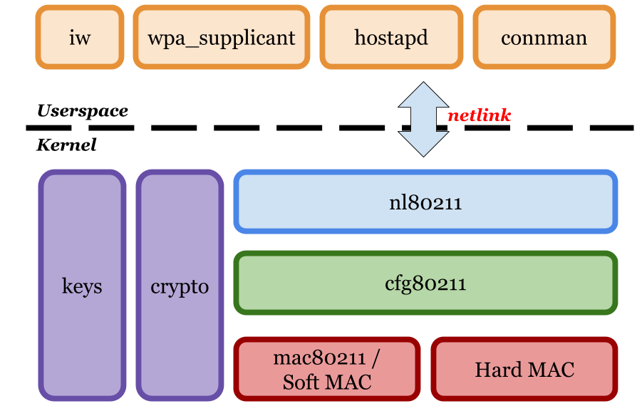
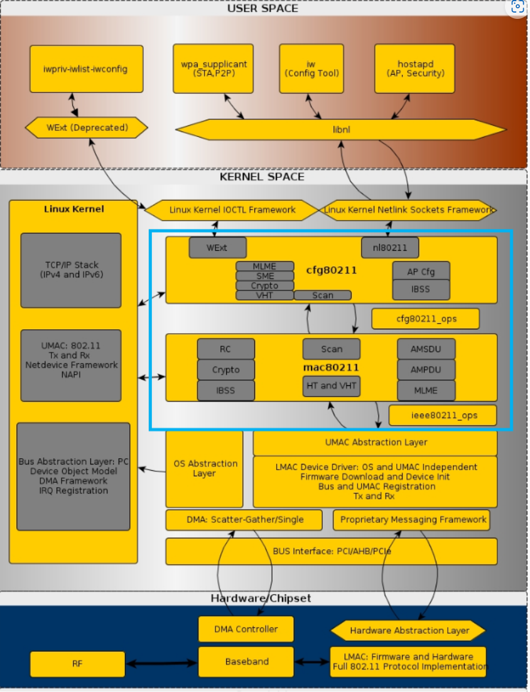

# 80211协议栈

> 参考文档：
>
> [Linux 802.11 Driver Developer’s Guide — The Linux Kernel documentation](https://www.kernel.org/doc/html/v4.12/driver-api/80211/)
>
> [Netlink - 维基百科，自由的百科全书](https://en.wikipedia.org/wiki/Netlink)
>
> [Emulating WLAN in Linux - part I: the 802.11 stack | Linux Embedded](https://linuxembedded.fr/2020/05/emulating-wlan-in-linux-part-i-the-80211-stack)
>
> 
>
> 笔者注：关于`Linux`内核网络子模块的相关介绍前人之述备矣，这里不做碍于篇幅和技术能力不做太多深入解读

## 整体架构概述

`Linux 80211`协议栈大致包含如下几个模块

`nl82011`模块、`cfg80211`模块、`mac80211`模块下文中详细展开每个模块

> 图片源自：[Emulating WLAN in Linux - part I: the 802.11 stack | Linux Embedded](https://linuxembedded.fr/2020/05/emulating-wlan-in-linux-part-i-the-80211-stack)

----

## 各个子模块概述

### 1. `nl80211`子模块

`nl`是`NetLink`的缩写，在古早的`Linux`版本中内核态与用户态的通信主要依靠`ioctl`、`syscall`、文件子系统、消息队列、信号量和共享内存。这些通信方式对于内核网络子模块来说并不很好的使用，它的设计和开发最初只是因为网络子模块在内核态与用户态交互时，使用原有的交互方式不能很好的满足需求。`netlink`为了代替`ioctl`而被开发，并在 `Linux`的`2.2`版本中被加入内核

在用户空间使用`netlink`时可以引入`libnl`库来使用封装好的接口或者是直接使用裸`socket`

> 关于这个协议的具体描述见[RFC 3549 - Linux Netlink as an IP Services Protocol](https://datatracker.ietf.org/doc/html/rfc3549)

#### 1.1 主要功能

`nl80211` 模块的主要作用是作为用户空间工具（如 `iw` 和 `hostapd`）与内核无线驱动程序（通常基于 `mac80211` 框架）的桥梁。它允许用户空间程序通过 Netlink 套接字与内核通信，从而实现对无线设备的管理和控制

### 2. `cfg80211`子模块

> cfg80211 is the configuration API for 802.11 devices in Linux. It bridges userspace and drivers, and offers some utility functionality associated with 802.11. cfg80211 must, directly or indirectly via mac80211, be used by all modern wireless drivers in Linux, so that they offer a consistent API through nl80211. For backward compatibility, cfg80211 also offers wireless extensions to userspace, but hides them from drivers completely.
>
> `cfg80211`是`Linux`中 `802.11` 设备的配置 `API`。它桥接用户空间和驱动程序，并提供一些与 `802.11` 相关的实用程序功能。`cfg80211` 必须直接或间接通过 `mac80211` 使用`Linux` 中的所有现代无线驱动程序，以便它们提供一致的`API` 通过 `nl80211`。为了向后兼容，`cfg80211` 还提供用户空间的无线扩展，但将它们完全隐藏在驱动程序中
>
> --摘自[cfg80211 subsystem — The Linux Kernel documentation](https://www.kernel.org/doc/html/v4.12/driver-api/80211/cfg80211.html)

#### 2.1 主要作用

1. **无线设备的抽象层**
   `cfg80211` 提供了一个统一的接口，屏蔽了不同无线网卡驱动的实现差异，使得用户空间工具（如 `iw` 和 `wpa_supplicant`）可以通过标准化的方式与无线设备交互
2. **管理无线网络功能**
   它支持 `802.11` 标准的各种功能，包括：
   - 扫描无线网络
   - 连接和断开无线网络
   - 管理接入点（`AP` 模式）
   - 设置无线网络参数（如信道、频率、加密方式等）
3. **与用户空间通信**
   `cfg80211` 使用 `netlink` 通信机制与用户空间工具（如 `iw`）交互，接收用户空间的配置命令并将结果返回
4. **支持驱动开发**
   它为无线网卡驱动提供了一个框架，驱动开发者可以通过实现 `cfg80211` 的回调函数来支持无线功能，而不需要直接处理复杂的 `802.11` 协议
5. **监管域管理**
   `cfg80211` 负责管理无线设备的监管域（`regulatory domain`），确保无线设备在不同国家或地区遵守当地的无线频谱法规

#### 2.2 与 `mac80211` 的关系

- `cfg80211` 是一个配置框架，负责管理无线设备的高层配置
- `mac80211` 是一个更底层的框架，负责实现 `802.11` 协议栈的具体功能
- 一般来说，`mac80211` 驱动会依赖 `cfg80211` 提供的接口，而 `cfg80211` 也可以直接与硬件驱动（如基于 `FullMAC` 的驱动）交互

#### 2.3 常见用户空间工具

- **`iw`**：用于配置和管理无线网络
- **`wpa_supplicant`**：用于管理无线网络的安全连接（如 `WPA/WPA2`）

### 3. `mac80211`子模块

`mac80211` 是 `Linux` 内核中的一个无线网络协议栈模块，主要用于实现 `802.11` 标准的中层逻辑。它为基于 `SoftMAC`（软件控制 MAC 层）的无线网卡驱动提供了一个通用框架，简化了驱动开发，并实现了 `802.11` 协议的大部分功能

#### 3.1 主要作用

1. **实现 802.11 协议栈**
   `mac80211` 实现了 `802.11` 标准的核心功能，包括：
   - 帧管理（如信标帧、探测帧、关联帧等）
   - 数据帧处理（如加密、解密、重传等）
   - 功能模式支持（如 `STA`、`AP`、`Ad-Hoc`、`Mesh` 等模式）
   - 功率管理（如节能模式）
2. **SoftMAC 驱动支持**
   `mac80211` 专为 `SoftMAC` 驱动设计，`SoftMAC` 驱动将大部分 `802.11` 协议的实现交由软件完成，而硬件仅负责基本的帧发送和接收。`mac80211` 提供了这些功能的通用实现，驱动开发者只需专注于硬件相关部分
3. **与 `cfg80211` 的协作**
   - `cfg80211` 负责无线设备的高层配置和管理
   - `mac80211` 负责实现 802.11 协议的具体逻辑
   - 两者协作，`cfg80211` 调用 `mac80211` 提供的接口来完成无线网络的配置和操作
4. **帧处理**
   `mac80211` 负责处理无线帧的生成、解析和管理，包括：
   - 数据帧的加密和解密（支持 `WPA/WPA2` 等加密协议）
   - 管理帧的生成和处理（如信标、探测请求/响应等）
   - 控制帧的处理（如 `RTS/CTS` 等）
5. **支持多种无线模式**
   `mac80211` 支持多种无线工作模式，包括：
   - **STA（Station）模式**：作为客户端连接到无线接入点
   - **AP（Access Point）模式**：作为无线接入点提供服务
   - **Ad-Hoc 模式**：点对点网络
   - **Mesh 模式**：无线网状网络
6. **QoS 和多媒体支持**
   它支持 `802.11e` 标准的服务质量（`QoS`）功能，用于多媒体流量的优先级管理
7. **调试和监控**
   `mac80211` 提供了丰富的调试和监控功能，方便开发者和管理员分析无线网络的行为

----

## 从Linux的WLAN整体架构来看

可以看出`80211`栈主要位于内核中的最上层，同时和用户空间中的应用、底层驱动、`linux`内核协议栈相关联，扮演了重要的承接角色。在这一部分的更底层还有着`UMAC`、`LMAC`这些更底层的模块

----

## FullMAC与SoftMAC不同的两种驱动架构模式

`FullMAC` 是无线网络设备驱动程序的一种架构模式，与 `SoftMAC` 相对。它定义了无线网卡（`Wi-Fi` 芯片）和驱动程序在功能实现上的分工方式

### 1. FullMAC(HardMAC)

**`FullMAC`又被称作`HardMAC`；**在 `FullMAC` 架构中，`Wi-Fi` 网卡的固件（`Firmware`）负责实现大部分的无线协议栈功能（如 `802.11` 协议的管理帧处理、加密解密、扫描、关联等）。驱动程序的主要职责是与固件通信，提供用户空间与硬件之间的接口。

简单来说，`FullMAC` 的核心思想是将无线协议的复杂逻辑尽可能地放到网卡的固件中，而驱动程序只需要处理基本的硬件控制和数据传输。

#### 1.1 FullMAC 的主要特点

1. **固件负责主要功能**：
   - 无线协议栈的实现（如扫描、关联、认证、加密等）
   - 管理帧的处理（如 `Beacon`、`Probe Request/Response`）
   - `QoS`（服务质量）和功率管理
2. **驱动程序较为简单**：
   - 主要负责与固件通信（通常通过接口如 `SDIO`、`USB` 或 `PCIe`）
   - 提供用户空间工具（如 `iw` 或 `wpa_supplicant`）与固件交互的接口
3. **硬件依赖性强**：
   - `FullMAC` 驱动程序通常与特定的硬件绑定，无法跨硬件复用
   - 固件的更新和维护由硬件厂商负责

#### 1.2 FullMAC 的优点

1. **降低驱动复杂性**：
   - 由于大部分功能由固件实现，驱动程序的代码量和复杂性显著降低
2. **更高的稳定性**：
   - 固件运行在网卡内部，与操作系统隔离，减少了因内核更新或驱动问题导致的不稳定性
3. **跨平台支持**：
   - 固件与操作系统无关，因此 `FullMAC` 驱动程序可以更容易地支持不同的操作系统（如 `Linux`、`Windows`、`Android`）
4. **节省主机资源**：
   - 由于大部分协议处理在网卡内部完成，减少了主机 `CPU` 的负担

#### 1.3 FullMAC 的缺点

1. **灵活性较低**：
   - 固件是由硬件厂商开发的，用户无法轻松修改或扩展功能
   - 对于一些高级功能（如 `Mesh` 网络、自定义协议），可能需要厂商支持
2. **依赖厂商支持**：
   - 固件的更新和维护完全依赖硬件厂商，可能导致功能更新滞后或安全问题
3. **调试困难**：
   - 固件是封闭的，开发者无法直接查看或修改其实现，调试问题时可能会受限

### 2. SoftMAC

在 `SoftMAC` 架构中，`Wi-Fi` 网卡的固件只负责最基本的硬件操作（如发送和接收数据包），而无线协议栈的复杂逻辑（如扫描、关联、认证、加密等）由操作系统内核中的软件实现。这种架构使得驱动程序和协议栈的开发更加灵活和可控

#### 2.1 SoftMAC 的主要特点

1. **协议栈由软件实现**：
   - `802.11` 协议的大部分功能（如管理帧处理、扫描、关联、加密等）由 `Linux` 内核中的 `mac80211` 框架实现
2. **硬件功能较简单**：
   - 硬件（网卡固件）只负责基本的操作，如数据包的发送和接收
3. **驱动程序复杂性较高**：
   - 驱动程序需要与 `mac80211` 框架配合，处理无线协议的各种细节
4. **灵活性高**：
   - 由于协议栈在软件中实现，开发者可以轻松修改或扩展功能

#### 2.2 SoftMAC 的工作原理

`SoftMAC` 驱动程序依赖于 Linux 内核中的 `mac80211` 框架。mac80211 提供了一个通用的 `802.11` 协议栈实现，驱动程序只需要实现与硬件的通信接口（通常通过 `cfg80211` 接口）。这种分层设计使得驱动程序可以专注于硬件控制，而协议栈的复杂逻辑由 `mac80211` 处理

#### 2.3 相关组件

1. **mac80211**：
   - `Linux` 内核中的 `802.11` 协议栈框架，负责实现无线协议的核心功能
2. **cfg80211**：
   - 提供用户空间与内核无线子系统之间的接口，支持工具如 `iw` 和 `wpa_supplicant`
3. **用户空间工具**：
   - 如 `iw`（用于管理无线设备）、`wpa_supplicant`（用于无线客户端连接）

### 3. FullMAC 与 SoftMAC 的对比

| 特性           | FullMAC        | SoftMAC              |
| -------------- | -------------- | -------------------- |
| **协议栈实现** | 由硬件固件实现 | 由驱动程序和内核实现 |
| **驱动复杂性** | 简单           | 复杂                 |
| **灵活性**     | 较低           | 较高                 |

### 4. 总结

`FullMAC` 是一种无线网卡驱动架构，适合资源受限的设备和消费级场景。它通过将复杂的无线协议逻辑放到固件中，简化了驱动开发，但也牺牲了一定的灵活性和可控性。与之相对的 `SoftMAC` 架构则更适合需要高度定制化和灵活性的场景

`SoftMAC` 是一种灵活的无线网卡驱动架构，适合需要高度定制化和复杂功能的场景。它通过将无线协议栈的大部分功能移到软件中实现，提供了更高的灵活性和可控性，但也增加了主机资源的占用和驱动开发的复杂性。与之相对的 `FullMAC` 架构更适合资源受限的设备和消费级场景

----

## Upper MAC(UMAC)与Lower MAC(LMAC)驱动架构下的逻辑分层

**UMAC**（`Upper MAC`）和 **LMAC**（`Lower MAC`）是无线网络协议栈中 `MAC` 层（`Medium Access Control`，媒体访问控制层）的两个逻辑分层。它们将 `MAC` 层的功能划分为高层和低层，以便更好地组织和实现无线通信的功能

### 1. UMAC（Upper MAC）

`UMAC` 是 `MAC` 层的高层部分，主要负责与无线协议的管理和控制相关的功能。它通常运行在主机（`Host`）端的软件中，或者在 `FullMAC` 架构中由固件实现

#### 1.1 UMAC 的主要功能

1. **协议管理**：
   - 处理 `802.11` 协议的管理帧（如 `Beacon`、`Probe Request/Response`、`Association` `Request/Response`等）
   - 负责扫描、关联、认证等操作
2. **网络管理**：
   - 管理无线网络的连接状态
   - 处理网络切换（`Roaming`）和断开连接
3. **加密和安全**：
   - 配置和管理无线网络的加密方式（如 `WPA/WPA2/WPA3`）
   - 处理密钥交换和认证协议
4. **QoS（服务质量）管理**：
   - 管理数据流的优先级和带宽分配
5. **用户空间交互**：
   - 提供接口供用户空间工具（如 `iw` 或 `wpa_supplicant`）与无线设备交互

### 2. LMAC（Lower MAC）

`LMAC` 是 `MAC` 层的低层部分，主要负责与硬件相关的实时操作。它通常运行在无线网卡的固件中，或者在 `SoftMAC` 架构中由驱动程序实现

#### 2.1 **LMAC 的主要功能**

1. **帧处理**：
   - 处理数据帧的发送和接收
   - 实现帧的重传、确认（`ACK`）和序列号管理
2. **时间敏感操作**：
   - 处理实时性要求较高的操作，如信道访问、退避算法（`Backoff`）、`RTS/CTS`（请求发送/清除发送）机制
3. **硬件控制**：
   - 控制无线网卡的物理层（`PHY`），如信道切换、功率控制等
   - 实现低级别的加密和解密操作
4. **功率管理**：
   - 实现设备的低功耗模式（如睡眠模式和唤醒）

### 3. UMAC 和 LMAC 的区别

| 特性           | UMAC（Upper MAC）          | LMAC（Lower MAC）              |
| -------------- | -------------------------- | ------------------------------ |
| **位置**       | 主机端（软件）或固件       | 网卡固件或驱动程序             |
| **功能**       | 高层协议管理和控制         | 低层实时操作和硬件控制         |
| **职责**       | 负责网络管理、加密、安全等 | 负责帧处理、信道访问、功率管理 |
| **实时性要求** | 较低                       | 较高                           |
| **实现方式**   | 软件或固件                 | 固件或硬件                     |
| **依赖性**     | 与用户空间工具交互         | 与硬件直接交互                 |

### 4. UMAC 和 LMAC 的协作

`UMAC` 和 `LMAC` 是 `MAC` 层的两个部分，它们通过明确的分工协作完成无线通信的功能：

1. `UMAC` 负责高层逻辑：
   - 例如，`UMAC` 决定连接到哪个无线网络，并通过管理帧与目标网络进行交互。
2. `LMAC` 负责低层操作：
   - 例如，`LMAC` 执行实际的帧发送和接收操作，并确保实时性要求（如信道访问和退避算法）得到满足这种分层设计使得无线协议栈的实现更加模块化和高效，同时也便于开发和维护

3. `UMAC` 和 `LMAC` 的分层设计：
   * 在 `FullMAC` 架构中，`UMAC` 和 `LMAC` 通常都由网卡的固件实现，主机端只需要一个简单的驱动程序
   * 在 `SoftMAC` 架构中，`UMAC` 通常由 `Linux` 内核中的 `mac80211` 框架实现，而 `LMAC` 由驱动程序或硬件实现

### 5. 总结

- `UMAC`：负责高层协议管理和控制，主要处理无线网络的逻辑功能
- `LMAC`：负责低层实时操作和硬件控制，主要处理无线通信的物理实现
- 它们的分工协作使得无线网络协议栈既灵活又高效，适应不同的硬件架构和应用场景
