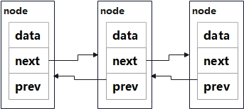
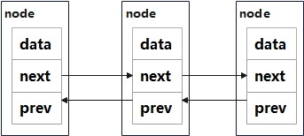

# 侵入式链表

> 参考文档
>
> [Release v5.4 · torvalds/linux](https://github.com/torvalds/linux/releases/tag/v5.4)


## 概述

常规写法的经典链表每个链表的节点包含指针部分和数据部分，每个节点的指针是一个指针指向下一个节点。每一个链表的节点的内容都是不一样的，每一个链表都需要定义一次，包括对于链表的操作的`API`也需要重新开发



`Linux`中的侵入式链表与普通的链表不同的，`Linux`提供了一个公共的链表头的结构体，其中只包含了头指针和尾指针

```c
//linux-5.4/include/linux/types.h
struct list_head {
	struct list_head *next, *prev;
};
```

在实际的使用是节点的`next`指针指向的是，下一个链表的指针域。在获取每个节点中的数据域时提供了一套公共的链表管理`API`




## 具体应用

在`Linux`内核中关于侵入式链表的具体应用有很多

比如说，内核等待队列的事件节点的定义

```c
struct wait_queue_entry {
	unsigned int		flags;
	void			*private;
	wait_queue_func_t	func;
	struct list_head	entry;
}
```

在读取具体的节点的内容时通过指针来反向获取节点的内容