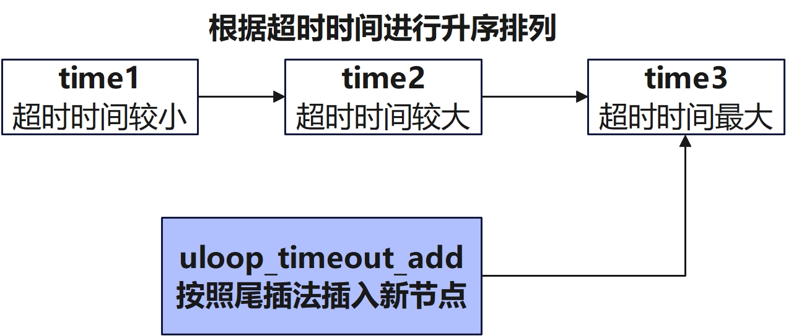
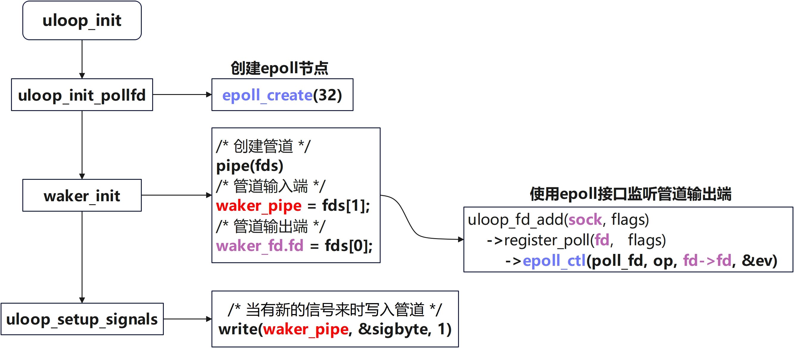
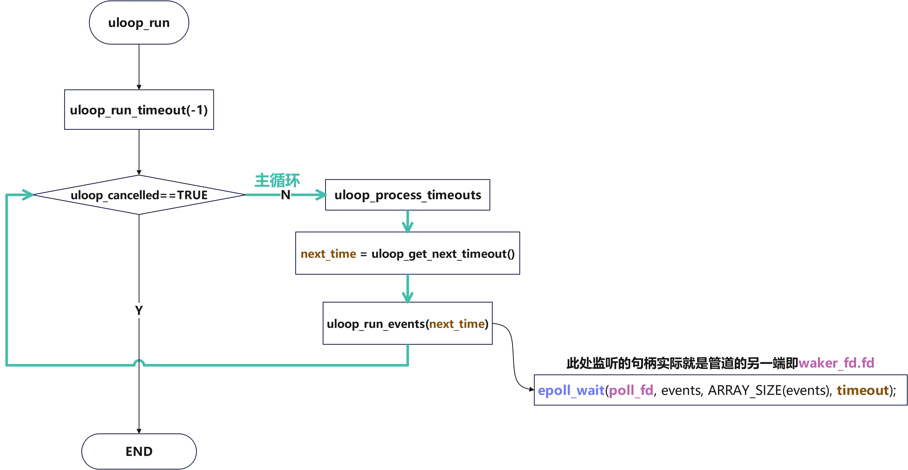
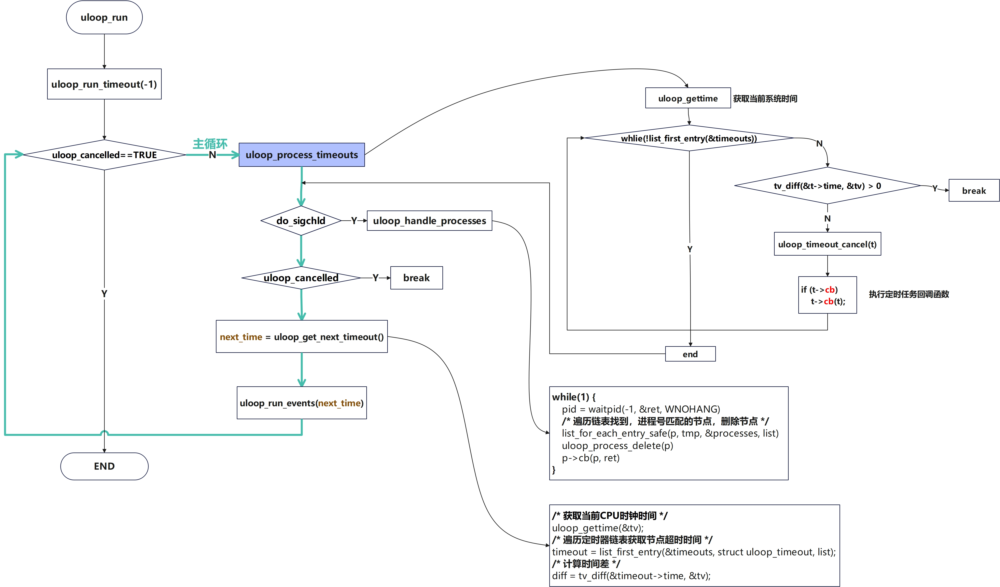

# uloop源码解析

[TOC]

## 概述

`uloop`是一个基于`epoll`建立的轻量级事件循环库，它允许程序以单线程、非阻塞的方式处理多种事件源。主要提供了`timeout`定时器处理和文件描述符触发事件的监控的能力

`uloop`的核心数据结构围绕着三个链表进行展开，分别是定时器链表、子进程链表、信号管理链表，其中信号管理链表主要是用于管理内部定时任务的销毁动作

整体架构的设计是，对外部提供创建监听句柄、子进程任务的外部接口。并注册外部信号量处理的回调函数，在外部收到外部的信号时，结束当前的定时任务。内部维护中每两次循环之间的间隔由每个事件设置的超时时间决定，底层是由`epoll_wait`等待预设好的事件

其中最重要的核心部分是定时器链表的管理和维护，每一轮都会先找到定时任务链表中的第一个节点，计算这个任务和当前时间的插值，用这个插值作为下一次循环的等待时间

**整体结构如下图**


## 主要作用和使用方法

### **设置定时任务**

`uloop`可以作为一个定时器来使用，执行一些周期性执行的定时任务

```c
#include <stdio.h>
#include <uloop.h>

struct uloop_timeout timeout;                        // 创建uloop_timeout全局变量

int frequency = 5;                                     // 每隔5秒超时一次

// 设置定时器回调
static void timeout_cb(struct uloop_timeout *t)
{
    printf("[%s] uloop test \n", __FUNCTION__);
    uloop_timeout_set(t, frequency * 1000);
}

int main()
{    
    uloop_init();                                    // 使用库初始化    
    timeout.cb = timeout_cb;                        // 设置定时器超时回调
    uloop_timeout_set(&timeout, frequency * 1000);    // 设置下次的超时时间
    uloop_run();
    uloop_done();
}
```

上述程序效果：每隔`5S`打印一次

### **监听句柄是否活跃**

程序创建了一个`TCP 8888`的端口并监听它，使用`uloop`设置回调在`socket`活跃时调用。程序整体分两部分，创建句柄并用`uloop`监听的`server`侧和连接`socket`的`client`端

**uloop_server侧程序如下:**

```c
#include <stdio.h>
#include <stdlib.h>
#include <string.h>
#include <unistd.h>
#include <sys/socket.h>
#include <netinet/in.h>
#include <arpa/inet.h>

#include "uloop.h"

#define PORT 8888
#define MAX_CONN 10

static struct uloop_fd server_fd;

static inline void close_server_fd(int sock)
{
    close(sock);
}

int create_server_socket()
{
    int sock;
    struct sockaddr_in server_addr;

    sock = socket(AF_INET, SOCK_STREAM, 0);
    if (sock < 0) {
        perror("socket");
        return -1;
    }

    // 设置地址可重用
    int reuse = 1;
    if (setsockopt(sock, SOL_SOCKET, SO_REUSEADDR, &reuse, sizeof(reuse)) < 0) {
        perror("setsockopt");
        close(sock);
        return -1;
    }

    memset(&server_addr, 0, sizeof(server_addr));
    server_addr.sin_family = AF_INET;
    server_addr.sin_addr.s_addr = htonl(INADDR_ANY);
    server_addr.sin_port = htons(PORT);

    if (bind(sock, (struct sockaddr *)&server_addr, sizeof(server_addr)) < 0) {
        perror("bind");
        close(sock);
        return -1;
    }

    if (listen(sock, MAX_CONN) < 0) {
        perror("listen");
        close(sock);
        return -1;
    }

    printf("Server listening on port %d...\n", PORT);

    return sock;
}

// 当有新的客户端连接时，此回调函数将被调用
static void server_cb(struct uloop_fd *u, unsigned int events)
{
    int conn_fd = 0;
    char client_ip[INET_ADDRSTRLEN] = {0};
    const char *msg = "Hello from uloop server!\n";
    struct sockaddr_in client_addr = {0};
    socklen_t client_len = sizeof(client_addr);

    if (events & ULOOP_READ) {
        conn_fd = accept(u->fd, (struct sockaddr *)&client_addr, &client_len);
        if (conn_fd < 0) {
            perror("accept");
            return;
        }

        inet_ntop(AF_INET, &client_addr.sin_addr, client_ip, INET_ADDRSTRLEN);
        printf("New connection from %s:%d\n", client_ip, ntohs(client_addr.sin_port));

        write(conn_fd, msg, strlen(msg));
        close(conn_fd);
        printf("Connection closed.\n");
    }

    return;
}

void server_run(int sock)
{
    uloop_init();

    server_fd.fd = sock;
    server_fd.cb = server_cb; 
    server_fd.flags = ULOOP_READ; // 监听可读事件

    uloop_fd_add(&server_fd, ULOOP_READ);
    uloop_run();

    uloop_done();

    return;
}

int main(int argc, char **argv)
{
    int sock = create_server_socket();

    server_run(sock);
    close_server_fd(sock);
    printf("Server shut down.\n");

    return 0;
}
```

**clinet侧：**

```c
#include <stdio.h>
#include <stdlib.h>
#include <string.h>
#include <unistd.h>
#include <sys/socket.h>
#include <netinet/in.h>
#include <arpa/inet.h>

#define SERVER_IP "127.0.0.1"
#define SERVER_PORT 8888
#define BUFFER_SIZE 1024

int client_uloop(int sock)
{
    struct sockaddr_in server_addr = {0};
    char buffer[BUFFER_SIZE] = {0};

    memset(&server_addr, 0, sizeof(server_addr));
    server_addr.sin_family = AF_INET;
    server_addr.sin_port = htons(SERVER_PORT);
    if (inet_pton(AF_INET, SERVER_IP, &server_addr.sin_addr) <= 0) {
        perror("inet_pton");
        close(sock);
        return 1;
    }

    if (connect(sock, (struct sockaddr *)&server_addr, sizeof(server_addr)) < 0) {
        perror("connect");
        close(sock);
        return 1;
    }

    printf("Connected to server at %s:%d\n", SERVER_IP, SERVER_PORT);

    ssize_t bytes_received = read(sock, buffer, sizeof(buffer) - 1);
    if (bytes_received < 0) {
        perror("read");
    } else if (bytes_received == 0) {
        printf("Server closed the connection.\n");
    } else {
        buffer[bytes_received] = '\0';
        printf("Received message: %s", buffer);
    }

    close(sock);

    return 0;
}

// 客户端程序：连接到服务器并接收消息
void do_loop()
{
    int sock;

    while (1) {
        sock = socket(AF_INET, SOCK_STREAM, 0);
        if (sock < 0) {
            perror("socket");
            return;
        }

        if (client_uloop(sock))
            perror("client_uloop failed");
        sleep(1);
    }

    return;
}

int main(int argc, char **argv)
{
    do_loop();

    return 0;
}
```

**上程序效果：**

* `server`侧创建一个`TCP 8888`端口，在有新的`client`端接入时会打印`New connection from client_ip:client_port`

* `client`端程序的作用已1S的间隔不断的去连接本机的`TCP 8888`端口，这里只是为了演示用，实际上任何程序接入`server`端都是可以的

**日志：**

```shell
# server端
./server.out
Server listening on port 8888...
New connection from 127.0.0.1:48498
Connection closed.
New connection from 127.0.0.1:48504
Connection closed.
New connection from 127.0.0.1:48516
Connection closed.
New connection from 127.0.0.1:48520
Connection closed.
New connection from 127.0.0.1:48532
Connection closed.

# client端
./client.out 
Connected to server at 127.0.0.1:8888
Received message: Hello from uloop server!
Connected to server at 127.0.0.1:8888
Received message: Hello from uloop server!
Connected to server at 127.0.0.1:8888
Received message: Hello from uloop server!
Connected to server at 127.0.0.1:8888
Received message: Hello from uloop server!
Connected to server at 127.0.0.1:8888
Received message: Hello from uloop server!
```

### **进程监控**

程序通过`fork`函数创建了一个子进程并在父进程中使用`uloop`来监听子进程的状态，当被监听的进程退出时就会调用对应的回调函数`process_cb`

```c
#include <stdio.h>
#include <stdlib.h>
#include <unistd.h>
#include <sys/wait.h>

#include "uloop.h"

static struct uloop_process child_process;

// 进程事件回调函数
static void process_cb(struct uloop_process *p, int ret)
{
    printf("Process %d exited with status %d\n", p->pid, WEXITSTATUS(ret));
}

int main(int argc, char **argv)
{
    pid_t pid;

    // 初始化 uloop
    uloop_init();

    pid = fork();

    if (pid < 0) {
        perror("fork");
        return 1;
    }

    if (pid == 0) {
        // 子进程
        printf("Child process started, PID: %d\n", getpid());
        sleep(2); // 模拟子进程工作
        printf("Child process exiting\n");
        exit(42);
    }

    // 父进程
    printf("Parent process, watching child PID: %d\n", pid);

    // 设置 uloop_process
    child_process.cb = process_cb;
    child_process.pid = pid;

    // 将进程添加到 uloop 监视
    uloop_process_add(&child_process);

    // 启动 uloop 事件循环
    uloop_run();

    // 清理 uloop
    uloop_done();

    return 0;
}
```

-----

## 核心数据结构

### 定时任务timeouts链表

定时器链表，记录定时器的状态

```c
/* 全局变量 */
static struct list_head timeouts = LIST_HEAD_INIT(timeouts);

/* 定时器链表节点 */
typedef void (*uloop_timeout_handler)(struct uloop_timeout *t);

struct uloop_timeout
{
    struct list_head list;        //链表头，用于链表操作
    bool pending;                //指向另一个定时器结构的指针，用于管理尚未处理的定时器

    uloop_timeout_handler cb;    //回调函数，用于处理定时器超时事件
    struct timeval time;        //用于存储超时时间
};
```

#### 定时任务链表管理接口

**`uloop_timeout_add`函数**

新增定时器节点

**源代码如下**

> 笔者注：除注释外，所有代码均未删改

```c
int uloop_timeout_add(struct uloop_timeout *timeout)
{
    struct uloop_timeout *tmp;
    struct list_head *h = &timeouts;

    if (timeout->pending)
        return -1;

    /*
     * 遍历整个定时链表
     * 比较需要插入的节点的时间和当前链表元素的时间，将较大的值采用尾插法插入
     */
    list_for_each_entry(tmp, &timeouts, list) {
        if (tv_diff(&tmp->time, &timeout->time) > 0) {
            h = &tmp->list;
            break;
        }
    }

    list_add_tail(&timeout->list, h);
    timeout->pending = true;

    return 0;
}
```

**核心思想**



整个定时器链表以`time`排序遵循递增的顺序，将时间较大的元素插入尾部

**`uloop_clear_timeouts`函数**

函数主要作用是，清空定时器链表

**源代码如下**

> 笔者注：除注释外，所有代码均未删改

```c
static void uloop_clear_timeouts(void)
{
    struct uloop_timeout *t, *tmp;
    
    /* 遍历定时器链表 */
    list_for_each_entry_safe(t, tmp, &timeouts, list)
        uloop_timeout_cancel(t);
}

int uloop_timeout_cancel(struct uloop_timeout *timeout)
{
    if (!timeout->pending)
        return -1;

    list_del(&timeout->list);
    timeout->pending = false;

    return 0;
}
```

**核心思想**

遍历链表，从链表中删除遍历到的每一个元素，并将进程状态`p->pending`置为`flase`

**`uloop_process_timeouts`函数**

定时器链表管理**核心接口**。遍历整个链表执行已经到达时间的节点回调，并清除定时器

**源代码如下**

> 笔者注：除注释外，所有代码均未删改

```c
static void uloop_process_timeouts(void)
{
    struct uloop_timeout *t;
    struct timeval tv;

    if (list_empty(&timeouts))
        return;

    uloop_gettime(&tv);
    while (!list_empty(&timeouts)) {
        /* 获取定时器链表时间和当前时间比较 */
        t = list_first_entry(&timeouts, struct uloop_timeout, list);
        if (tv_diff(&t->time, &tv) > 0)
            break;

        /* 清除超时的定时器，并执行定时器回调 */
        uloop_timeout_cancel(t);
        if (t->cb)
            t->cb(t);
        
    }
}
```

**核心思想**

遍历整个定时器链表，将时间超过当前时间的节点清除，然后执行对应回调

### 子进程管理processes链表

将待检测的子进程注册后会在子进程执行结束后执行提前注册的回调，需要注意的是**`uloop`不支持多线程，多线程下会出现死锁问题**

```c
static struct list_head processes = LIST_HEAD_INIT(processes);

struct uloop_process
{
    struct list_head list;        //链表头，用于链表操作
    bool pending;                //进程的状态是否处于“待处理”状态

    uloop_process_handler cb;    //回调函数指针
    pid_t pid;                    //管理的子进程的PID
};
```

#### 子进程管理链表管理接口

**uloop_process_add函数**

添加新节点

**源代码如下**

> 笔者注：除注释外，所有代码均未删改

```c
int uloop_process_add(struct uloop_process *p)
{
    struct uloop_process *tmp;
    struct list_head *h = &processes;

    if (p->pending)
        return -1;

    list_for_each_entry(tmp, &processes, list) {
        if (tmp->pid > p->pid) {
            h = &tmp->list;
            break;
        }
    }

    list_add_tail(&p->list, h);
    p->pending = true;

    return 0;
}
```

**核心思想**

按照升序排序将新节点插入链表中

**`uloop_clear_processes`函数**

清空链表

**源代码如下**

> 笔者注：除注释外，所有代码均未删改

```c
static void uloop_clear_processes(void)
{
    struct uloop_process *p, *tmp;

    list_for_each_entry_safe(p, tmp, &processes, list)
        uloop_process_delete(p);
}

int uloop_process_delete(struct uloop_process *p)
{
    if (!p->pending)
        return -1;

    list_del(&p->list);
    p->pending = false;

    return 0;
}
```

**核心思想**

遍历链表，从链表中删除遍历到的每一个元素，并将进程状态`p->pending`置为`flase`

**`uloop_handle_processes`函数**

子进程管理核心接口，

**源代码如下**

> 笔者注：除注释外，所有代码均未删改

```c
static void uloop_handle_processes(void)
{
    struct uloop_process *p, *tmp;
    pid_t pid;
    int ret;

    do_sigchld = false;

    while (1) {
        pid = waitpid(-1, &ret, WNOHANG);
        if (pid < 0 && errno == EINTR)
            continue;

        if (pid <= 0)
            return;
        /*
         * 遍历链表，直到找到与子进程匹配的pid
         * 删除节点并执行节点对应回调
         */
        list_for_each_entry_safe(p, tmp, &processes, list) {
            if (p->pid < pid)
                continue;

            if (p->pid > pid)
                break;

            uloop_process_delete(p);
            p->cb(p, ret);
        }
    }
}
```

### 信号管理signals链表

信号管理链表,主要的作用是管理外部的信号和子进程链表的信号

```c
static struct list_head signals = LIST_HEAD_INIT(signals);

typedef void (*uloop_signal_handler)(struct uloop_signal *s);

struct uloop_signal
{
    struct list_head list;            //链表头，用于链表操作
    struct sigaction orig;            //信号的原始处理器的设置
    bool pending;                    //指示信号是否处于“待处理”状态

    uloop_signal_handler cb;        //回调函数指针
    int signo;                        //存储了信号的编号
};
```

#### 信号管理链表管理接口

**`uloop_signal_add`函数**

添加新的信号到信号管理链表中

**源代码如下**

> 笔者注：除注释外，所有代码均未删改

```c
int uloop_signal_add(struct uloop_signal *s)
{
    struct list_head *h = &signals;
    struct uloop_signal *tmp;
    struct sigaction sa;

    if (s->pending)
        return -1;

    /* 将传入的信号按照升序排列添加到链表中 */
    list_for_each_entry(tmp, &signals, list) {
        if (tmp->signo > s->signo) {
            h = &tmp->list;
            break;
        }
    }

    list_add_tail(&s->list, h);
    s->pending = true;

    sigaction(s->signo, NULL, &s->orig);

    if (s->orig.sa_handler != uloop_signal_wake) {
        /* 设置信号处理回调函数 uloop_signal_wake */
        sa.sa_handler = uloop_signal_wake;
        sa.sa_flags = 0;
        sigemptyset(&sa.sa_mask);
        /* 将sa.sa_handle绑定为信号s->signo的回调函数 */
        sigaction(s->signo, &sa, NULL);
    }

    return 0;
}
```

**核心思想**

信号管理链表的接口，与子进程和定时器管理链表的接口非常相似，先将节点添加到链表中然后设置回调。不同的是对于信号处理的回调函数不能直接进行绑定，需要通过`sigaction`系统调用来实现

**`uloop_signal_delete`函数**

**源代码如下**

> 笔者注：除注释外，所有代码均未删改

```c
int uloop_signal_delete(struct uloop_signal *s)
{
    if (!s->pending)
        return -1;

    list_del(&s->list);
    s->pending = false;

    if (s->orig.sa_handler != uloop_signal_wake)
        sigaction(s->signo, &s->orig, NULL);

    return 0;
}
```

**核心思想**

将节点从链表中删除，并将回调函数重置

-----

## 定时任务&子进程管理任务整体流程

### 1. 初始化uloop

初始化`uloop`的动作在底层对应的实际上是初始化了一个管道，并注册`epoll`事件监听管道的读端；在`uloop`初始化时会创建一个管道，管道的输入存储在一个全局变量中在接收到外部信号时则写这个句柄，管道的输出端使用`epoll`进行监听，监听超时时间即`uloop`超时时间

**`uloop`主体结构是一个大循环**，在每一轮的循环中去检查数个链表的节点元素是否超时，若超时则需要执行其对应的回调函数，并设置新一轮的循环。每一轮的循环的中间**间隔时间靠`epoll`监听管道输出端来阻塞进程**

**`uloop_init`函数**

```c
int uloop_init(void)
{
    if (uloop_init_pollfd() < 0)
        return -1;

    if (waker_init() < 0) {
        uloop_done();
        return -1;
    }

    uloop_setup_signals(true);

    return 0;
}
```

**核心思想**

本质是对`epoll`的一层封装，`uloop_init_pollfd`中创建`epoll`节点，后续在上层设置互斥锁防止出现死锁等问题。后续设置信号量监听回调函数

关于`uloop_init`函数的内部实现的具体调用栈如下

**函数调用栈**

```c
/* 创建epoll节点 */
uloop_init_pollfd()
    ->epoll_create()

uloop_init()
    /* 创建管道，使用epoll监听管道输出端 */
    ->waker_init()
        ->pipe(fds)
        ->uloop_fd_add(&waker_fd, ULOOP_READ)
            ->register_poll(sock, flags)
                ->epoll_ctl(poll_fd, op, fd->fd, &ev)
    /* 注册信号回调函数，回调函数写入管道输出端 */
    ->uloop_setup_signals()
        ->uloop_install_handler()
            ->uloop_signal_wake()
                ->write(waker_pipe, &sigbyte, 1)
```

**核心流程图**

核心思想是创建一个管道，并注册一部分外部信号的回调。使用`epoll`来监听管道的输出端，而在信号的回调中向管道的输入端写入数据。利用了`epoll_wait`的阻塞特性来作为底层的定时设置

**这里需要特别注意的是`uloop_fd_add`函数是直接对外暴露的**，如果需要添加对某个句柄的监听可直接调用这个接口



### 2. 设置定时器超时时间

`uloop_timeout_set`函数

```c
int uloop_timeout_set(struct uloop_timeout *timeout, int msecs)
{
    struct timeval *time = &timeout->time;

    if (timeout->pending)
        uloop_timeout_cancel(timeout);

    uloop_gettime(time);

    time->tv_sec += msecs / 1000;
    time->tv_usec += (msecs % 1000) * 1000;

    if (time->tv_usec > 1000000) {
        time->tv_sec++;
        time->tv_usec -= 1000000;
    }

    return uloop_timeout_add(timeout);
}
```

**核心思想**

获取当前系统时间，然后在此基础上设置超时时间，将待设置的配置添加到`uloop`的链表中

### 3. 核心循环

**核心循环流程**

**函数调用栈**

```c
/* 设置epoll监听管道输出端，并设置超时时间 */
uloop_run()
    ->uloop_run_timeout(-1)
        ->next_time = uloop_get_next_timeout();
        ->uloop_run_events(next_time);
            ->uloop_fetch_events
                ->epoll_wait(poll_fd, events, ARRAY_SIZE(events), timeout);
```

**核心流程图**

`uloop`的主循环实际上是在监听句柄的输出端，如果没有外部信号则该管道的输出端会一直不活跃。`uloop`便是利用了`epoll`阻塞式的特性来实现循环的等待并且在有外部中断信号时可以优雅的退出这个循环，这里的超时时间便是根据定时器链表中的事件计算，先计算超时事件再设置`epoll`监听

在主循环中每一轮去检查定时器链表和进程管理链表（见后文）来实现固定间隔事件处理事件的效果

**如果在循环的过程中句柄活跃则会直接唤醒`epoll`进入下一步流程，而不是等待时间结束**



**`uloop_run_timeout`函数**

核心接口，对定时器链表和子进程链表中的

```c
int uloop_run_timeout(int timeout);

static inline int uloop_run(void)
{
    return uloop_run_timeout(-1);
}

int uloop_run_timeout(int timeout)
{
    int next_time = 0;

    uloop_run_depth++;

    uloop_status = 0;
    uloop_cancelled = false;
    do {
        uloop_process_timeouts();                // 检测uloop链表中所有元素，将超时的事件从链表中删除

        if (do_sigchld)                            // 是否收到SIGCHLD信号，若收到则为true
            uloop_handle_processes();            // 检查所有已结束的子进程，在链表中删除节点，并调用回调函数处理

        if (uloop_cancelled)
            break;

        next_time = uloop_get_next_timeout();    // 计算下个事件超时离当前时间多久
        if (timeout >= 0 && (next_time < 0 || timeout < next_time))
                next_time = timeout;
        uloop_run_events(next_time);            //通过epoll监听文件句柄，超时时间设置为next_time
    } while (!uloop_cancelled && timeout < 0);

    --uloop_run_depth;

    return uloop_status;
}
```

**核心流程**



**核心思想**

最外层记录循环的深度，内层使用一个大的`while`循环作为函数的核心逻辑，使用`uloop_cancelled`和`timeout`共同控制循环

-----

## 监听句柄任务整体流程

### uloop_fd_add函数

由于`uloop`底层实际上是`epoll`，所以如果需要监听某个句柄则可以直接调用`uloop_fd_add`函数。这会将待监听的句柄添加到`struct uloop_fd`中，其默认采用非阻塞和水平触发

`uloop`中使用了一个全局变量`cur_fds`来存储对应的事件

```c
static struct uloop_fd_event cur_fds[ULOOP_MAX_EVENTS];
```

`uloop_fetch_events`函数中会对其进行赋值

> 笔者注：此处删除了大量字段，仅保留了核心部分逻辑

```c
static int uloop_fetch_events(int timeout)
{
    int n, nfds;

    nfds = epoll_wait(poll_fd, events, ARRAY_SIZE(events), timeout);
    for (n = 0; n < nfds; ++n) {
        struct uloop_fd_event *cur = &cur_fds[n];
        struct uloop_fd *u = events[n].data.ptr;
        ...
        cur->fd = u;
        ...
    }
    return nfds;
}
```

在`uloop_run_events`函数中对其进行调用

> 笔者注：此处删除了大量字段，仅保留了核心部分逻辑

```c
static void uloop_run_events(int64_t timeout)
{
    struct uloop_fd_event *cur;
    struct uloop_fd *fd;

    while (cur_nfds > 0) {
        struct uloop_fd_stack stack_cur;
        unsigned int events;

        cur = &cur_fds[cur_fd++];
        cur_nfds--;

        fd = cur->fd;

        stack_cur.fd = fd;
        fd_stack = &stack_cur;
        do {
            stack_cur.events = 0;
            fd->cb(fd, events);
        } while (stack_cur.fd && events);

        return;
    }
}
```

## **参考链接**

> [【openwrt】uloop_run过程分析_uloop 源代码分析-CSDN博客](https://blog.csdn.net/qq_24835087/article/details/122439506)
>
> [openWrt libubox组件之uloop原理分析-CSDN博客](https://blog.csdn.net/weixin_30388677/article/details/98090433)
