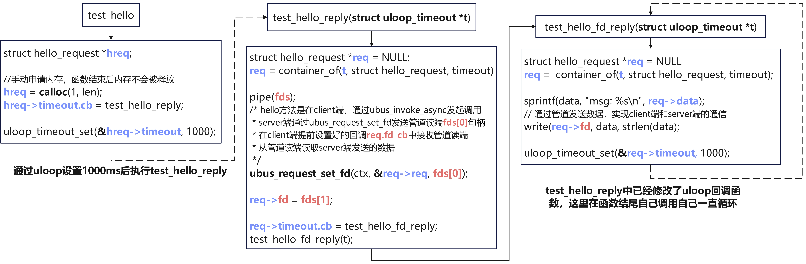

# ubus examples原理分析

> 笔者注：本文分析的是ubus源码中的官方demo，见源码目录的./ubus/examples/client.c

## client整体流程

整体流程上，`ubus`的运行需要三部分`ubusd`守护进程、`server`端和`client`端，本文对于`client`端的实现和`client`端与守护进程和`server`端的交互进行分析

**函数调用栈**

```c
main
    ->uloop_init
    ->ubus_connect
    	//这里创建了一个struct ubus_context变量，注册了各个回调
    	//将各种请求添加到对应的各个实践链表和一个avl树中
        ->ubus_connect_ctx
    //使用uloop监听刚才创建的ctx->sock.cb，在其对应的回调函数中去处理守护进程发来的消息
    ->ubus_add_uloop
    ->client_main
    	//分别演示了ubus的同步消息和异步消息
    	->ubus_invoke("watch");
		->ubus_invoke_async("hello");
```

这里需要特别的对`ubus_connect_ctx`函数展开解读，这个函数中执行了关键的初始化动作

**ubus_connect_ctx函数**

> 笔者注：为了方便阅读，此处省略了部分逻辑

```c
// ubus/libubus.c
int ubus_connect_ctx(struct ubus_context *ctx, const char *path)
{
	uloop_init();
	memset(ctx, 0, sizeof(*ctx));

	ctx->sock.fd = -1;
    //设置监听socket的回调，在监听到socket活跃后立刻执行
	ctx->sock.cb = ubus_handle_data;
    //设置ubus连接断开时的回调
	ctx->connection_lost = ubus_default_connection_lost;
    //设置处理消息队列的回调，一些消息可能没有被及时处理，就会被放的消息处理队列中
	ctx->pending_timer.cb = ubus_process_pending_msg;
	
    //UBUS_MSG_CHUNK_SIZE是65536
	ctx->msgbuf.data = calloc(1, UBUS_MSG_CHUNK_SIZE);
	ctx->msgbuf_data_len = UBUS_MSG_CHUNK_SIZE;

    //存储客户端发起的、正在等待响应的 ubus 请求
	INIT_LIST_HEAD(&ctx->requests);
    //暂存那些因为当前调用栈深度或其他原因不能立即处理的传入 ubus 消息
	INIT_LIST_HEAD(&ctx->pending);
    //管理那些需要自动重新订阅的事件订阅者
	INIT_LIST_HEAD(&ctx->auto_subscribers);
    //存储此 ubus 上下文注册的本地 ubus 对象
	avl_init(&ctx->objects, ubus_cmp_id, false, NULL);
    /* path含义是守护进程与client端通信使用的socket可以在程序启动时输入参数来指定
     * 如果没有指定。那么ctx->sock.fd使用默认值UBUS_UNIX_SOCKET
     * UBUS_UNIX_SOCKET在编译时指定，通常是/var/run/ubus/ubus.sock
     */
	ubus_reconnect(ctx, path);

	return 0;
}

//这里展开ubus_reconnect核心内容
->ubus_reconnect
    //UBUS_UNIX_SOCKET通常是var/run/ubus/ubus.sock
    if (!path)
        path = UBUS_UNIX_SOCKET;
	ctx->sock.fd = usock(USOCK_UNIX, path, NULL);
```

**核心思想**

`ubus_connect_ctx`函数主要用于创建新的`ubus`对象`ctx`，这个对象使用全局变量进行存储。这里主要是创建`ctx`对应的句柄、回调并将事件注册到对应的链表和一个`avl`树中

## client端/server端与ubus守护进程通信

### 守护进程接收client端/server端消息

`ubus`中的`client`端或`server`端与守护进程`ubusd`进程的通信是依靠于`socket`句柄，在程序启动时可以使用参数指定使用什么句柄，如果没有指定那么就会使用`cmake`中指定默认句柄路径，`cmake`中会为`UBUS_UNIX_SOCKET`宏去赋值

**进程间通信socket初始化流程**

在程序运行时就会使用`UBUS_UNIX_SOCKET`中存储的句柄来通信

```c
->ubus_connect
    ->ubus_connect_ctx
      //设置监听socket的回调
      ctx->sock.cb = ubus_handle_data;
    	->ubus_reconnect
    	  //UBUS_UNIX_SOCKET会被默认配置成/var/run/ubus/ubus.sock
    	  ctx->sock.fd = usock(USOCK_UNIX, UBUS_UNIX_SOCKET, NULL);
```

**通信过程函数调用栈**

```c
//这里添加一个ubus对象,添加ubus对象的动作无法由client端自己完成，只能发消息给ubusd守护进程
->ubus_add_object
    ->ubus_start_request
        ->__ubus_start_request
            ->ubus_send_msg
    			//这里使用sendmsg函数通过ctx->sock.fd去发送消息给守护进程
    			->sendmsg(fd, &msghdr, 0)
```

### client端/server端接收守护进程消息

`main`中会使用`ubus_add_uloop`监听`ctx->sock.fd`，并在回调函数`ubus_handle_data`中去处理守护进程发送的消息

**ubus_handle_data函数**

> 笔者注：此处源码除注释外未作增删

```c
// ubus/libubus-io.c
void __hidden ubus_handle_data(struct uloop_fd *u, unsigned int events)
{
	struct ubus_context *ctx = container_of(u, struct ubus_context, sock);
	int recv_fd = -1;

	while (1) {
		if (!ctx->stack_depth)
			ctx->pending_timer.cb(&ctx->pending_timer);

		if (!get_next_msg(ctx, &recv_fd))
			break;
		ubus_process_msg(ctx, &ctx->msgbuf, recv_fd);
		if (uloop_cancelling() || ctx->cancel_poll)
			break;
	}

	if (!ctx->stack_depth)
		ctx->pending_timer.cb(&ctx->pending_timer);

	if (u->eof)
		ctx->connection_lost(ctx);
}
```

**核心思想**

这里可以看到函数中使用了一个`while(1)`的循环，在循环中会处理所有的与守护进程通信使用的句柄发送的消息，直到完全处理结束

## 各个DEMO测试模块

在`ubus`的`examples`目录下有数个以`test_`开头的函数，组成了这个演示`demo`

`client`端的演示中，最重要的是`client_main`函数

**client_main函数**

> 笔者注：为了方便阅读，此处省略了部分逻辑

```c
// ubus/examples/client.c
static void client_main(void)
{
	static struct ubus_request req;
	uint32_t id;

    ubus_add_object(ctx, &test_client_object);

	ubus_lookup_id(ctx, "test", &id);

	blob_buf_init(&b, 0);
	blobmsg_add_u32(&b, "id", test_client_object.id);
	ubus_invoke(ctx, id, "watch", b.head, NULL, 0, 3000);
	test_client_notify_cb(&notify_timer);

	blob_buf_init(&b, 0);
	blobmsg_add_string(&b, "msg", "blah");
	ubus_invoke_async(ctx, id, "hello", b.head, &req);
	req.fd_cb = test_client_fd_cb;
	req.complete_cb = test_client_complete_cb;
	ubus_complete_request_async(ctx, &req);

	uloop_timeout_set(&count_timer, 2000);

	uloop_run();
}
```

**核心思想**

`client`端的演示主要从这个函数开始，函数中实现了发起了一个同步请求`watch`和一个异步请求`hello`

首先是通过`ubus_add_object`把`test_client_object`注册到`ubus`中，然后通过`ubus_lookup_id`找到`"test"`对应的`id`，然后调用了`"test"`的`"watch"`方法和`hello`方法。`test`和`hello`实际上是在`server`端中声明的`ubus`接口

### test_watch方法

`watch`方法相对简单，是一个单向的同步消息，消息中携带了一个`test_client_object`对象的`id`，请求`server`端订阅这个`test_client_object`对象。订阅后如果有调用 `ubus_notify` 函数来发出一个事件/通知时，`ubusd`会将这个通知转发给所有订阅了该对象的订阅者

**订阅者会注册两个回调函数`cb`和`remove_cb`**，分别是收到订阅事件发生(`cb`)和订阅对象取消订阅(`remove_cb`)，订阅事件是由**被订阅对象**通过`ubus_notify`发送来触发的

* **client端**

  封装`ubus`消息，将 `test_client_object.id`封装在`id`字段中发送

  ```c
  //ubus/examples/client.c:client_main
  blob_buf_init(&b, 0);
  blobmsg_add_u32(&b, "id", test_client_object.id);
  //ubus_invoke函数会等待watch方法结束并返回，参数中的3000就是超时时间3000ms
  ubus_invoke(ctx, id, "watch", b.head, NULL, 0, 3000);
  //一直循环的通过ubus_notify发送test_client_object事件
  test_client_notify_cb(&notify_timer);
  ```

  再`client`端中注册了一个`ubus`对象和其对应的回调函数，并将这个对象的`id`发送给`server`端，请求`server`端订阅这个`ubus`对象

  **发起test_client_object事件**

  在注册`test_client_object`之后，`client`端会在`test_client_notify_cb`函数中通过`ubus_notify`发送`test_client_object`事件，这会触发注册者(`server`)的回调函数

* **server端**

  从解析`ubus`消息然后从中读取`WATCH_ID`这个字段，然后通过`ubus_subscribe`注册对应的`ubus`对象

  > 笔者注：此处源码除注释外未作增删
  
  ```c
  // ubus/examples/server.c
  static int test_watch(struct ubus_context *ctx, struct ubus_object *obj,
  		      struct ubus_request_data *req, const char *method,
  		      struct blob_attr *msg)
  {
  	struct blob_attr *tb[__WATCH_MAX];
  	int ret;
  
  	blobmsg_parse(watch_policy, __WATCH_MAX, tb, blob_data(msg), blob_len(msg));
  	if (!tb[WATCH_ID])
  		return UBUS_STATUS_INVALID_ARGUMENT;
  
      //设置注册ubus对象的卸载回调
  	test_event.remove_cb = test_handle_remove;
  	//设置注册ubus对象的触发回调
      test_event.cb = test_notify;
      //注册client端发来的ubus对象
  	ret = ubus_subscribe(ctx, &test_event, blobmsg_get_u32(tb[WATCH_ID]));
  	fprintf(stderr, "Watching object %08x: %s\n", blobmsg_get_u32(tb[WATCH_ID]), ubus_strerror(ret));
  	return ret;
  }
  ```
  
  **核心思想**
  
  `watch`方法的实现主要是接收传入的消息，从其中解析出`ubus`对象的`id`，向`ubusd`注册这个`ubus`对象并设置对应的触发事件回调和取消订阅事件的回调

### test_hello方法

`hello`方法是另一个`client`端和`server`端的通信实例`demo`，相对来说复杂了很多

**`hello`方法实现`client`端和`server`端的通信使用的是`ubus_invoke_async`和`ubus_request_set_fd`。**首先在`client`端通过`ubus_invoke_async`去调用`hello`方法同时会注册一个名字叫`fd_cb`的回调函数，在这里通过`ustream`库来达到对传入的管道读端的异步`IO`。然后在`server`端创建管道将管道读端通过`ubus_request_set_fd`发送到`client`端，在`server`端向管道写端写入数据。这里使用管道可能是为了避免资源竞争和省略加锁的步骤

* **client端**

  `clinent`端主要的逻辑是发送一个异步的`ubus`消息，调用`hello`方法。并注册了两个回调分别在`server`端响应的句柄和异步请求完成的回调

  ```c
  //ubus/examples/client.c:client_main
  blob_buf_init(&b, 0);
  blobmsg_add_string(&b, "msg", "blah");
  //发起一个ubus异步请求
  ubus_invoke_async(ctx, id, "hello", b.head, &req);
  //server端发送的消息处理函数
  req.fd_cb = test_client_fd_cb;
  //异步请求完成的回调函数
  req.complete_cb = test_client_complete_cb;
  //结束异步请求
  ubus_complete_request_async(ctx, &req);
  ```

  **消息处理**

  由于`ubus`异步调用中，`client`端和`server`端之间的消息通信主要是靠读写管道来实现，所以`client`端处理`server`端的消息也基本上是围绕着处理管道的文件描述符来进行的。主要涉及到两个函数`test_client_fd_cb`和`test_client_fd_data_cb`，分别是使用`ustream`来将管道读端的文件描述符转化为`ustream_fd`然后再去读取其中的内容

  **对应源代码**

  > 笔者注：为了方便阅读，此处省略了部分逻辑

  ```c
  static void test_client_fd_data_cb(struct ustream *s, int bytes)
  {
  	char *data, *sep;
  	int len;
  
  	data = ustream_get_read_buf(s, &len);
  	sep = strchr(data, '\n');
  
  	*sep = 0;
  	fprintf(stderr, "Got line: %s\n", data);
  	ustream_consume(s, sep + 1 - data);
  }
  
  static void test_client_fd_cb(struct ubus_request *req, int fd)
  {
  	static struct ustream_fd test_fd;
  
  	fprintf(stderr, "Got fd from the server, watching...\n");
  
  	test_fd.stream.notify_read = test_client_fd_data_cb;
  	ustream_fd_init(&test_fd, fd);
  }
  ```

* **server端**

  `server`端的处理主要是通过`uloop`设置循环，然后向管道的写端写入数据，在`client`端读取管道的读端，**流程见下图**。关于为什么可以使用管道在两个进程见通信，这部分的底层实现需要分析`ubusd`源码，这里不做展开
  
  
