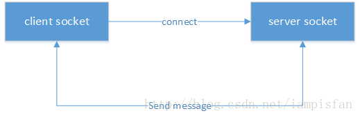

# ubus源码解析

> 笔者注：ubus项目内容繁杂相关解析文档的编写非一日之功，日后必定会对此文本进行拆分，分作各个小模块以便阅读和维护


## ubus简介

`ubus`是`OpenWrt`中的进程间通信机制，类似于桌面版`linux`的`dbus`，`Android`的`binder`。`ubus`相当于简化版的`dbus`，`ubus`基于`unix socket`实现，`socket`绑定到一个本地文件，具有较高的效率；

`unix socket`是`C/S`模型，建立一个`socket`连接，`server`端和`client`端分别要做如下步骤：

1. 建立一个`socket server`端，绑定到一个本地`socket`文件，监听`client`的连接；
2. 建立一个或多个`socket client`端，连接到`server`端；
3. `client`端和`server`端相互发送消息；
4. `client`端或`server`端收到对方消息后，针对具体消息进行相应处理。



`ubus`同样基于这套流程，其中`ubusd`实现`server`，其他进程实现`client`，例如`ubus(cli)`、`netifd`、`procd`；
两个`client`通信需要通过`server`转发。


## 核心数据结构

### **struct ubus_context**

```c
struct ubus_context
{
	struct list_head requests;
	struct avl_tree objects;
	struct list_head pending;

	struct uloop_fd sock;
	struct uloop_timeout pending_timer;

	uint32_t local_id;
	uint16_t request_seq;
	bool cancel_poll;
	int stack_depth;

	void (*connection_lost)(struct ubus_context *ctx);
	void (*monitor_cb)(struct ubus_context *ctx, uint32_t seq, struct blob_attr *data);

	struct ubus_msghdr_buf msgbuf;
	uint32_t msgbuf_data_len;
	int msgbuf_reduction_counter;

	struct list_head auto_subscribers;
	struct ubus_event_handler auto_subscribe_event_handler;
};
```


## 关键接口

`ubus`源码中提供了一个官方`demo`，具体编译和使用方法参考[ubus编译和使用方法](https://github.com/Garfield-1/StudyNotes/tree/master/07_%E5%BC%80%E6%BA%90%E9%A1%B9%E7%9B%AE%E8%A7%A3%E6%9E%90/03_ubus%E6%BA%90%E7%A0%81%E8%A7%A3%E6%9E%90/%E6%BA%90%E7%A0%81%E8%A7%A3%E6%9E%90/01_ubus%E7%BC%96%E8%AF%91)。

### uloop_init

初始化uloop库，可参考[uloop源码解析](https://github.com/Garfield-1/StudyNotes/tree/master/07_%E5%BC%80%E6%BA%90%E9%A1%B9%E7%9B%AE%E8%A7%A3%E6%9E%90/02_uloop%E8%A7%A3%E6%9E%90/%E6%BA%90%E7%A0%81%E8%A7%A3%E6%9E%90)，此处不再赘述

### ubus_connect

创建一个`struct ubus_context`节点

