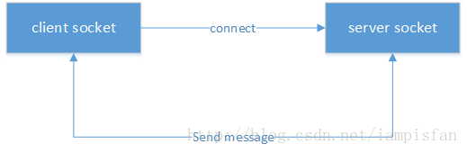

# ubus源码解析

> 笔者注：ubus项目内容繁杂相关解析文档的编写非一日之功，日后必定会对此文本进行拆分，分作各个小模块以便阅读和维护

## ubus简介

`ubus`是`OpenWrt`中的进程间通信机制，类似于桌面版`linux`的`dbus`，`Android`的`binder`。`ubus`相当于简化版的`dbus`，`ubus`基于`unix socket`实现，`socket`绑定到一个本地文件，具有较高的效率；

`unix socket`是`C/S`模型，建立一个`socket`连接，`server`端和`client`端分别要做如下步骤：

1. 建立一个`socket server`端，绑定到一个本地`socket`文件，监听`client`的连接；
2. 建立一个或多个`socket client`端，连接到`server`端；
3. `client`端和`server`端相互发送消息；
4. `client`端或`server`端收到对方消息后，针对具体消息进行相应处理。

`ubus`同样基于这套流程，其中`ubusd`实现`server`，其他进程实现`client`，例如`ubus(cli)`、`netifd`、`procd`；
两个`client`通信需要通过`server`转发。

## 使用方法

