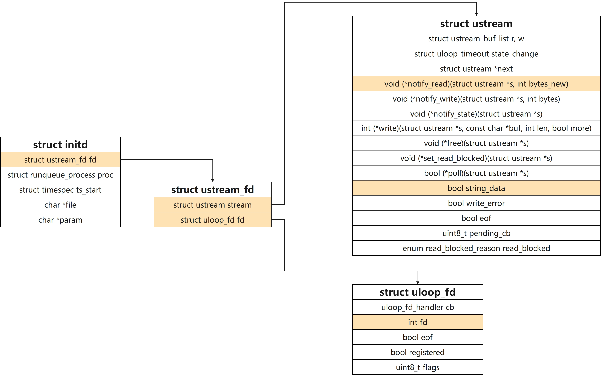

# procd监听进程无输出问题分析

## 关于被注册的进程的输出

> 笔者注：在openwrt架构的实际开发过程中常常会遇到自己添加的模块中的printf输出看不到的情况，故查看procd源码希望可以找到问题原因

**关键函数调用栈**

```c
rc
    ->_rc
        ->add_initd
            ->q_initd_run
                ->ustream_fd_init
                    ->ustream_fd_set_uloop
                        ->uloop_fd_add
```

## 被监听进程的标准输出，标准错误的重定向

**`q_initd_run`**函数

```c
static void q_initd_run(struct runqueue *q, struct runqueue_task *t)
{
    struct initd *s = container_of(t, struct initd, proc.task);
    int pipefd[2];
    pid_t pid;

    clock_gettime(CLOCK_MONOTONIC_RAW, &s->ts_start);
    DEBUG(2, "start %s %s \n", s->file, s->param);
    if (pipe(pipefd) == -1) {
        ERROR("Failed to create pipe: %m\n");
        return;
    }

    pid = fork();
    if (pid < 0)
        return;

    if (pid) {
        close(pipefd[1]);
        fcntl(pipefd[0], F_SETFD, FD_CLOEXEC);
        s->fd.stream.string_data = true,
        s->fd.stream.notify_read = pipe_cb,
        runqueue_process_add(q, &s->proc, pid);
        ustream_fd_init(&s->fd, pipefd[0]);
        return;
    }
    close(pipefd[0]);

    int devnull = open("/dev/null"c, O_RDONLY);
    dup2(devnull, STDIN_FILENO);
    dup2(pipefd[1], STDOUT_FILENO);
    dup2(pipefd[1], STDERR_FILENO);

    if (devnull > STDERR_FILENO)
        close(devnull);

    execlp(s->file, s->file, s->param, NULL);
    exit(1);
}

void ustream_fd_init(struct ustream_fd *sf, int fd)
{
    ...
    sf->fd.fd = fd;
    ...
}
```

**核心思想**

`q_initd_run`函数首先创建了一个管道，并通过`fork`创建了新的进程

* 父进程：关闭了管道的写端；初始化了部分关键参数，并将进程添加到运行队列中去
* 子进程：关闭了管道的读端，将进程的**标准错误**和**标准输出**绑定到**管道的写端**上去；接着通过`execlp`函数执行指定的命令
* 通过`ustream_fd_init`函数将管道的输出端绑定到`s->fd->fd.fd`上

其中父进程的配置参数，其在内存中的分别情况如图；需要注意的是，传入运行队列的是`s->proc`部分，初始化的是`s->fd`部分；



## 管道输出端的最终使用

在`q_initd_run`函数中通过`fork`创建了新的进程执行待运行的命令，又通过管道将新进程的标准输出和标准错误重定向

**`ustream_fd_init`函数**

> 笔者注：已省略部分逻辑

```c
static void ustream_fd_set_uloop(struct ustream *s, bool write)
{
    struct ustream_fd *sf = container_of(s, struct ustream_fd, stream);
    ...
    uloop_fd_add(&sf->fd, flags);
}

void ustream_fd_init(struct ustream_fd *sf, int fd)
{
    struct ustream *s = &sf->stream;
    ...
    sf->fd.fd = fd;
    ...
    ustream_fd_set_uloop(s, false);
}
```

**核心思想**

管道输出端的句柄最终是通过`uloop_fd_add`添加到`uloop`中；`uloop`中用`epoll`来监听这个句柄

> 笔者注：uloop的回调和uloop初始化部分还需要分析
