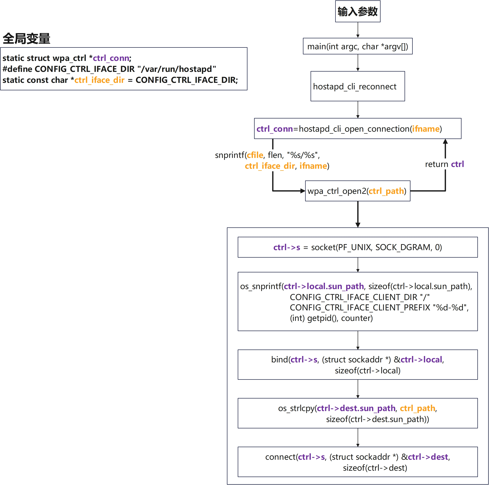
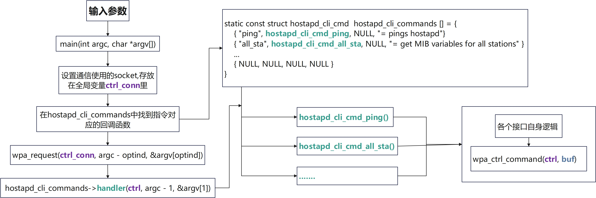
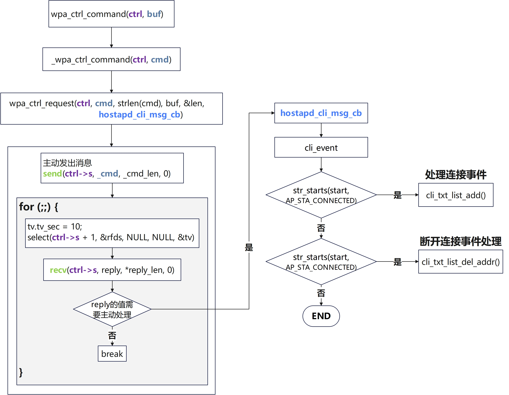

# hostapd ctrl if模块梳理

[TOC]

## 概述

`hostapd`的`ctrl i/f`（`control interface`，控制接口）模块主要作用是**为外部程序（如命令行工具hostapd_cli、GUI等）提供与hostapd守护进程进行交互的机制**，实现运行时控制和状态查询

## 对应源代码

`ctrl if`模块对应源代码是`./hostapd/ctrl_iface.c`和`./hostapd/ctrl_iface.h`

## hostapd主进程

### 配置句柄

`hostapd`通信时采用的方法是通过文件句柄来进行通信，句柄会存储在`hostapd.conf`中的`ctrl_interface`配置选项中，在读取配置文件时会将这个字段存入`struct hostapd_bss_config`中的`ctrl_interface`字段中用于后续的使用

在`./hostapd/hostapd.conf`中可以找到相关的注释

```shell
# Interface for separate control program. If this is specified, hostapd
# will create this directory and a UNIX domain socket for listening to requests
# from external programs (CLI/GUI, etc.) for status information and
# configuration. The socket file will be named based on the interface name, so
# multiple hostapd processes/interfaces can be run at the same time if more
# than one interface is used.
# /var/run/hostapd is the recommended directory for sockets and by default,
# hostapd_cli will use it when trying to connect with hostapd.
ctrl_interface=/var/run/hostapd
```

通信使用的句柄会在`hostapd_ctrl_iface_path`函数中拼接而成

```c
static char * hostapd_ctrl_iface_path(struct hostapd_data *hapd)
{
    char *buf;
    size_t len;

    if (hapd->conf->ctrl_interface == NULL)
        return NULL;

    len = os_strlen(hapd->conf->ctrl_interface) +
        os_strlen(hapd->conf->iface) + 2;
    buf = os_malloc(len);
    if (buf == NULL)
        return NULL;

    os_snprintf(buf, len, "%s/%s",
            hapd->conf->ctrl_interface, hapd->conf->iface);
    buf[len - 1] = '\0';
    return buf;
}
```

这里的`hapd->conf->ctrl_interface`是对应配置文件中的`ctrl_interface`，`hapd->conf->iface`是对应配置文件中的`interface`选项

在配置句柄之后会通过`eloop_register_read_sock`函数来对其进行监听，同时配置对应回调`hostapd_ctrl_iface_receive`用来处理`socket`中的消息

### 使用命令

在启动`hostapd`主进程之后，输入

```shell
sudo ./hostapd_cli -i wlan0 help
```

`-i`指定端口，`help`查看使用帮助

## hostapd_cli侧

在`hostapd_cli`的中会使用一个全局变量`static struct wpa_ctrl *ctrl_conn`来存储待使用的`socket`

### 初始化句柄

`hostapd_cli`在与`hostapd`的主进程进行通信时是作为`client`端，在创建与主进程通信的socket时。

* 使用`bind`函数将`socket`绑定本地的一个随机文件

* 使用`connet`将`socket`的目标句柄，这个目标是全局变量`CONFIG_CTRL_IFACE_DIR`中存储与主进程通信使用的句柄的路径，传入端口比如`wlan0`，然后将两者进行拼接
  * 目标句柄在主进程中也会使用，区别是主进程是读取配置文件获取文件路径



### 处理用户命令

`hostapd_cli`内部维护了一个全局的结构体数组，存储支持的命令和对应的回调函数。在接收到命令后会首先在数组中找到对应的回调然后调用，最后使用`wpa_ctrl_command`接口来发送和接收数据



### 发送和接收数据

数据的发送和接收使用的时之前创建的`socket`句柄，发送后使用`select`监听句柄，并对需要主动处理的事件调用注册好的`hostapd_cli_msg_cb`进行处理



### 整体流程

 [client端整体流程.pdf](.\img\client端整体流程.pdf)
