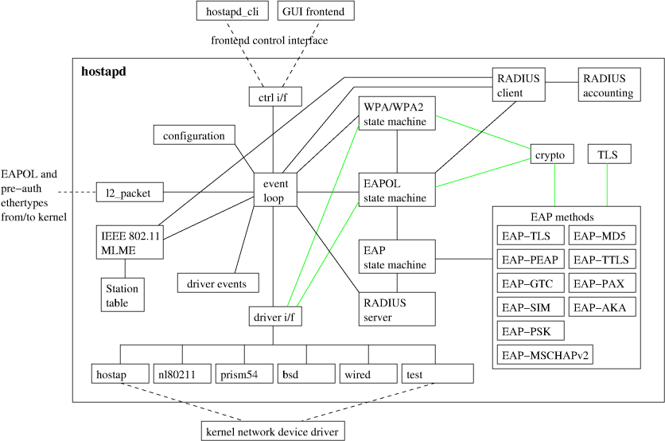

# 软件设计架构

> 笔者注：由于简中网络和hostapd官网上的大量资料，均是使用旧版本，这里分析时会结合0.5.10与2.9版本的hostapd共同分析
>
> 参考文档：
>
> [Hostapd 详解 | 老张的blog](https://samuelzq.github.io/2022/04/11/hostapd/)
>
> [hostapd: Developers' documentation for hostapd](https://w1.fi/hostapd/devel/index.html)
>
> [hostapd-devel.pdf](https://hostap.epitest.fi/hostapd/hostapd-devel.pdf)


## 1. 软件架构图

d

**概述：**

上图来自`hostapd`官网列出的一份`0.5.X`源码说明文档[hostapd-devel.pdf](https://hostap.epitest.fi/hostapd/hostapd-devel.pdf)，此版本时间约为`2008`年，这里仅作一份参考；

从上图中可以看到，整个`hostapd`的核心在于`event loop`模块，从名字可以看出这是一个循环事件的模块；其中各个协议的具体处理和驱动部分处理，均是模块化的处理在循环中去处理

遗憾的是官方文档并未单独去详细说明每个模块的作用与实现，这里必须结合源代码与三方资料进行分析。这里列出一份表格仅作参考（后续更新完善）

**各个模块名称及作用：**

| 模块                | 主要作用                                                     |
| ------------------- | ------------------------------------------------------------ |
| `event loop`        | `event loop`模块（即`eloop`模块）的主要作用是提供一个事件驱动的机制，用于管理和处理异步事件。它是`hostapd`的核心组件之一，负责协调各种事件的调度和执行 |
| `l2_packet`         | `l2_packet` 模块 的作用是提供一个抽象层，用于处理链路层（`Layer 2`）的数据包发送和接收。它是`hostapd`和`wpa_supplicant`的关键模块之一，主要用于与无线网络的低层协议交互 |
| `configuration`     | 解析和管理配置文件（如 `hostapd.conf`），并将配置选项加载到程序中，以便控制`hostapd`的行为 |
| `ctrl i/f`          | 控制接口（`ctrl i/f`）为另外的应用程序提供了和`hostapd`交互的接口。通过该接口，外部程序可以对`hostapd`进行配置 |
| `driver i/f`        | `driver i/f`（`driver interface`）模块的主要作用是提供一个抽象层，用于与底层无线网卡驱动程序进行交互。它定义了一组标准化的接口，使得`hostapd`可以与不同的无线驱动程序通信，而无需关心驱动程序的具体实现细节 |
| `driver events`     | 已废弃？                                                     |
| `EAP`               | `EAP`模块是实现无线网络认证的核心组件之一。`EAP`是一种灵活的认证框架，支持多种认证方法（如`EAP-TLS`、`EAP-PEAP`、`EAP-TTLS` 等），广泛用于无线网络（如`WPA/WPA2`企业模式）和有线网络（如`IEEE 802.1X`） |
| `EAPOL`             | `EAPOL`状态机，实现`IEEE 802.1X`协议的核心部分。它负责在接入点（`AP`）和客户端（`Supplicant`）之间管理认证过程。`EAPOL`是`IEEE 802.1X`的一个关键组件，用于在局域网（`LAN`）中传输 `EAP`消息 |
| `RADIUS`            | `RADIUS`（`Remote Authentication Dial-In User Service`）模块是用于与外部认证服务器进行通信的关键组件。它实现了`RADIUS`协议，用于处理用户认证、授权和计费（`AAA`）请求。`RADIUS`模块通常用于企业级无线网络（如`WPA/WPA2`企业模式），通过与`RADIUS`服务器（如 `FreeRADIUS`）交互来验证客户端的身份 |
| `RADIUS server`     | `RADIUS Server` 模块 的作用是实现一个内置的 `RADIUS` 服务器，用于处理无线网络中的用户认证请求。它允许 `hostapd`在不依赖外部`RADIUS`服务器（如 `FreeRADIUS`）的情况下，直接在接入点（`AP`）上完成用户认证 |
| `RADIUS client`     | `RADIUS Client` 模块 的作用是实现 `RADIUS` 协议的客户端功能，用于与外部 `RADIUS` 服务器通信。它是`hostapd`实现企业级无线网络认证（如 `WPA/WPA2` 企业模式）的关键组件，通过 `RADIUS` 协议将用户认证请求发送到外部 `RADIUS` 服务器，并处理服务器的响应 |
| `RADIUS accounting` | `RADIUS Accounting` 模块 的作用是记录和管理客户端的会话信息，用于网络访问的计费和统计。它通过与外部 `RADIUS` 服务器交互，发送会话相关的会计信息，如会话开始、结束和流量使用情况 |


## 2. event loop模块

`eloop`模块主要作用是提供了一种事件驱动机制，整个`hostapd`模块实际上是一直运行在`eloop`循环中的。`eloop`的底层实现实际上是将注册的事件存放在一个队列中创建对应的`socket`句柄，然后依靠一些异步`IO`接口去监听这些句柄。较高版本的`hostapd`为了兼容性在支持了`select`、`poll`、`epoll`和`kqueue`而这些代码又高度耦合。此处可阅读低版本`hostapd`源码或类似的其他库如`uloop`源码

1. **主要作用**

   * 事件监听与分发：

     - `eloop`模块监听各种事件来源，例如套接字的读写事件、定时器事件和信号事件

     - 当事件发生时，`eloop`会调用相应的回调函数来处理这些事件

   * 跨平台支持：
     - `eloop`模块支持多种底层实现方式，包括`select`、`poll`、`epoll`和`kqueue`，以适应不同的操作系统和性能需求

   * 定时器管理：
     - 提供定时器功能，允许注册定时任务，并在指定时间后触发回调函数

   * 信号处理：
     - 处理系统信号（如`SIGINT`、`SIGTERM`等），用于优雅地终止程序或重新加载配置

   * 统一的事件处理框架：
     - 通过统一的接口，`eloop`模块将不同类型的事件（如`I/O`事件、定时器事件和信号事件）整合到一个框架中，简化了事件处理的逻辑

2. **关键功能**

   * `I/O`事件处理：

     - 通过`eloop_register_read_sock`等函数注册套接字的读写事件

     - 使用底层机制（如`epoll_wait`）高效地监听这些事件

   * 定时器事件处理：

     - 通过`eloop_register_timeout`注册定时器事件

     - 定时器事件会按照时间顺序存储，并在超时时触发回调

   * 信号事件处理：

     - 通过`eloop_register_signal`注册信号处理函数

     - 当接收到特定信号时，调用对应的回调函数

   * **事件循环**：
     - `eloop_run`函数是事件循环的核心，它不断监听事件并分发到相应的处理函数，直到程序终止

3. **示例代码**

   以下是`eloop`模块的一个典型使用场景：

   ```c
   // 注册一个套接字的读事件
   eloop_register_read_sock(sock, my_read_handler, eloop_data, user_data);
   // 注册一个定时器事件
   eloop_register_timeout(5, 0, my_timeout_handler, eloop_data, user_data);
   // 注册一个信号处理事件
   eloop_register_signal(SIGINT, my_signal_handler, user_data);
   // 启动事件循环
   eloop_run();
   ```

4. **总结**

   `eloop`模块是`hostapd`中事件驱动架构的核心，它通过统一的接口管理`I/O`事件、定时器事件和信号事件，提供了高效、灵活的事件处理能力。这使得`hostapd`能够在复杂的网络环境中高效地处理各种异步任务，例如管理客户端连接、处理认证请求和响应外部信号等


## 3. ctrl i/f模块

待补充


## 4. driver i/f模块

`driver i/f`（`driver interface`）模块的主要作用是提供一个抽象层，用于与底层无线网卡驱动程序进行交互。它定义了一组标准化的接口，使得`hostapd`可以与不同的无线驱动程序通信，而无需关心驱动程序的具体实现细节

1. **主要功能**

   * **抽象化驱动程序接口**：
     - `driver i/f`模块通过定义一组函数指针（如`struct wpa_driver_ops`），为不同的无线驱动程序提供统一的接口。这些接口包括扫描、连接、认证、加密密钥管理等操作

   * **支持多种驱动程序**：

     通过实现`wpa_driver_ops`结构中的函数，不同的驱动程序可以被集成到hostapd中。例如，支持`Linux`内核的`nl80211`接口或其他专有驱动程序。

   * **管理无线硬件**：
     - 负责控制无线网卡的硬件功能，例如设置信道、管理`SSID`、配置加密密钥、处理扫描结果等

   * **事件处理**：
     - 监听来自驱动程序的事件（如关联、认证、断开连接等），并将这些事件通知到`hostapd`的核心逻辑

   * **支持高级功能**：
     - 提供对高级无线功能的支持，例如`802.11w`管理帧保护、`802.11r`快速切换、`802.11ac/ax`等

2. **模块作用总结**

   `driver i/f`模块是`hostapd`与无线网卡驱动之间的桥梁。它屏蔽了底层驱动的实现细节，为`hostapd`提供了一个统一的接口，使得`hostapd`可以支持多种无线硬件和驱动程序。通过这一模块，`hostapd`能够实现无线接入点的功能，包括认证、加密、关联管理等


## 5. l2_packet模块

`l2_packet` 模块 的作用是提供一个抽象层，用于处理链路层（`Layer 2`）的数据包发送和接收。它是`hostapd`和`wpa_supplicant`的关键模块之一，主要用于与无线网络的低层协议交互

1. **`l2_packet` 模块的主要功能**

* 发送和接收链路层数据包：

  - 负责在链路层（如以太网或无线链路）上发送和接收数据包

  - 主要用于处理 `EAPOL` 消息（如 `EAPOL-Start`、`EAPOL-Key` 等）

* 接口抽象：

  - 提供一个统一的接口，屏蔽底层操作系统和驱动的差异

  - 支持多种平台（如 `Linux`、`FreeBSD`、`Windows`）和驱动程序

* 事件通知：
  - 监听链路层事件（如接口状态变化、数据包到达等），并将这些事件通知给上层模块

* 与认证模块交互：

  - 在 `IEEE 802.1X` 认证过程中，`l2_packet` 模块用于发送和接收认证相关的消息

  - 例如，在 `EAPOL` 握手中，`l2_packet` 模块负责传输 `EAPOL-Key` 消息

2. **`l2_packet` 模块的实现**

   `l2_packet` 模块的实现根据操作系统和平台的不同而有所变化。以下是一些关键文件：

   - **`src/l2_packet/l2_packet_linux.c`**：`Linux` 平台的实现，使用 `PF_PACKET` 套接字处理链路层数据包

   - **`src/l2_packet/l2_packet_freebsd.c`**：`FreeBSD` 平台的实现

   - **`src/l2_packet/l2_packet_winpcap.c`**：`Windows` 平台的实现，使用 `WinPcap` 库

   - **`src/l2_packet/l2_packet_none.c`**：一个空实现，用于不需要链路层操作的场景

5. **总结**

   `	hostapd` 中的 `l2_packet` 模块是一个关键的底层组件，负责处理链路层数据包的发送和接收。它为上层模块（如 `IEEE 802.1X` 和 `EAPOL` 状态机）提供了一个统一的接口，屏蔽了操作系统和驱动的差异，从而实现跨平台的兼容性和灵活性


## 6. EAP模块

`EAP`模块是实现无线网络认证的核心组件之一。`EAP`是一种灵活的认证框架，支持多种认证方法（如`EAP-TLS`、`EAP-PEAP`、`EAP-TTLS` 等），广泛用于无线网络（如`WPA/WPA2`企业模式）和有线网络（如`IEEE 802.1X`）

1. **`EAP` 模块的作用**

   `hostapd`中的`EAP`模块主要负责以下任务：

   * **处理 EAP 消息**：接收和解析来自客户端（`Supplicant`）的 `EAP` 消息，并生成响应
   * **与认证服务器交互**：通过`RADIUS`协议与后端认证服务器（如 `FreeRADIUS`）通信，转发`EAP`消息并接收认证结果
   * **支持多种 EAP 方法**：实现对多种`EAP`方法的支持，如基于证书的`EAP-TLS`、基于用户名和密码的`EAP-PEAP`等
   * **状态管理**：维护每个客户端的`EAP`会话状态，包括认证的开始、进行中和完成3
   * **密钥生成**：在认证成功后，协助生成会话密钥（如 `PMK`），用于后续的加密通信

2. **EAP 模块的主要组成**

   在`hostapd`的代码中，`EAP`模块的实现主要位于`eap_server`目录下，关键文件包括：

   - **`src/eap.c`**：`EAP` 框架的核心逻辑，负责消息处理和状态管理

   - **`src/eap_methods.c`**：注册和管理支持的 `EAP` 方法

   - **`src/eap_tls.c`**：实现 `EAP-TLS` 方法

   - **`src/eap_peap.c`**：实现 `EAP-PEAP` 方法

   - **`src/eap_ttls.c`**：实现 `EAP-TTLS` 方法

   - **`src/eap_server/eap_server.c`**：`EAP` 服务器的入口点，处理与客户端的交互

5. **总结**

   `hostapd`中的 `EAP` 模块是实现无线网络认证的核心组件，负责处理 `EAP` 消息、与认证服务器交互以及生成会话密钥。它通过灵活的框架支持多种认证方法，为无线网络提供了强大的安全性和可扩展性


## 7. EAPOL模块

`EAPOL`状态机，实现`IEEE 802.1X`协议的核心部分。它负责在接入点（`AP`）和客户端（`Supplicant`）之间管理认证过程。`EAPOL`是`IEEE 802.1X`的一个关键组件，用于在局域网（`LAN`）中传输 `EAP`消息

1. **`EAPOL`状态机的作用**

   `EAPOL`状态机的主要作用是协调和管理以下任务：

   * **初始化认证过程**：当客户端连接到 `AP` 时，`EAPOL` 状态机会启动认证过程
   * **消息交换**：通过 `EAPOL` 协议在客户端和认证服务器（如 `RADIUS`）之间传递 `EAP` 消息
   * **状态管理**：维护认证过程的状态，包括身份验证的开始、进行中和完成
   * **超时和重试**：处理认证超时和重试逻辑
   * **密钥管理**：在认证完成后，协助生成和分发加密密钥（如 `WPA/WPA2` 中的 `PTK` 和 `GTK`）

2. **`EAPOL`状态机的主要状态**

   `EAPOL` 状态机通常包含以下主要状态：

   * **`INITIALIZE`**：初始化状态机，清除所有状态和计时器
   * **`DISCONNECTED`**：表示客户端未连接或认证失败
   * **`CONNECTING`**：表示正在与客户端进行认证消息的交换
   * **`AUTHENTICATED`**：表示认证成功，客户端被允许访问网络
   * **`ABORTING`**：表示认证过程被中止，例如由于超时或错误

4. **在`hostapd`中的实现**

   在 `hostapd`的代码中，`EAPOL`状态机的实现通常位于 `eapol_auth`目录下，主要文件包括：

   - **`src/eapol_auth_sm.c`**：`EAPOL` 状态机的核心实现
   - **`src/eap_common.c`**：`EAPOL` 协议的通用功能
   
   这些文件共同实现了`EAPOL`状态机的逻辑，包括状态转换、计时器管理和消息处理
   
6. **总结**

   `EAPOL` 状态机是`hostapd`中实现`IEEE 802.1X`协议的核心组件，负责管理认证过程和密钥交换。它通过状态转换和消息处理，确保客户端能够安全地接入网络


## 8. RADIUS模块

`RADIUS`（`Remote Authentication Dial-In User Service`）模块是用于与外部认证服务器进行通信的关键组件。它实现了`RADIUS`协议，用于处理用户认证、授权和计费（`AAA`）请求。`RADIUS`模块通常用于企业级无线网络（如`WPA/WPA2`企业模式），通过与`RADIUS`服务器（如 `FreeRADIUS`）交互来验证客户端的身份

1. **`RADIUS` 模块的作用**
   * **用户认证**：将客户端的认证请求（如用户名和密码、证书等）转发给 `RADIUS` 服务器，并接收认证结果
   * **授权管理**：根据 `RADIUS` 服务器的响应，决定客户端是否可以访问网络
   * **计费支持**：在某些场景下，`RADIUS` 模块还可以处理计费相关的请求
   * **EAP 转发**：在使用 `EAP`（`Extensible Authentication Protocol`）认证时，`RADIUS` 模块负责将 `EAP` 消息封装到 `RADIUS` 协议中进行传输

2. **`RADIUS` 模块的主要组成**

   在`hostapd`的代码中，`RADIUS`模块的实现主要位于`radius`目录下，关键文件包括：

   - **`src/radius.c`**：`RADIUS`客户端的核心实现，负责构建和解析`RADIUS`消息
   - **`src/radius/radius_client.c`**：实现与`RADIUS`服务器的通信逻辑，包括发送请求和接收响应
   - **`src/radiusradius_server.c`**：如果`hostapd`配置为`RADIUS`服务器模式，则该文件实现服务器端逻辑

### 8.1 RADIUS Server模块

`RADIUS Server` 模块 的作用是实现一个内置的 `RADIUS` 服务器，用于处理无线网络中的用户认证请求。它允许 `hostapd`在不依赖外部`RADIUS`服务器（如 `FreeRADIUS`）的情况下，直接在接入点（`AP`）上完成用户认证

1. **主要功能**

   * **用户认证**：

     - 验证客户端（`Supplicant`）的身份信息，例如用户名和密码、证书或其他认证凭据

     - 支持多种认证协议，如 `EAP`（`Extensible Authentication Protocol`）

   * **授权管理**：

     - 根据认证结果决定客户端是否可以访问网络

     - 可以根据配置为不同用户分配特定的网络权限（如 `VLAN` 分配）

   * **EAP 支持**：

     - 作为 `EAP` 认证的服务器端，支持多种 EAP 方法（如 `EAP-TLS`、`EAP-PEAP`、`EAP-TTLS`等）

     - 处理 `EAPOL` 消息（`EAP over LAN`），与客户端进行认证消息的交换

   * **密钥管理**：
     - 在认证成功后，生成并分发会话密钥（如 `PMK`），用于后续的加密通信

   * **日志记录**：
     - 记录认证请求、响应和结果，便于管理员监控和调试

2. **`RADIUS Server` 模块的实现**

   在`hostapd`的代码中，`RADIUS Server` 模块的实现主要位于以下文件中：

   - **`src/radius/radius_server.c`**：`RADIUS` 服务器的核心逻辑

3. **`RADIUS Server` 的工作流程**

   * **初始化**：

     - `hostapd`启动时，加载 `RADIUS` 服务器的配置（如共享密钥、用户数据库等）

     - 初始化 `RADIUS` 服务器模块，监听指定的端口（默认 1812）

   * **接收认证请求**：

     - 客户端通过 `EAPOL` 协议发送认证请求

     - `RADIUS Server` 模块解析请求并提取认证信息

   * **处理认证**：

     - 根据配置的认证方法（如 `EAP-TLS`、`EAP-PEAP` 等），验证客户端的身份

     - 如果使用用户名和密码认证，则会与用户数据库进行匹配

   * **返回认证结果**：

     - 如果认证成功，返回 `Access-Accept` 消息，并附带会话密钥等信息

     - 如果认证失败，返回 `Access-Reject` 消息

   * **后续操作**：
     - 在认证成功后，`RADIUS Server` 可以触发其他操作，例如分配 `VLAN` 或记录日志

4. **总结**

   `hostapd`中的 `RADIUS Server` 模块提供了一个轻量级的认证解决方案，适用于小型网络或测试场景。它通过支持多种 `EAP` 方法和灵活的配置选项，为无线网络提供了基本的认证和授权功能

### 8.2 RADIUS client模块

在`hostapd`中，`RADIUS Client`模块 的作用是实现 `RADIUS` 协议的客户端功能，用于与外部 `RADIUS` 服务器通信。它是`hostapd`实现用户认证和会计功能的关键组件，主要负责将认证请求和会计信息发送到 `RADIUS` 服务器，并处理服务器的响应

1. **`RADIUS Client`模块的主要功能**

   * 用户认证：
     - 将客户端的认证信息（如用户名、密码或证书）封装为 `RADIUS` 消息，并发送到外部 `RADIUS` 服务器
     - 接收 `RADIUS` 服务器的响应（如 `Access-Accept` 或 `Access-Reject`），并根据结果决定是否允许客户端接入网络

   * 会计功能：
     - 发送会计消息（如 `Accounting-Start`、`Accounting-Stop` 和 `Accounting-Interim-Update`）到 `RADIUS` 服务器，用于记录客户端的会话信息（如会话时长、流量使用等）

   * `EAP` 消息转发：
     - 在使用 `EAP`（`Extensible Authentication Protocol`）认证时，`RADIUS Client` 模块负责将 `EAP` 消息封装到 `RADIUS` 消息中，并与 `RADIUS` 服务器进行交互

   * 消息构建与解析：

     - 构建符合 `RADIUS` 协议的请求消息（如认证请求、会计请求）

     - 解析 `RADIUS` 服务器的响应消息，提取相关信息（如认证结果、会话密钥等）

   * 安全性：

     - 使用共享密钥对 `RADIUS` 消息进行验证，确保消息的完整性和来源可信

     - 支持 `Message-Authenticator` 属性，用于进一步增强消息的安全性

2. **`RADIUS Client`模块的实现**

   在 `hostapd`的代码中，`RADIUS Client` 模块的实现主要位于以下文件中：

   - **`src/radiusradius_client.c`**：`RADIUS` 客户端的核心逻辑，包括消息的构建、发送和接收
   - **`src/radiusradius.c`**：实现 `RADIUS` 消息的通用功能，如消息编码和解码
   
3. **`RADIUS Client`的工作流程**

   * 初始化：

     - 在 `hostapd` 启动时，`RADIUS Client` 模块根据配置文件（如 `hostapd.conf`）初始化

     - 配置包括 `RADIUS` 服务器的地址、端口、共享密钥等

   * 发送认证请求：

     - 当客户端发起认证时，`RADIUS Client` 模块将认证信息（如 `EAP` 消息）封装为 `RADIUS` `Access-Request` 消息

     - 消息通过 `UDP` 发送到配置的 `RADIUS` 服务器

   * 处理认证响应：

     - 接收 `RADIUS` 服务器的响应消息（如 `Access-Accept` 或 `Access-Reject`）

     - 如果认证成功，提取会话密钥（如 `PMK`）并传递给其他模块；如果认证失败，则拒绝客户端接入

4. **会计功能**

   - 在客户端接入网络后，`RADIUS Client` 模块发送 `Accounting-Start` 消息记录会话开始

   - 在会话进行中，定期发送 `Accounting-Interim-Update` 消息报告会话状态

   - 在会话结束时，发送 `Accounting-Stop` 消息记录会话结束

5. **错误处理**：
   - 如果`RADIUS`服务器不可用或响应超时，`RADIUS Client` 模块会进行重试或切换到备用服务器

6. **总结**

   `hostapd`中的`RADIUS Client` 模块是实现无线网络认证和会计功能的核心组件。它通过与外部 `RADIUS` 服务器交互，完成用户认证、会话记录和流量统计等任务，为企业和公共网络提供了安全性和可管理性

### 8.3 RADIUS Accounting模块

`RADIUS Accounting`模块 的作用是记录和管理客户端的会话信息，用于网络访问的计费和统计。它通过与外部 `RADIUS` 服务器交互，发送会话相关的会计信息（`Accounting Information`），如会话开始、结束和流量使用情况

1. **RADIUS Accounting 模块的主要功能**

   * 会话开始记录：
     - 当客户端成功通过认证并连接到网络时，发送 `Accounting-Start` 消息到 `RADIUS` 服务器，记录会话的开始时间和相关信息

   * 会话结束记录：
     - 当客户端断开连接或会话超时时，发送 `Accounting-Stop` 消息到 `RADIUS` 服务器，记录会话的结束时间、使用的流量等信息

   * 中间会计更新：
     - 在会话进行中，定期发送 `Accounting-Interim-Update` 消息，报告会话的当前状态和流量使用情况

   * 流量统计：
     - 收集客户端的流量使用数据（如上传和下载的字节数），并将这些数据发送到 `RADIUS` 服务器

   * 计费支持：
     - 为基于使用量的计费系统提供支持，通过记录客户端的会话时长和流量使用情况，生成计费数据

   * 日志记录：
     - 记录会计相关的操作和事件，便于管理员进行监控和调试

2. **`RADIUS Accounting` 模块的实现**

   在 `hostapd`的代码中，`RADIUS Accounting` 模块的实现主要位于以下文件中：

   - **`src/radius/radius_client.c`**：实现 `RADIUS` 客户端的核心逻辑，包括会计消息的构建和发送

   - **`src/radius/radius.c`**：处理 `RADIUS` 消息的通用功能

   - **`src/ap/accounting.c`**：实现与接入点会计相关的逻辑

3. **`RADIUS Accounting` 的工作流程**

   * 会话开始：

     - 客户端通过认证后，`hostapd`调用会计模块，构建 `Accounting-Start` 消息

     - 消息中包含客户端的 `MAC` 地址、`IP` 地址、会话 `ID` 等信息。

     - 消息通过 `UDP` 发送到配置的 `RADIUS` 服务器

   * 中间更新：

     - 在会话进行中，`hostapd`定期发送 `Accounting-Interim-Update` 消息
     - 消息中包含当前会话的状态和流量统计数据

   * 会话结束：

     - 当客户端断开连接或会话超时时，`hostapd`构建 `Accounting-Stop` 消息

     - 消息中包含会话的结束时间、总流量使用情况等信息

   - 服务器响应：
     - `RADIUS` 服务器接收会计消息后，返回响应消息，确认接收到会计数据

4. **总结**

   `hostapd`中的 `RADIUS Accounting` 模块通过与 `RADIUS` 服务器交互，记录客户端的会话信息和流量使用情况，为网络计费和统计提供支持。它是企业网络和公共 `Wi-Fi` 环境中实现用户管理和计费的重要组件
