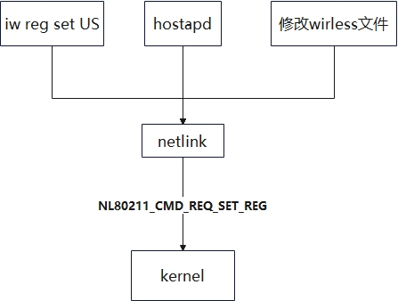

# 国家码修改

这里列出`openwrt`架构下国家码的修改的大致流程

## 上层模块配置国家码

可以看到对应国家码的修改实际是内核提供了一个接口，各种上层应用都是使用这个接口，那么只要在合适的位置去添加处理逻辑即可



## 国家码的生效

* **原生openwrt**

  过`wireless-regdb`将`db.txt`转换为`regulatory.db`文件来查找国家码；修改`build_dir/target-mipsel_mips-interAptiv_musl/wireless-regdb-2017-10-20-4343d359`目录下`db.txt`

  **这里贴出一小段`db.txt`文件的内容**

  ```yml
  # This is the world regulatory domain
  country 00:
  	(2402 - 2472 @ 40), (20)
  	# Channel 12 - 13.
  	(2457 - 2482 @ 20), (20), NO-IR, AUTO-BW
  	# Channel 14. Only JP enables this and for 802.11b only
  	(2474 - 2494 @ 20), (20), NO-IR, NO-OFDM
  	# Channel 36 - 48
  	(5170 - 5250 @ 80), (20), AUTO-BW
  	# Channel 52 - 64
  	(5250 - 5330 @ 80), (20), NO-IR, DFS, AUTO-BW
  	# Channel 100 - 144
  	(5490 - 5730 @ 160), (20), NO-IR, DFS
  	# Channel 149 - 165
  	(5735 - 5835 @ 80), (20), NO-IR
  	# IEEE 802.11ad (60GHz), channels 1..3
  	(57240 - 63720 @ 2160), (0)

  country AD:
  	(2402 - 2482 @ 40), (20)
  	(5170 - 5250 @ 80), (20)
  	(5250 - 5330 @ 80), (20), DFS
  	(5490 - 5710 @ 80), (27), DFS
  	# 60 GHz band channels 1-4, ref: Etsi En 302 567
  	(57000 - 66000 @ 2160), (40)
  
  country AE: DFS-FCC
  	(2402 - 2482 @ 40), (20)
  	(5170 - 5250 @ 80), (17), AUTO-BW
  	(5250 - 5330 @ 80), (24), DFS, AUTO-BW
  	(5490 - 5730 @ 160), (24), DFS
  	(5735 - 5835 @ 80), (30)
  ```

* **原生 linux的cfg80211**

  要`make menuconfig`使能`CONFIG_CFG80211_INTERNAL_REGDB`宏，并修改`net/wireless/db.txt`里的国家信道表，重新编译，编译后会生成`regdb.c`文件

  查询`Linux`源码后发现，在`linux-4.14.90-dev/linux-4.14.90/net/wireless/db.txt`中提到了，`CONFIG_CFG80211_INTERNAL_REGDB`这个宏是几乎不会被使用的

  > #
  >
  > \# This file is a placeholder to prevent accidental build breakage if someone enables CONFIG_CFG80211_INTERNAL_REGDB.  Almost no one actually needs to enable that build option.
  >
  > #
  >
  > \# You should be using CRDA instead.  It is even better if you use the CRDA package provided by your distribution, since they will probably keep it up-to-date on your behalf.
  >
  > #
  >
  > \# If you _really_ intend to use CONFIG_CFG80211_INTERNAL_REGDB then you will need to replace this file with one containing appropriately formatted regulatory rules that cover the regulatory domains you will be using.  Your best option is to extract the db.txt file from the wireless-regdb git
  >
  > \# repository:
  >
  > \# git://git.kernel.org/pub/scm/linux/kernel/git/linville/wireless-regdb.git
  >
  > #
  >
  > 译文：此文件是一个占位符，以防止意外构建破坏，如果有人启用CONFIG_CFG80211_INTERNAL_REGDB。**实际上几乎没有人需要启用该构建选项**。
  >
  > **你应该使用CRDA**。如果您使用您的发行版提供的CRDA包就更好了，因为他们可能会代表您保持最新
  >
  > 如果您真的打算使用CONFIG_CFG80211_INTERNAL_REGDB，那么您将需要用一个包含适当格式的监管规则的文件来替换该文件，该规则涵盖您将使用的监管域。**最好的选择是从wireless-regdb git中提取db.txt文件**

* **使用如backports的linux**

  在对应的代码(`openwrt`)上根据需求做修改后，将生成的对应的`build_dir/target-mipsel_mips-interAptiv_musl/wirelessregdb-2017-10-20-4343d359`目录下的目`regulatory.db`文件编译到镜像中

**总结**

国家码的配置还是依赖于`regulatory.db`文件，这个文件在单板中被存储在`/lib/firmware/regulatory.db`，由内核的`cfg80211`模块进行加载

## 国家码生效流程

### 上层应用

首先是上层应用通过`network`发送`NL80211_CMD_REQ_SET_REG`:给内核，已`hostapd`举例，这里列出对应注释

> \* @NL80211_CMD_REQ_SET_REG: ask the wireless core to set the regulatory domain to the specified ISO/IEC 3166-1 alpha2 country code. The core will store this as a valid request and then query userspace for it.
>
>译文：要求无线核心将监管域设置为指定的ISO/IEC 3166-1 alpha2国家代码。内核将把它存储为一个有效的请求，然后查询用户空间。

这里列出对应代码

> 笔者注：为保证阅读删除部分冗余逻辑

```cpp
static int wpa_driver_nl80211_set_country(void *priv, const char *alpha2_arg)
{
	struct i802_bss *bss = priv;
	struct wpa_driver_nl80211_data *drv = bss->drv;
	char alpha2[3];
	struct nl_msg *msg;

	msg = nlmsg_alloc();

	alpha2[0] = alpha2_arg[0];
	alpha2[1] = alpha2_arg[1];
	alpha2[2] = '\0';

	if (!nl80211_cmd(drv, msg, 0, NL80211_CMD_REQ_SET_REG) ||
        nla_put_string(msg, NL80211_ATTR_REG_ALPHA2, alpha2) ||
            ((alpha2_arg[3] == 'T') && nla_put_u32(msg, NL80211_ATTR_DFS_CAC_TIME, 0))) {
		nlmsg_free(msg);
		return -EINVAL;
	}

	return 0;
}
```

### 内核部分

### cfg80211中大致流程

> 内核部分主要分析`backports-4.19.7-1`模块

`backports`中会注册一个工作队列

```c
//net/wireless/reg.c
//这里通过DECLARE_WORK注册了一个reg_work工作队列和对应回调
static DECLARE_WORK(reg_work, reg_todo);
```

在用户空间的`NL80211_CMD_REQ_SET_REG`请求来到后先使用对应回调`nl80211_req_set_reg`注册在这个工作队列中，然后使用工作队列的处理函数去处理

这里简单列出函数调用栈

```cpp
nl80211_req_set_reg
    //接收用户空间传入的国家码，形式是两个大写字母
    ->regulatory_hint_user
    	->queue_regulatory_request
    		//这里的处理是，将传入的国家码转化为大写形式，然后加入一个工作队列中，然后调用这个队列去处理
    		->list_add_tail(&request->list, &reg_requests_list);
			  schedule_work(&reg_work);
				->reg_todo
```

在调用工作队列后应该是，通过`reg_process_hint_user`函数处理用户空间请求，这里会读取`reg_requests_list`队列中的最后一个请求，然后处理

这里列出函数调用栈

```cpp
reg_todo
    ->reg_process_pending_hints
    	->reg_process_hint
    		->reg_process_hint_user
    			->reg_query_database
    				//读取数据库文件
   					->query_regdb_file
    					//此时如果regulatory.db已经被加载到全局变量中那么走这个逻辑
    					->query_regdb
    						//这里读取DB中的数据，包括信道，功率的等信息
    						->regdb_query_country
    							//读取DB中的数据后，将其放入reg_regdb_work工作队列中，然后唤醒
    							->reg_schedule_apply
    								->schedule_work(&reg_regdb_work)
    									->reg_regdb_apply
    					//如果regulatory.db还没有被加载，将regulatory.db加载到一个全局变量中
    					->request_firmware_nowait("..", "regulatory.db", "..")
    						->regdb_fw_cb
```

`reg_regdb_work`工作队列的回调

```c
//这里读取了刚才被存放到工作队列中的功率信息
reg_regdb_apply
    ->set_regdom
    	->reg_set_rd_user
    		//这这里更新了一个当前监管域全局变量cfg80211_regdomain，这个监管域变量中就存放着功率相关的信息
    		->reset_regdomains
    			->reg_update_last_request
        //更新监管域信息
        ->update_all_wiphy_regulatory
            ->wiphy_update_regulatory
```

**backports中的大致流程**

整体的编码是依赖内核的工作队列实现模块的解耦合，主要使用`reg_work`和`reg_regdb_work`两个工作队列，首先用户空间通过`netlink`发送国家码信息到内核后先会被添加到`reg_work`中去，然后读取`regulatory.db`中的数据，将其中的数据保存在一个全局链表中。然后调用`reg_regdb_work`工作队列，处理这个链表中的数据，使用链表中的最后的一个的监管域来更新

这个监管域管理可以接收驱动或是用户态的管理请求，提供了一个比较统一的`API`接口，这一点在`reg_process_hint`（`reg_work`工作队列回调）和`set_regdom`（`reg_regdb_work`工作队列回调）函数中都可以窥见

其中关于功率等信息的读取是在`regdb_query_country`函数中`reg_schedule_apply`读取`DB`中的数据，然后加入`reg_regdb_work`工作队列中

最后在`reset_regdomains`函数中更新了一个全局的当前监管域变量`cfg80211_regdomain`

```c
rcu_assign_pointer(cfg80211_regdomain, new_regdom);
```

**在后续的流程中如果需要调用驱动接口更新监管域信息可以在`wiphy_update_regulatory`函数尾部通过读取`cfg80211_regdomain`这个全局变量来实现**

## 国家码的读取

国家码的读取靠`iw reg get`命令实现，这里要分析`iw reg get`的具体流程，`iw`中是使用了一个`NL80211_CMD_GET_REG`的`netlink`消息，发送后查看消息返回值

底层还是从管理域中去读取

这里简单列出函数调用栈

```c
nl80211_get_reg_do
    ->cfg80211_get_dev_from_info
    	->__cfg80211_rdev_from_attrs
```

----

## cfg80211与驱动的交互

### **从channel修改看cfg80211到驱动的流程**

开发者通常会在驱动中提供了一个修改信道的接口例如`demo_cfg80211_channel_switch`

这里列出函数调用栈如下

```c
static struct cfg80211_ops demo_cfg80211_ops = {
    .channel_switch = demo_cfg80211_channel_switch,
}

cfg80211_init
    ->wiphy_new(&demo_cfg80211_ops, sizeof(struct demo_hw))
    wiphy_register(wiphy)
```

`static struct cfg80211_ops demo_cfg80211_ops`中的`demo_cfg80211_channel_switch`函数，通过`wiphy_priv(wiphy)`和`wiphy_register(wiphy)`被注册在内核中，最终在`cfg80211`模块中通过`rdev->ops->channel_switch`被调用

```c
static inline int rdev_channel_switch(struct cfg80211_registered_device *rdev,
				      struct net_device *dev,
				      struct cfg80211_csa_settings *params)
{
	int ret;
	trace_rdev_channel_switch(&rdev->wiphy, dev, params);
	ret = rdev->ops->channel_switch(&rdev->wiphy, dev, params);
	trace_rdev_return_int(&rdev->wiphy, ret);
	return ret;
}

static int nl80211_channel_switch(struct sk_buff *skb, struct genl_info *info)
{
	if (!rdev->ops->channel_switch ||
	    !(rdev->wiphy.flags & WIPHY_FLAG_HAS_CHANNEL_SWITCH))
		return -EOPNOTSUPP;

    ......

    wdev_lock(wdev);
	err = rdev_channel_switch(rdev, dev, &params);
	wdev_unlock(wdev);
}
```

其实到这里从用户空间到`cfg80211`，再到驱动的整个流程就已经清晰了
