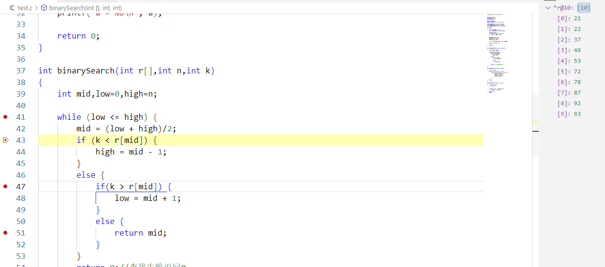
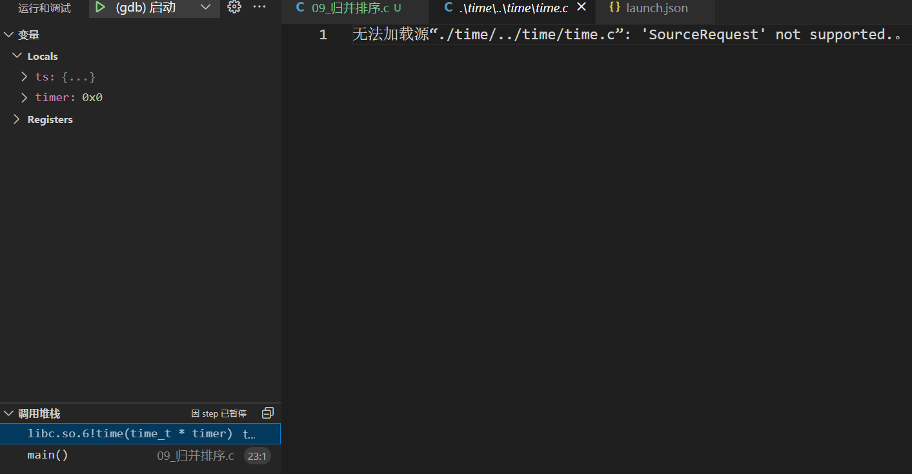
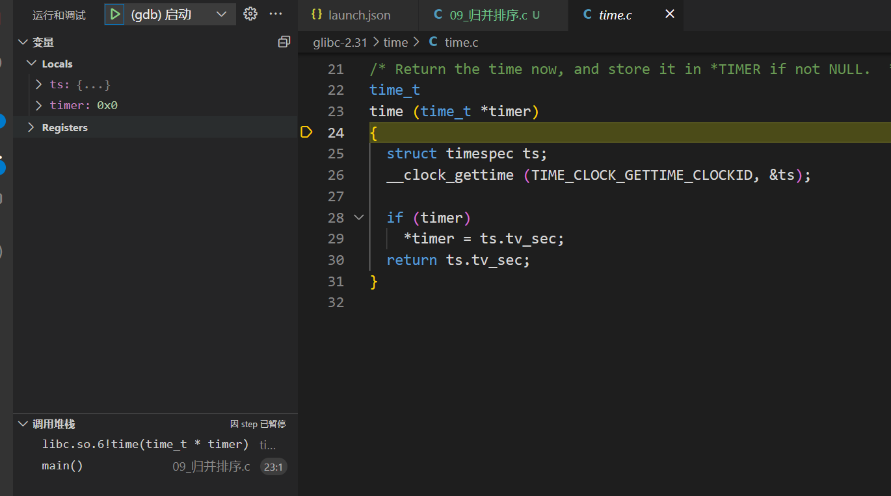

# 通过工具可视化的使用GDB(VSCode为例)

## 配置环境

   1. 安装微软官方提供的`C/C++`插件

   2. 配置将文件`launch.json`改为如下

      ```json
      {
          // 使用 IntelliSense 了解相关属性。 
          // 悬停以查看现有属性的描述。
          // 欲了解更多信息，请访问: https://go.microsoft.com/fwlink/?linkid=830387
          "version": "0.2.0",
          "configurations": [
              {
                  "name": "(gdb) 启动", //配置名称，显示在配置下拉菜单中
                  "type": "cppdbg", //配置类型
                  "request": "launch", //请求配置类型，可以是启动或者是附加
                  "program": "${fileDirname}/a.out", //程序可执行文件的完整路径，${workspaceFolder}表示远程连接的初始路径
                  "args": [], //传递给程序的命令行参数
                  "stopAtEntry": true, //可选参数，如果为true,调试程序应该在入口（main）处停止
                  "cwd": "${workspaceFolder}", //用于查找依赖项和其他文件的当前工作目录
                  "environment": [], //表示要预设的环境变量
                  "externalConsole": false, //如果为true，则为调试对象启动控制台
                  "MIMode": "gdb", //要连接到的控制台启动程序
                  "setupCommands": [ //为了安装基础调试程序而执行的一个或多个GDB/LLDB命令
                      {
                          "description": "开启pretty-printer",
                          "text": "-enable-pretty-printing",
                          "ignoreFailures": true
                      },
                      {
                          "description": "设置反汇编风格为inter",
                          "text": "-gdb-set disassembly-flavor intel",
                          "ignoreFailures": true
                      }
                  ]
              }
          ]
      }
      ```

* 如果调试时出现`Module containing this breakpoint has not yet loaded or the breakpoint address could not be obtained.`的提示，请在`gcc`编译时添加`-g`参数

* 如果调试时提示无法找到对应的动态库，使用如下命令修改环境变量

  ```shell
  export LD_LIBRARY_PATH=/path/to/your/libs:$LD_LIBRARY_PATH
  ```

* 可将右键变量添加到监视，在监视中可使用`gdb`命令查看数组结构体等元素的值

  例如可在监视中手动添加`*r@10`来监视数组`r`的前`10`位元素

  

## 如何调试库函数

   * 在调试时如果单步执行遇到库函数`srand(time(NULL));`则GDB会提示无法加载源文件

     

   * 此时代码中的`time(NULL)`函数指向`libc.so.6`库，由于在`GDB`配置路径中不存在对应版本的`glibc`源代码所以无法正常跳转至函数定义处

     >  /lib/x86_64-linux-gnu/libc.so.6是Linux操作系统中的动态链接库，全称为C标准库。在Linux系统中，所有使用C语言编写的程序都需要使用C标准库提供的函数、变量和常量。C标准库的主要功能包括文件操作、字符串操作、数学计算、内存管理、时间处理、网络通信等方面。C标准库是Linux操作系统中的一项核心组件，对于开发Linux应用程序非常重要。/lib/x86_64-linux-gnu/libc.so.6这个文件是C标准库的本地动态链接库，也就是所谓的libc库。在运行Linux程序时，如果发现程序需要用到C标准库中的函数或变量，就会自动调用该库中相应的代码来完成操作

   * 通过`ldd --version`、直接执行对应的`libc.so.6`文件都可以找到自身系统的`libc.so.6`对应的glibc版本是多少

   * 下载对应版本的`glibc`源代码，并将源代码目录放在配置文件中的`"cwd": "${workspaceFolder}/glibc-2.31",`中，此时再使用gdb调试遇到库函数时便会跳转至`glibc`源码中对应的函数实现

