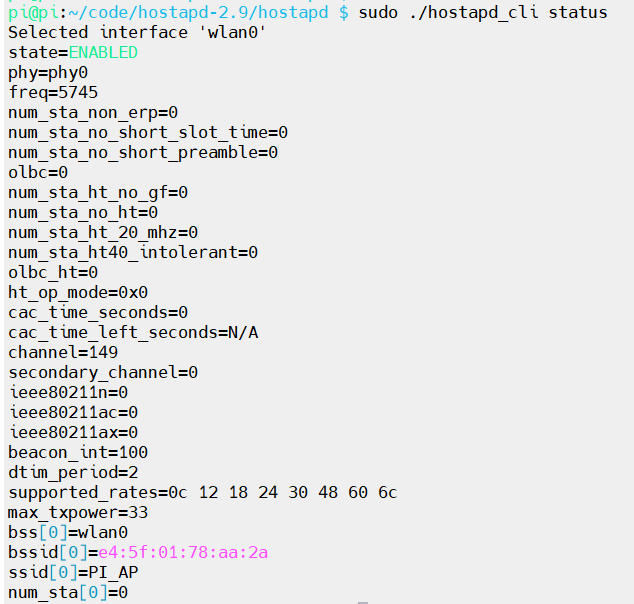
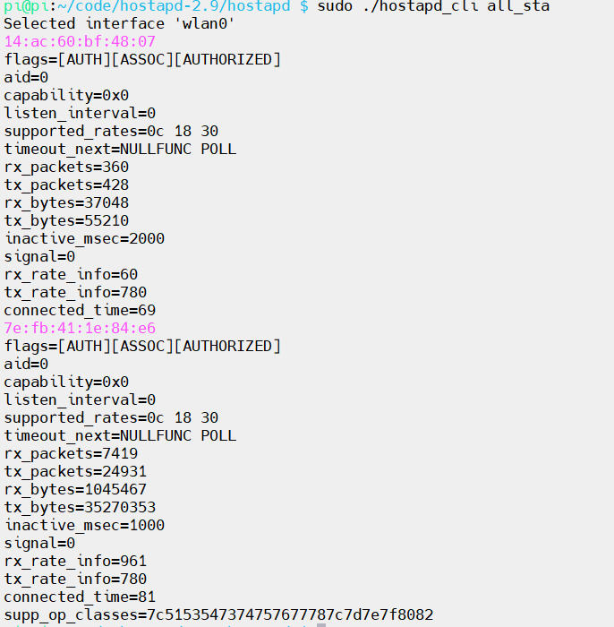
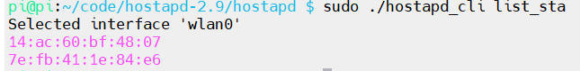
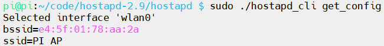
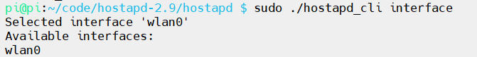
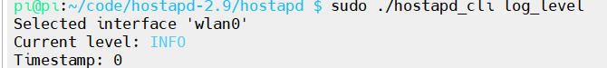
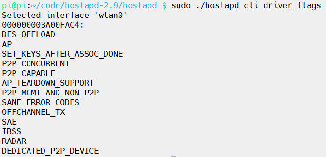

# hostapd常用命令及配置

[TOC]

## 概述

在`hostapd`编译完成后，会生成一个`hostapd_cli`的可执行文件。`hostapd_cli`是一款用作无线`AP`功能的客户端程序。它需要与`hostapd`主程序配置使用，使用`hostapd_cli -h`命令可以看到支持的命令

```shell
pi@pi:~/code/hostapd-2.9/hostapd $ ./hostapd_cli -h
hostapd_cli v2.9
Copyright (c) 2004-2019, Jouni Malinen <j@w1.fi> and contributors

usage: hostapd_cli [-p<path>] [-i<ifname>] [-hvB] [-a<path>] \
                   [-P<pid file>] [-G<ping interval>] [command..]

Options:
   -h           help (show this usage text)
   -v           shown version information
   -p<path>     path to find control sockets (default: /var/run/hostapd)
   -s<dir_path> dir path to open client sockets (default: /var/run/hostapd)
   -a<file>     run in daemon mode executing the action file based on events
                from hostapd
   -B           run a daemon in the background
   -i<ifname>   Interface to listen on (default: first interface found in the
                socket path)

commands:
  ping = pings hostapd
  mib = get MIB variables (dot1x, dot11, radius)
  relog = reload/truncate debug log output file
  status = show interface status info
  sta <addr> = get MIB variables for one station
  all_sta = get MIB variables for all stations
  list_sta = list all stations
  new_sta <addr> = add a new station
  deauthenticate <addr> = deauthenticate a station
  disassociate <addr> = disassociate a station
  sa_query <addr> = send SA Query to a station
  disassoc_imminent = send Disassociation Imminent notification
  ess_disassoc = send ESS Dissassociation Imminent notification
  bss_tm_req = send BSS Transition Management Request
  get_config = show current configuration
  help = show this usage help
  interface [ifname] = show interfaces/select interface
  raw <params..> = send unprocessed command
  level <debug level> = change debug level
  license = show full hostapd_cli license
  quit = exit hostapd_cli
  set <name> <value> = set runtime variables
  get <name> = get runtime info
  set_qos_map_set <arg,arg,...> = set QoS Map set element
  send_qos_map_conf <addr> = send QoS Map Configure frame
  chan_switch <cs_count> <freq> [sec_channel_offset=] [center_freq1=]
    [center_freq2=] [bandwidth=] [blocktx] [ht|vht]
    = initiate channel switch announcement
  hs20_wnm_notif <addr> <url>
    = send WNM-Notification Subscription Remediation Request
  hs20_deauth_req <addr> <code (0/1)> <Re-auth-Delay(sec)> [url]
    = send WNM-Notification imminent deauthentication indication
  vendor <vendor id> <sub command id> [<hex formatted data>]
    = send vendor driver command
  enable = enable hostapd on current interface
  reload = reload configuration for current interface
  disable = disable hostapd on current interface
  update_beacon = update Beacon frame contents
  erp_flush = drop all ERP keys
  log_level [level] = show/change log verbosity level
  pmksa  = show PMKSA cache entries
  pmksa_flush  = flush PMKSA cache
  set_neighbor <addr> <ssid=> <nr=> [lci=] [civic=] [stat]
    = add AP to neighbor database
  remove_neighbor <addr> <ssid=> = remove AP from neighbor database
  req_lci <addr> = send LCI request to a station
  req_range  = send FTM range request
  driver_flags  = show supported driver flags
  accept_acl =Add/Delete/Show/Clear accept MAC ACL
  deny_acl =Add/Delete/Show/Clear deny MAC ACL
  poll_sta <addr> = poll a STA to check connectivity with a QoS null frame
  req_beacon <addr> [req_mode=] <measurement request hexdump>  = send a Beacon report request to a station
  reload_wpa_psk = reload wpa_psk_file only
```

## 1. hostapd_cli ping

当你执行`hostapd_cli ping`命令时，它将向 hostapd 发送一个简单的请求，`hostapd`会返回一个响应。这个命令主要用于测试`hostapd`是否正常工作，并检查与`hostapd`的连接是否通畅


## 2. hostapd_cli mib

显示`MIB`(管理信息库)变量，如`dot1x/dot11/radius`状态信息


## 3. hostapd_cli relog

`relog`命令会强制`hostapd`重新加载其日志配置，通常用于更新或更改日志设置后，确保新的日志配置立即生效，当修改了`hostapd`配置文件中的日志级别(`logger_stdout_leve`、`logger_syslog_level`等) 时，执行`hostapd_cli relog`命令可以应用这些更改


## 4. hostapd_cli status

通过`status`命令，你可以获取`hostapd`的当前运行状态，查看无线网络接口的配置信息、接入点状态、活动客户端的连接状态等



## 5. hostapd_cli all_sta

读取`ap`所有的下挂`sta`具体信息



## 6. hostapd_cli sta [sta_MAC]

读取`ap`的指定`mac`的下挂`sta`具体信息

![hostapd_cli sta [sta_MAC]](./img/hostapd_cli sta [sta_MAC].jpg)

## 7. hostapd_cli list_sta

列出所有已连接到当前`AP`的设备`MAC`地址



## 8. hostapd_cli new_sta [sta_MAC]

向`hostapd`的内部状态表中手动添加一个新的`STA`，多用于调试

![hostapd_cli new_sta [sta_MAC]](./img/hostapd_cli new_sta [sta_MAC].jpg)

## 9. hostapd_cli deauthenticate [sta_MAC]

`hostapd_cli deauthenticate`命令通过去认证(`deauthentication`)操作断开某个客户端与接入点的连接，适用于无线网络管理中需要控制客户端连接的场景

![hostapd_cli deauthenticate [sta_MAC]](./img/hostapd_cli deauthenticate [sta_MAC].jpg)

## 10. hostapd_cli disassociate [sta_MAC]

发送一个断开关联(`disassociation`)消息到客户端，强制它断开与接入点的连接。与`deauthenticate`不同，`disassociate`主要用于因某些原因而使客户端离开无线网络，而不一定是由于身份验证或安全问题

![hostapd_cli disassociate [sta_MAC]](./img/hostapd_cli disassociate [sta_MAC].jpg)

## 11. hostapd_cli signature [sta_MAC]

`signature`命令用于获取特定已连接`STA`的**指纹特征字符串**。这个字符串基于该设备在连接过程中发送的`IEEE 802.11`帧(如`Probe Request`或`Association Request`)中的信息元素(`Information Elements, IEs`)生成

## 12. hostapd_cli WPS相关功能

> 笔者注：**由于无设备验证这里仅列出功能作用，没有运行结果截图**

### 12.1 hostapd_cli wps_pin

在`hostapd_cli`中，`wps_pin`命令用于启动 **WPS PIN 码认证模式**，允许客户端(Enrollee)通过输入特定的 8 位数字 PIN 码连接到无线热点

**命令如下：**

```
hostapd_cli wps_pin <UUID|any> <PIN> [timeout] [MAC地址]
```

**参数格式**

- **UUID|any**：指定允许连接的客户端`UUID`
  - 如果不确定设备的`UUID`，通常使用 **`any`**，表示允许任何`UUID`的设备尝试使用该 PIN 码连接
- **PIN**：设定的`8`位数字`PIN`码(例如`12345670`)
- **timeout**(可选)：该`PIN`码的有效期(秒)。默认为`0`(永不过期)，建议设置一个合理的时间(如`300`秒)以增强安全性
- **MAC地址**(可选)：限定只有该`MAC`地址的设备才能使用此`PIN`码连接

### 12.2 hostapd_cli wps_check_pin [pin]

用于预验证`WPS PIN`码格式和校验和

### 12.3 hostapd_cli wps_pbc

`wps_pbc`命令用于触发`WPS`按钮配置模式(`Push Button Configuration`)，这是目前最常用的无线配网方式，模拟了物理路由器上的`WPS`按钮

### 12.4 hostapd_cli wps_cancel

`wps_cancel`命令用于立即终止当前正在进行的`WPS`流程

### 12.5 hostapd_cli wps_nfc_tag_read

`wps_nfc_tag_tag`命令用于通过`NFC`(近场通信)标签获取的设备数据来授权或配置一个站点

### 12.6 hostapd_cli wps_nfc_config_token

`wps_nfc_config_token`命令用于生成一个包含当前无线热点(`AP`)配置信息的数据包。这个数据包通常会被写入一个`NFC`标签，让外部设备通过“碰一碰”的方式获取`Wi-Fi`凭据并自动连接

### 12.7 hostapd_cli wps_nfc_token

`wps_nfc_token`命令用于生成一个特定于当前`AP`的`WPS`密码令牌(`Password Token`)与之前的`wps_nfc_config_token`直接提供`Wi-Fi`密码不同，这个命令生成的令牌通常用于带外(`Out-of-Band, OOB`)身份验证流程，提供更高级别的安全性

### 12.8 hostapd_cli wps_ap_pin

此命令生成一个用于`WPS`配置的`PIN`，该`PIN`可以用于与设备进行配对。当设备支持`WPS PIN`配置时，可以输入该`PIN`来完成`Wi-Fi`网络的连接

### 12.9 hostapd_cli wps_config

查看`WPS`配置：通过运行此命令，可以查看当前`hostapd`配置中的`WPS`设置，确保接入点支持`WPS`功能并已正确配置

配置`WPS`：通过修改`hostapd`配置文件中的`WPS`设置，控制接入点如何与客户端进行配对

### 12.10 hostapd_cli wps_get_status

获取`wps`的当前状态，开启`wps`功能未触发时`Disabled`，`wps`触发后是`Active`，超时未连接时是`Timed out`

## 13. hostapd_cli disassoc_imminent 

**命令格式**

```shell
hostapd_cli disassoc_imminent <MAC地址> <断开倒计时(TU)>
```

**作用**

`hostapd_cli disassoc_imminent`命令用于向某个无线`STA`发送`Disassociation Imminent`报文。该命令的作用是通知客户端即将与`AP`断开连接，并告知它即将失去与接入点的关联。通常，这种命令用于警告客户端准备断开连接


## 14. hostapd_cli ess_disassoc

**命令格式**

```shell
hostapd_cli ess_disassoc <MAC地址> <断开倒计时(秒)> <URL>
```

**作用**

`ess_disassoc`是`802.11u`协议中的一个高级命令。它用于通知客户端：“你将被断开连接，请访问以下`URL`以了解原因或处理账号问题(如欠费、服务条款更新等)”


## 15. hostapd_cli bss_tm_req

`hostapd_cli bss_tm_req`命令用于向无线客户端发送`BSS`过渡管理请求，要求设备切换到其他接入点。它通常用于网络负载均衡、无缝漫游和优化无线覆盖等场景。通过合理配置和使用此命令，管理员可以优化无线网络的性能和客户端设备的连接质量


## 16. hostapd_cli get_config

`hostapd_cli get_config`命令能查看当前`hostapd`的配置内容。通过该命令，可以轻松获取无线网络设置、加密方式、连接数等信息，帮助在调试、管理和优化无线网络时，获得关键的配置信息



## 17. hostapd_cli interface

`interface`命令的主要功能是显示当前hostapd*配置的所有接口



## 18. hostapd_cli raw

开发者调试新加的`hostapd`控制命令

* 脚本中发送动态命令

* 测试`hostapd`的响应行为

* 执行不常用、版本特有的命

## 19. hostapd_cli level

`hostapd_cli level`命令用于设置或查询`hostapd`日志记录的日志级别。该命令允许您控制`hostapd`打印的日志信息的详细程度。日志级别的设置会影响到输出到控制台、日志文件以及系统日志中的信息

## 20. hostapd_cli license

`hostapd_cli license`命令的意义在于向用户展示`hostapd`(`Host Access Point Daemon`)的许可信息。`hostapd`是一个开源项目，用于在`Linux`系统上创建和管理无线接入点。通过`hostapd_cli license`命令，用户可以查看`hostapd`的许可证信息，以确保他们遵循相应的开源许可协议


## 21. hostapd_cli quit

`quit`是一个最基础的控制命令，用于退出交互模式

## 22. hostapd_cli set

`hostapd_cli set`命令用于设置`hostapd`的某些配置参数。通过这个命令，您可以动态地修改运行中的`hostapd`配置，而不必重新启动`hostapd`服务。可以修改的配置项包括`SSID`、加密方式、信道等

## 23. hostapd_cli get

`hostapd_cli get`命令用于查询当前`hostapd`配置中的参数值。它允许您查看某些配置项的当前状态或值

## 24. hostapd_cli set_qos_map_set

**命令格式**

```shell
hostapd_cli set_qos_map_set <DSCP范围及映射值,用逗号分隔>
```

`hostapd_cli set_qos_map_set`命令用于设置`QoS`(`Quality of Service`)映射规则。`QoS`用于在网络中优先传输某些类型的流量，特别是对于实时应用，如视频和语音通话。这个命令用于设置`QoS`映射规则，将不同的服务类映射到不同的优先级

## 25. hostapd_cli send_qos_map_conf

`hostapd_cli send_qos_map_conf`命令用于将之前通过`set_qos_map_set`设置的`QoS`映射规则应用到无线网络。这个命令是一个触发命令，用于通知`hostapd`向无线客户端广播`QoS`映射规则

## 26. hostapd_cli chan_switch

`hostapd_cli chan_switch`命令用于`hostapd`中手动触发无线AP切换频道的操作

## 27. hostapd_cli hs20_wnm_notif

**命令格式**

```shell
hostapd_cli hs20_wnm_notif <MAC地址> <URL>
```

**参数格式**

- **MAC地址**：接收该通知的特定已连接`STA`的`MAC`地址
- **URL**：通知中携带的统一资源定位符(`URL`)

**命令作用**

命令作用该命令用于向指定的客户端发送`WNM-Notification`消息，特别用于`Hotspot 2.0`(`HS2.0`)功能

## 28. hostapd_cli hs20_deauth_req

**命令格式**

```shell
hostapd_cli hs20_deauth_req <MAC地址> <代码> <重新关联延迟(秒)> [URL]
```

**参数格式**

- **MAC地址**：目标设备的 MAC 地址。
- **代码**：表示断开原因的整数。
  - `0`: 保留。
  - `1`: 账户限制(如时长用尽)
  - `2`: 需要重新认证(服务条款更新)
- **重新关联延迟**：以秒为单位，告诉客户端在这个时间内不要尝试重新连接此`AP`
- **URL**(可选)：引导用户处理问题的地址(如充值页面)

**命令作用**

该命令用于发送`Deauthentication Request`(去认证请求)消息。该请求是`Hotspot 2.0`(`HS2.0`)相关功能的一部分，用于强制客户端断开连接

## 29. hostapd_cli vendor

**命令格式**

```shell
hostapd_cli vendor <vendor_id> <subcmd_id> [十六进制数据参数]
```

**参数格式**

- **vendor_id：**厂商的`OUI`(组织唯一标识符)，通常是一个`24`位的十六进制数(例如`Intel`为`0x001735`，`Realtek`为`0x00e04c`)
- **subcmd_id**：厂商自定义的子命令`ID`
- **十六进制数据**：随命令发送的特定二进制负载(`Payload`)

**命令作用**

`vendor`命令是一个用于**向底层无线驱动程序发送厂商自定义命令(Vendor-Specific Commands)**的高级调试接口。它是`hostapd`与 Linux 内核`nl80211`驱动框架之间的一个透传通道，允许开发者在不修改`hostapd`源码的情况下，直接调用网卡驱动特有的私有功能

## 30. hostapd_cli enable

`hostapd_cli enable`命令的作用是启用`hostapd`配置的无线接入点。通过该命令，可以启用或激活`hostapd`服务，从而让无线接入点开始广播并为客户端提供连接服务

## 31. hostapd_cli reload

`hostapd_cli reload`命令用于重新加载`hostapd`配置文件，而不需要停止`hostapd`服务。这允许`hostapd`应用新的配置而不中断当前的无线服务。此命令通常在修改了`hostapd`配置文件(如`hostapd.conf`)后使用，可以让配置生效

## 32. hostapd_cli disable

`hostapd_cli disable`命令用于禁用`hostapd`服务，即关闭无线网络的广播和服务。执行该命令后，`AP`将不再提供无线网络连接，设备也无法连接到该`AP`

## 33. hostapd_cli update_beacon

`hostapd_cli update_beacon`命令用于更新当前`hostapd AP`广播的`beacon`帧。具体来说，该命令强制`hostapd`重新生成和发送`beacon`帧，以便更新其广播的信息，通常用于修改无线网络配置后，立即更新`AP`的广播信息

## 34.hostapd_cli erp_flush

`hostapd_cli erp_flush`命令的作用是刷新`Extended Rate Physical (ERP)`相关的缓存或表项。具体来说，它会清除`hostapd`中与`ERP`相关的缓存信息，这些信息可能会影响到无线网络的性能或者接入点的配置

## 35. hostapd_cli log_level

获取当前的日志等级



## 36. hostapd_cli pmksa

`hostapd_cli pmksa`命令主要用于管理`PMKSA`缓存条目，提供查看、添加和删除缓存条目的功能，帮助`hostapd`进行高效的设备认证

## 37. hostapd_cli pmksa_flush

`hostapd_cli pmksa_flush`命令的作用是清空`PMKSA`缓存，即删除所有存储的`PMKSA`(`Pairwise Master Key Security Association`)条目

## 38. hostapd_cli set_neighbor

**命令格式**

```shell
hostapd_cli set_neighbor <bssid> <ssid> <nr> [lci] [civic]
```

**参数格式**

* **bssid  ：**邻居`AP`的`MAC`地址(格式如`aa:bb:cc:dd:ee:ff`)
* **ssid：** 邻居`AP`的`SSID`(需用十六进制表示，例如`"MyWiFi"`→`4d7957694669`)
* **nr：**`Neighbor Report`元素的十六进制编码(包含`BSSID`、频段、信道、能力等)
* **lci(可选)：**`Location Configuration Information`(`LCI`)，十六进制格式
* **civic(可选)**：`Civic Location`，十六进制格式

这个命令用于向 邻居数据库中添加一个邻居`AP`。通过`set_neighbor`命令，您可以将另一个`AP`添加到当前`AP`的邻居列表中，并提供一些额外的信息，如`AP`的`SSID`、信道、位置等

## 39. hostapd_cli remove_neighbor

**命令格式**

```shell
hostapd_cli remove_neighbor <BSSID>
```

**参数格式**

* **BSSID：**要删除的邻居`AP`的`MAC`地址，格式为`aa:bb:cc:dd:ee:ff`(支持带冒号或不带冒号，但推荐使用标准冒号格式)

该命令用于从邻居数据库中移除 一个 邻居`AP`。使用此命令可以删除一个已经记录的邻居`AP`，通常用于动态更新邻居列表，或者当`AP`不再可用时，及时移除不必要的邻居

## 40. hostapd_cli req_lci

`req_lci`是一个命令，用于触发`LCI`(`Location Channel Information`)测量请求，符合`IEEE 802.11v`标准。这个命令允许`AP`向`STA`请求其 位置通道信息(`LCI`)，这对于进行无线电测量和 位置管理至关重要

## 41. hostapd_cli req_range

* **请求信号范围测量：**`req_range`允许`AP`向`STA`请求其信号范围或网络环境信息，这对于评估客户端与`AP`之间的连接质量非常有用
* **增强网络管理与优化：**通过收集`STA`信号质量数据，`AP`可以优化漫游决策，帮助`STA`在多个接入点之间选择最佳信号。在大规模无线网络中，`req_range`命令可以帮助管理员评估网络的覆盖范围和信号强度。

* **IEEE 802.11k测量支持：**`802.11k`标准定义了多种测量请求和报告类型，而`req_range`是其中之一。它用于网络质量的动态评估，帮助`BSS`(基本服务集)中的设备更好地管理无线资源

## 42. hostapd_cli driver_flags

查询驱动程序的当前标志：`driver_flags`命令可以用来查看当前无线驱动程序的标志。例如，它可能会显示是否支持某些特性(如`WPS`、`STA`、`AP`模式等)



## 43. hostapd_cli accept_acl

`accept_acl`命令用于动态管理接入控制列表(`ACL`)，即实时控制哪些`MAC`地址被允许(`Accept`)或禁止(`Deny`)连接到热点，该命令的具体用法取决于你想要执行的操作(添加、删除、查看或刷新)。

- 添加`MAC`地址到允许列表：

  ```shell
  hostapd_cli accept_acl ADD_ACL <MAC地址>
  ```

- 从允许列表中删除`MAC`地址：

  ```shell
  hostapd_cli accept_acl DEL_ACL <MAC地址>
  ```

- 显示当前允许列表中的所有`MAC`：

  ```shell
  hostapd_cli accept_acl SHOW
  ```

- 清空整个允许列表：

  ```shell
  hostapd_cli accept_acl CLEAR
  ```

## 44. hostapd_cli deny_acl 

`deny_acl`命令与`accept_acl`相对，用于动态管理黑名单(禁止接入列表)。通过此命令，你可以实时禁止特定的`MAC`地址连接到你的无线热点，或者将已经连接的可疑设备强制断开并列入黑名单，而无需重启`hostapd`服务

根据 2025 年`hostapd`的标准控制接口协议，其子命令格式如下：

- **添加设备到黑名单：**

  ```shell
  hostapd_cli deny_acl ADD_ACL <MAC地址>
  ```

- **从黑名单中移除设备：**

  ```shell
  hostapd_cli deny_acl DEL_ACL <MAC地址>
  ```

- **查看当前黑名单列表：**

  ```shell
  hostapd_cli deny_acl SHOW
  ```

- **清空整个黑名单：**

  ```shell
  hostapd_cli deny_acl CLEAR
  ```

## 45. hostapd_cli poll_sta

`hostapd_cli poll_sta`命令用于 轮询指定的客户端设备，并获取该设备的状态信息或进行相关的操作。通常，`poll_sta`是用来检查某个设备(`STA`)是否仍然连接到`AP`并获取其状态信息

## 46. hostapd_cli req_beacon

* 触发客户端扫描周围的`AP`(邻居)并报告扫描结果回`AP`
* 用于无线网络漫游优化(如`BSS Transition Management`)
* 辅助`AP`了解`STA`周边的无线环境(包括信号强度、信道使用等)

## 47. hostapd_cli reload_wpa_psk

`hostapd_cli reload_wpa_psk`命令用于 重新加载`WPA PSK`(`Pre-shared Key`，预共享密钥)配置。它的作用是使`Hostapd`重新加载或更新与`WPA`相关的密钥配置。这通常用于在运行时动态更新或修改`WPA`密钥，而无需重新启动`Hostapd`服务

## 参考文档

[hostapd-2.9源码](https://w1.fi/releases/hostapd-2.9.tar.gz)

[【hostapd_cli 命令全集】-CSDN博客](https://blog.csdn.net/qq_42206726/article/details/154690664)
