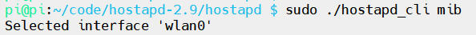
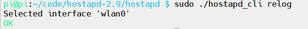

# hostapd常用命令及配置

[TOC]

## 概述

在`hostapd`编译完成后，会生成一个`hostapd_cli`的可执行文件。`hostapd_cli`是一款用作无线`AP` 功能的客户端程序。它需要与`hostapd`主程序配置使用，使用`hostapd_cli -h`命令可以看到支持的命令

```shell
pi@pi:~/code/hostapd-2.9/hostapd $ ./hostapd_cli -h
hostapd_cli v2.9
Copyright (c) 2004-2019, Jouni Malinen <j@w1.fi> and contributors

usage: hostapd_cli [-p<path>] [-i<ifname>] [-hvB] [-a<path>] \
                   [-P<pid file>] [-G<ping interval>] [command..]

Options:
   -h           help (show this usage text)
   -v           shown version information
   -p<path>     path to find control sockets (default: /var/run/hostapd)
   -s<dir_path> dir path to open client sockets (default: /var/run/hostapd)
   -a<file>     run in daemon mode executing the action file based on events
                from hostapd
   -B           run a daemon in the background
   -i<ifname>   Interface to listen on (default: first interface found in the
                socket path)

commands:
  ping = pings hostapd
  mib = get MIB variables (dot1x, dot11, radius)
  relog = reload/truncate debug log output file
  status = show interface status info
  sta <addr> = get MIB variables for one station
  all_sta = get MIB variables for all stations
  list_sta = list all stations
  new_sta <addr> = add a new station
  deauthenticate <addr> = deauthenticate a station
  disassociate <addr> = disassociate a station
  sa_query <addr> = send SA Query to a station
  disassoc_imminent = send Disassociation Imminent notification
  ess_disassoc = send ESS Dissassociation Imminent notification
  bss_tm_req = send BSS Transition Management Request
  get_config = show current configuration
  help = show this usage help
  interface [ifname] = show interfaces/select interface
  raw <params..> = send unprocessed command
  level <debug level> = change debug level
  license = show full hostapd_cli license
  quit = exit hostapd_cli
  set <name> <value> = set runtime variables
  get <name> = get runtime info
  set_qos_map_set <arg,arg,...> = set QoS Map set element
  send_qos_map_conf <addr> = send QoS Map Configure frame
  chan_switch <cs_count> <freq> [sec_channel_offset=] [center_freq1=]
    [center_freq2=] [bandwidth=] [blocktx] [ht|vht]
    = initiate channel switch announcement
  hs20_wnm_notif <addr> <url>
    = send WNM-Notification Subscription Remediation Request
  hs20_deauth_req <addr> <code (0/1)> <Re-auth-Delay(sec)> [url]
    = send WNM-Notification imminent deauthentication indication
  vendor <vendor id> <sub command id> [<hex formatted data>]
    = send vendor driver command
  enable = enable hostapd on current interface
  reload = reload configuration for current interface
  disable = disable hostapd on current interface
  update_beacon = update Beacon frame contents
  erp_flush = drop all ERP keys
  log_level [level] = show/change log verbosity level
  pmksa  = show PMKSA cache entries
  pmksa_flush  = flush PMKSA cache
  set_neighbor <addr> <ssid=> <nr=> [lci=] [civic=] [stat]
    = add AP to neighbor database
  remove_neighbor <addr> <ssid=> = remove AP from neighbor database
  req_lci <addr> = send LCI request to a station
  req_range  = send FTM range request
  driver_flags  = show supported driver flags
  accept_acl =Add/Delete/Show/Clear accept MAC ACL
  deny_acl =Add/Delete/Show/Clear deny MAC ACL
  poll_sta <addr> = poll a STA to check connectivity with a QoS null frame
  req_beacon <addr> [req_mode=] <measurement request hexdump>  = send a Beacon report request to a station
  reload_wpa_psk = reload wpa_psk_file only
```

## hostapd_cli ping

当你执行 `hostapd_cli ping` 命令时，它将向 hostapd 发送一个简单的请求，`hostapd`会返回一个响应。这个命令主要用于测试 `hostapd`是否正常工作，并检查与 `hostapd`的连接是否通畅


## hostapd_cli mib

显示 `MIB`（管理信息库）变量，如`dot1x/dot11/radius`状态信息



## hostapd_cli relog

`relog`命令会强制`hostapd`重新加载其日志配置，通常用于更新或更改日志设置后，确保新的日志配置立即生效



## 参考文档

[hostapd-2.9源码](https://w1.fi/releases/hostapd-2.9.tar.gz)

[【hostapd_cli 命令全集】-CSDN博客](https://blog.csdn.net/qq_42206726/article/details/154690664)
