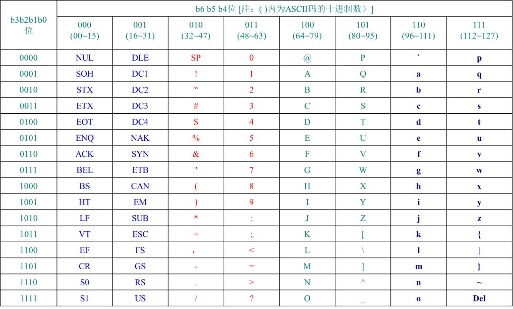

`cjson`中设计大量的字符串处理逻辑，其中有许多设计可以学习借鉴，在此列出；

#### `skip`函数

跳过空格和无用字符

**源代码中函数实现如下**

> 笔者注：代码已做格式化处理

```c
static const char *skip(const char *in) 
{
	while (in && *in && (unsigned char)*in <= 32) {
		in++;
	}

	return in;
}
```

**函数核心思想**

函数通过`while`循环遍历整个字符串，首先判断**指针不为空**，指针指向的**值不为空**

不断向后偏移，直到指向的字符的`ACSII`码大于`32`;函数作者非常巧妙的利用了`ASCII`码表的排列的规则，将前`32`位在字符串解析时无法用到的字符舍弃，只保留了有效字符

